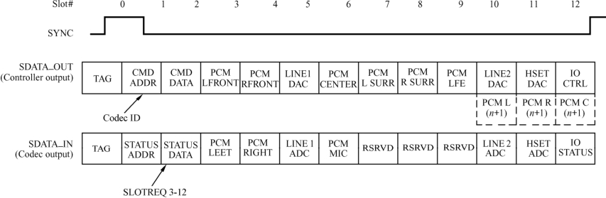

### 17.2.3 AC'97接口

AC'97（Audio Codec 1997）是以Intel为首的5个PC厂商Intel、Creative Labs、NS、Analog Device 与Yamaha共同提出的规格标准。与PCM和IIS不同，AC'97不只是一种数据格式，用于音频编码的内部架构规格，它还具有控制功能。

AC'97采用AC-Link与外部的编解码器相连，AC-Link接口包括位时钟（BITCLK）、同步信号校正（SYNC）和从编码到处理器及从处理器中解码（SDATDIN与SDATAOUT）的数据队列。AC'97数据帧以SYNC脉冲开始，包括12个20位时隙以及1个16位“tag”段，共计256个数据序列。例如，时序“1”和“2”用于访问编码的控制寄存器，而时隙“3”和“4”分别负载左、右两个音频通道。“tag”段表示其他时隙中哪一个包含有效数据。把帧分成时隙使传输控制信号和音频数据仅通过4根线到达9个音频通道或转换成其他数据流成为可能。图17.3所示AC'97的时序图。

PCM、IIS和AC'97各有其优点和应用范围，例如在CD、MD、MP3随身听多采用IIS接口，移动电话多采用PCM接口，智能手机、PDA则多使用和PC一样的AC'97编码格式。

