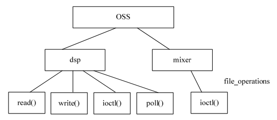

### 17.3.3 dsp接口

int register_sound_dsp(struct file_operations *fops, int dev);

上述函数与register_sound_mixer()类似，它用于注册一个dsp设备，第一个参数fops即是文件操作接口，第二个参数dev是设备编号，如果填入−1，则系统自动分配一个设备编号。dsp也是一个典型的字符设备，因此编码的主要工作是实现file_operations中的read()、write()、ioctl()等函数。

dsp接口file_operations中的read()和write()函数非常重要，read()函数从音频控制器中获取录音数据到缓冲区并复制到用户空间，write()函数从用户空间复制音频数据到内核空间缓冲区并最终发送到音频控制器。

dsp接口file_operations中的ioctl()函数处理对采样率、量化精度、DMA缓冲区块大小等参数设置I/O控制命令的处理。

在数据从缓冲区复制到音频控制器的过程中，通常会使用DMA，DMA对声卡而言非常重要。例如，在放音时，驱动设置完DMA控制器的源数据地址（内存中的DMA缓冲区）、目的地址（音频控制器FIFO）和DMA的数据长度，DMA控制器会自动发送缓冲区的数据填充FIFO，直到发送完相应的数据长度后才中断一次。

在OSS驱动中，建立存放音频数据的环形缓冲区（ring buffer）通常是值得推荐的方法。此外，在OSS驱动中，一般会将一个较大的DMA缓冲区分成若干个大小相同的块（这些块也被称为“段”，即fragment），驱动程序使用DMA每次在声音缓冲区和声卡之间搬移一个fragment。在用户空间，可以使用ioctl()系统调用来调整块的大小和个数。

除了read()、write()和ioctl()外，dsp接口的poll()函数通常也需要被实现，以向用户反馈目前能否读写DMA缓冲区。

在OSS驱动初始化过程中，会调用register_sound_dsp()和register_sound_mixer()注册dsp和mixer设备；在模块卸载的时候，会调用代码清单17.2。

代码清单17.2 OSS驱动初始化注册dsp和mixer设备

1 static int xxx_init(void) 
 
 2 { 
 
 3 struct xxx_state *s = &xxx_state; 
 
 4 ... 
 
 5 /* 注册dsp设备 */ 
 
 6 if ((audio_dev_dsp = register_sound_dsp(&xxx_audio_fops, - 1)) < 0) 
 
 7 goto err_dev1; 
 
 8 /* 设备mixer设备 */ 
 
 9 if ((audio_dev_mixer = register_sound_mixer(&xxx_mixer_fops, - 1)) < 0) 
 
 10 goto err_dev2; 
 
 11 ... 
 
 12 } 
 
 13 
 
 14 void _ _exit xxx_exit(void) 
 
 15 {

16 /* 注销dsp和mixer设备接口 */ 
 
 17 unregister_sound_dsp(audio_dev_dsp); 
 
 18 unregister_sound_mixer(audio_dev_mixer); 
 
 19 ... 
 
 20 }

根据17.3.2和17.3.3小节的分析，可以画出一个Linux OSS驱动结构的简图，如图17.4所示。

