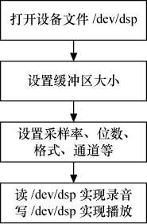

### 17.3.4 OSS用户空间编程

#### 1．dsp编程

对OSS驱动声卡的编程使用Linux文件接口函数，如图17.5所示，dsp接口的操作一般包括如下几个步骤。

（1）打开设备文件/dev/dsp。

采用何种模式对声卡进行操作也必须在打开设备时指定，对于不支持全双工的声卡来说，应该使用只读或者只写的方式打开，只有那些支持全双工的声卡，才能以读写的方式打开，这还依赖于驱动程序的具体实现。Linux允许应用程序多次打开或者关闭与声卡对应的设备文件，从而能够很方便地在放音状态和录音状态之间进行切换。

（2）如果有需要，设置缓冲区大小。

运行在Linux内核中的声卡驱动程序专门维护了一个缓冲区，其大小会影响到播放和录音时的效果，使用ioctl()系统调用可以对它的尺寸进行恰当设置。调节驱动程序中缓冲区大小的操作不是必须的，如果没有特殊的要求，一般采用默认的缓冲区大小也就可以了。如果想设置缓冲区的大小，则通常应紧跟在设备文件打开之后，这是因为对声卡的其他操作有可能会导致驱动程序无法再修改其缓冲区的大小。

（3）设置声道（channel）数量。

根据硬件设备和驱动程序的具体情况，可以设置为单声道或者立体声。

（4）设置采样格式和采样频率

采样格式包括AFMT_U8（无符号8位）、AFMT_S8（有符号8位）、AFMT_U16_LE（小端模式，无符号16位）、AFMT_U16_BE（大端模式，无符号16位）、AFMT_MPEG、AFMT_AC3等。使用SNDCTL_DSP_SETFMT IO控制命令可以设置采样格式。

对于大多数声卡来说，其支持的采样频率范围一般为5kHz～44.1kHz或者48kHz，但并不意味着该范围内的所有连续频率都会被硬件支持，在Linux系统下进行音频编程时最常用到的几种采样频率是11025Hz、16000Hz、22050Hz、32000Hz和44100Hz。使用SNDCTL_DSP_SPEED IO控制命令可以设置采样频率。

（5）读写/dev/dsp实现播放或录音。

代码清单17.3（read、write、ioctl的出错处理没有列出）的程序实现了利用/dev/dsp接口进行声音录制和播放的过程，它的功能是先录制几秒钟音频数据，将其存放在内存缓冲区中，然后再进行播放。

代码清单17.3 OSS dsp接口应用编程范例

1 #include ... 
 
 2 #define LENGTH 3 /* 存储秒数 */ 
 
 3 #define RATE 8000 /* 采样频率 */ 
 
 4 #define SIZE 8 /* 量化位数 */ 
 
 5 #define CHANNELS 1 /* 声道数目 */ 
 
 6 /* 用于保存数字音频数据的内存缓冲区 */ 
 
 7 unsigned char buf[LENGTH *RATE * SIZE * CHANNELS / 8]; 
 
 8 int main() 
 
 9 { 
 
 10 int fd; /* 声音设备的文件描述符 */ 
 
 11 int arg; /* 用于ioctl调用的参数 */ 
 
 12 int status; /* 系统调用的返回值 */ 
 
 13 /* 打开声音设备 */ 
 
 14 fd = open("/dev/dsp", O_RDWR); 
 
 15 
 
 16 /* 设置采样时的量化位数 */ 
 
 17 arg = SIZE; 
 
 18 status = ioctl(fd, SOUND_PCM_WRITE_BITS, &arg); 
 
 19 
 
 20 /* 设置采样时的通道数目 */ 
 
 21 arg = CHANNELS; 
 
 22 status = ioctl(fd, SOUND_PCM_WRITE_CHANNELS, &arg); 
 
 23 
 
 24 /* 设置采样率 */ 
 
 25 arg = RATE; 
 
 26 status = ioctl(fd, SOUND_PCM_WRITE_RATE, &arg); 
 
 27 
 
 28 /* 循环，直到按下[Ctrtfc] */ 
 
 29 while (1) { 
 
 30 printf("Say something:\n"); 
 
 31 status = read(fd, buf, sizeof(buf)); /* 录音 */ 
 
 32 
 
 33 printf("You said:\n"); 
 
 34 status = write(fd, buf, sizeof(buf)); /* 放音 */ 
 
 35 
 
 36 /* 在继续录音前等待放音结束 */ 
 
 37 status = ioctl(fd, SOUND_PCM_SYNC, 0); 
 
 38 
 
 39 } 
 
 40 }

#### 2．mixer编程

声卡上的混音器由多个混音通道组成，它们可以通过驱动程序提供的设备文件/dev/mixer进行编程。对混音器的操作一般都通过ioctl()系统调用来完成，所有控制命令都以SOUND_MIXER或者MIXER开头，表17.1列出了常用的混音器控制命令。

**表17.1 混音器常用命令**

| 命 令 | 作 用 |
| :-----  | :-----  | :-----  | :-----  |
| SOUND_MIXER_VOLUME | 主音量调节 |
| SOUND_MIXER_BASS | 低音控制 |
| SOUND_MIXER_TREBLE | 高音控制 |
| SOUND_MIXER_SYNTH | FM合成器 |
| SOUND_MIXER_PCM | 主D/A转换器 |
| SOUND_MIXER_SPEAKER | PC喇叭 |
| SOUND_MIXER_LINE | 音频线输入 |
| SOUND_MIXER_MIC | 麦克风输入 |
| SOUND_MIXER_CD | CD输入 |
| SOUND_MIXER_IMIX | 放音音量 |
| SOUND_MIXER_ALTPCM | 从D/A 转换器 |
| SOUND_MIXER_RECLEV | 录音音量 |
| SOUND_MIXER_IGAIN | 输入增益 |
| SOUND_MIXER_OGAIN | 输出增益 |
| SOUND_MIXER_LINE1 | 声卡的第1输入 |
| SOUND_MIXER_LINE2 | 声卡的第2输入 |
| SOUND_MIXER_LINE3 | 声卡的第3输入 |

对声卡的输入增益和输出增益进行调节是混音器的一个主要作用，目前大部分声卡采用的是8位或者16位的增益控制器，声卡驱动程序会将它们变换成百分比的形式，也就是说无论是输入增益还是输出增益，其取值范围都是从0～100。

（1）SOUND_MIXER_READ宏。

在进行混音器编程时，可以使用SOUND_MIXER_READ宏来读取混音通道的增益大小，例如，如下代码可以获得麦克风的输入增益：

ioctl(fd, SOUND_MIXER_READ(SOUND_MIXER_MIC), &vol);

对于只有一个混音通道的单声道设备来说，返回的增益大小保存在低位字节中。而对于支持多个混音通道的双声道设备来说，返回的增益大小实际上包括两个部分，分别代表左、右两个声道的值，其中低位字节保存左声道的音量，而高位字节则保存右声道的音量。下面的代码可以从返回值中依次提取左右声道的增益大小：

int left, right; 
 
 left = vol & 0xff; 
 
 right = (vol & 0xff00) >> 8;

（2）SOUND_MIXER_WRITE宏。

如果想设置混音通道的增益大小，则可以通过SOUND_MIXER_WRITE宏来实现，例如下面的语句可以用来设置麦克风的输入增益：

vol = (right << 8) + left; 
 
 ioctl(fd, SOUND_MIXER_WRITE(SOUND_MIXER_MIC), &vol);

（3）查询MIXER信息。

声卡驱动程序提供了多个ioctl()系统调用来获得混音器的信息，它们通常返回一个整型的位掩码，其中每一位分别代表一个特定的混音通道，如果相应的位为1，则说明与之对应的混音通道是可用的。

通过SOUND_MIXER_READ_DEVMASK返回的位掩码查询出能够被声卡支持的每一个混音通道，而通过SOUND_MIXER_READ_RECMAS返回的位掩码则可以查询出能够被当作录音源的每一个通道。例如，如下代码可用来检查CD输入是否是一个有效的混音通道：

ioctl(fd, SOUND_MIXER_READ_DEVMASK, &devmask); 
 
 if (devmask & SOUND_MIXER_CD) 
 
 printf("The CD input is supported");

如下代码可用来检查CD输入是否是一个有效的录音源：

ioctl(fd, SOUND_MIXER_READ_RECMASK, &recmask); 
 
 if (recmask & SOUND_MIXER_CD) 
 
 printf("The CD input can be a recording source");

大多数声卡提供了多个录音源，通过SOUND_MIXER_READ_RECSRC可以查询出当前正在使用的录音源，同一时刻可使用两个或两个以上的录音源，具体由声卡硬件本身决定。相应地，使用SOUND_MIXER_WRITE_RECSRC可以设置声卡当前使用的录音源，如下代码可以将CD输入作为声卡的录音源使用。

devmask = SOUND_MIXER_CD; 
 
 ioctl(fd, SOUND_MIXER_WRITE_RECSRC, &devmask);

此外，所有的混音通道都有单声道和双声道的区别，如果需要知道哪些混音通道提供了对立体声的支持，可以通过SOUND_MIXER_READ_STEREODEVS来获得。

代码清单17.4的程序实现了利用/dev/mixer接口对混音器进行编程的过程，该程序可对各种混音通道的增益进行调节。

代码清单17.4 OSS mixer接口应用编程范例

1 #include ... 
 
 2 /* 用来存储所有可用混音设备的名称 */ 
 
 3 const char *sound_device_names[] = SOUND_DEVICE_NAMES; 
 
 4 int fd; /* 混音设备所对应的文件描述符 */ 
 
 5 int devmask, stereodevs; /* 混音器信息对应的bit掩码 */ 
 
 6 char *name; 
 
 7 /* 显示命令的使用方法及所有可用的混音设备 */ 
 
 8 void usage() 
 
 9 { 
 
 10 int i; 
 
 11 fprintf(stderr, "usage: %s <device> <left-gain%%> <right-gain%%>\n" 
 
 12 "%s <device> <gain%%>\n\n""Where <device> is one of:\n", name, name); 
 
 13 for(i = 0; i < SOUND_MIXER_NRDEVICES; i++) 
 
 14 if ((1 << i) &devmask) 
 
 15 /* 只显示有效的混音设备 */

16 fprintf(stderr, "%s ", sound_device_names[i]); 
 
 17 fprintf(stderr, "\n"); 
 
 18 exit(1); 
 
 19 } 
 
 20 
 
 21 int main(int argc, char *argv[]) 
 
 22 { 
 
 23 int left, right, level; /* 增益设置 */ 
 
 24 int status; /* 系统调用的返回值 */ 
 
 25 int device; /* 选用的混音设备 */ 
 
 26 char *dev; /* 混音设备的名称 */ 
 
 27 int i; 
 
 28 name = argv[0]; 
 
 29 /* 以只读方式打开混音设备 */ 
 
 30 fd = open("/dev/mixer", O_RDONLY); 
 
 31 if (fd == - 1) { 
 
 32 perror("unable to open /dev/mixer"); 
 
 33 exit(1); 
 
 34 } 
 
 35 
 
 36 /* 获得所需要的信息 */ 
 
 37 status = ioctl(fd, SOUND_MIXER_READ_DEVMASK, &devmask); 
 
 38 if(status == - 1) 
 
 39 perror("SOUND_MIXER_READ_DEVMASK ioctl failed"); 
 
 40 status = ioctl(fd, SOUND_MIXER_READ_STEREODEVS, &stereodevs); 
 
 41 if (status == - 1) 
 
 42 perror("SOUND_MIXER_READ_STEREODEVS ioctl failed"); 
 
 43 /* 检查用户输入 */ 
 
 44 if (argc != 3 && argc != 4) 
 
 45 usage(); 
 
 46 /* 保存用户输入的混音器名称 */ 
 
 47 dev = argv[1]; 
 
 48 /* 确定即将用到的混音设备 */ 
 
 49 for (i = 0; i < SOUND_MIXER_NRDEVICES; i++) 
 
 50 if (((1 << i) &devmask) && !strcmp(dev, sound_device_names[i])) 
 
 51 break; 
 
 52 if (i == SOUND_MIXER_NRDEVICES) { 
 
 53 /* 没有找到匹配项 */ 
 
 54 fprintf(stderr, "%s is not a valid mixer device\n", dev); 
 
 55 usage(); 
 
 56 } 
 
 57 /* 查找到有效的混音设备 */ 
 
 58 device = i; 
 
 59 /* 获取增益值 */ 
 
 60 if (argc == 4) { 
 
 61 /* 左、右声道均给定 */ 
 
 62 left = atoi(argv[2]); 
 
 63 right = atoi(argv[3]); 
 
 64 } else { 
 
 65 /* 左、右声道设为相等 */ 
 
 66 left = atoi(argv[2]); 
 
 67 right = atoi(argv[2]); 
 
 68 } 
 
 69 
 
 70 /* 对非立体声设备给出警告信息 */

71 if ((left != right) && !((1 << i) &stereodevs)) 
 
 72 fprintf(stderr, "warning: %s is not a stereo device\n", dev); 
 
 73 
 
 74 /* 将两个声道的值合到同一变量中 */ 
 
 75 level = (right << 8) + left; 
 
 76 
 
 77 /* 设置增益 */ 
 
 78 status = ioctl(fd, MIXER_WRITE(device), &level); 
 
 79 if (status == - 1) { 
 
 80 perror("MIXER_WRITE ioctl failed"); 
 
 81 exit(1); 
 
 82 } 
 
 83 /* 获得从驱动返回的左右声道的增益 */ 
 
 84 left = level &0xff; 
 
 85 right = (level &0xff00) >> 8; 
 
 86 /* 显示实际设置的增益 */ 
 
 87 fprintf(stderr, "%s gain set to %d%% / %d%%\n", dev, left, right); 
 
 88 /* 关闭混音设备 */ 
 
 89 close(fd); 
 
 90 return 0; 
 
 91 }

编译上述程序为可执行文件mixer，执行./mixer <device> <left-gain%> <right-gain%>或./mixer <device> <gain%>可设置增益，device可以是vol、pcm、speaker、line、mic、cd、igain、line1、phin、video。

