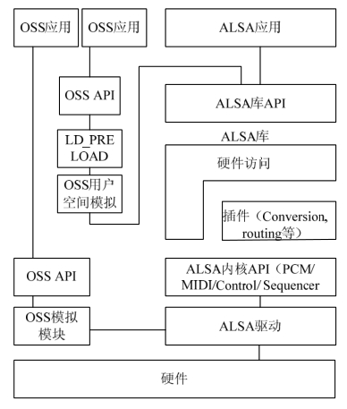

### 17.4.1 ALSA的组成

虽然OSS已经非常成熟，但它毕竟是一个没有完全开放源代码的商业产品，而且目前基本上在Linux mainline中失去了更新。而ALSA （Advanced Linux Sound Architecture）恰好弥补了这一空白，它符合GPL，是在Linux下进行音频编程时另一种可供选择的声卡驱动体系结构。ALSA除了像OSS那样提供了一组内核驱动程序模块之外，还专门为简化应用程序的编写提供了相应的函数库，与OSS提供的基于ioctl的原始编程接口相比，ALSA函数库使用起来要更加方便一些。ALSA的主要特点如下。

● 支持多种声卡设备。

● 模块化的内核驱动程序。

● 支持SMP和多线程。

● 提供应用开发函数库（alsa-lib）以简化应用程序开发。

● 支持OSS API，兼容OSS应用程序。

ALSA具有更加友好的编程接口，并且完全兼容于OSS，对应用程序员来讲无疑是一个更佳的选择。ALSA系统包括驱动包alsa-driver、开发包alsa-libs、开发包插件alsa-libplugins、设置管理工具包alsa-utils、其他声音相关处理小程序包alsa-tools、特殊音频固件支持包alsa- firmware、 OSS接口兼容模拟层工具alsa-oss共7个子项目，其中只有驱动包是必需的。

alsa-driver指内核驱动程序，包括硬件相关的代码和一些公共代码，非常庞大，代码总量达数十万行；alsa-libs指用户空间的函数库，提供给应用程序使用，应用程序应包含头文件asoundlib.h，并使用共享库libasound.so；alsa-utils包含一些基于ALSA的用于控制声卡的应用程序，如alsaconf（侦测系统中声卡并写一个适合的ALSA配置文件）、alsactl（控制ALSA声卡驱动的高级设置）、alsamixer（基于ncurses的混音器程序）、amidi（用于读写ALSA RawMIDI）、amixer （ALSA声卡混音器的命令行控制）、aplay（基于命令行的声音文件播放）、arecord（基于命令行的声音文件录制）等。

目前ALSA内核提供给用户空间的接口有：

● 信息接口（Information Interface，/proc/asound）；

● 控制接口（Control Interface，/dev/snd/controlCX）；

● 混音器接口（Mixer Interface，/dev/snd/mixerCXDX）；

● PCM接口（PCM Interface，/dev/snd/pcm CXDX）；

● Raw迷笛接口（Raw MIDI Interface，/dev/ snd/midiCXDX）；

● 音序器接口（Sequencer Interface，/dev/snd/ seq）；

● 定时器接口（Timer Interface，/dev/snd/ timer）。

和OSS类似，上述接口也以文件的方式被提供，不同的是这些接口被提供给alsa-lib使用，而不是直接给应用程序使用的。应用程序最好使用alsa-lib，或者更高级的接口，比如jack提供的接口。

图17.6所示为ALSA声卡驱动与用户空间体系结构的简图，从中可以看出ALSA内核驱动与用户空间库及OSS之间的关系。

