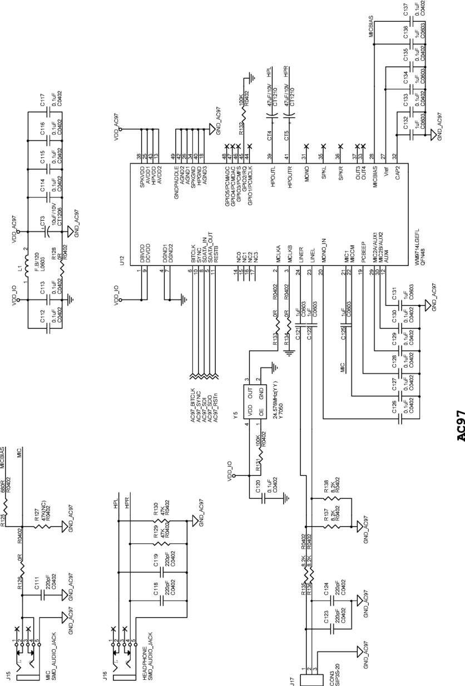

### 17.6 S3C6410+WM9714 ASoC驱动实例

LDD6410开发板上为S3C6410的AC'97接口上连接了Wolfson公司的WM9714 Codec芯片，其硬件连接如图17.6所示。WM9714芯片主要外接了Microphone、Line in模拟输入和Headphone模拟输出。而在数字接口方面，与S3C6410 CPU的连接包含了AC-Link总线上必要的信号。

WM9714是一款比较复杂的Codec芯片，其与AC'97 2.2兼容。内部集成了HiFi立体声ADC/DAC、AUX ADC/DAC和用于话音的Voice ADC/DAC，同时包含数个mux和mixer以及增益调节，在使用该芯片上，读懂数据手册中的“Audio Paths Overview”即音频路径图非常关键。

LDD6410开发板上ASoC驱动的3部分分别是。

（1）Codec驱动。由内核源代码sound/soc/codecs/wm9713.c实现。

（2）平台驱动。由内核源代码sound/soc/s3c/s3c-ac97.c实现S3C6410 CPU端的DAI驱动，由sound/soc/s3c/s3c-pcm.c实现CPU端的DMA驱动。

（3）板驱动。由内核源代码sound/soc/s3c/smdk6410_wm9713.c实现，它将第1部分和第2部分进行绑定。

sound/soc/codecs/wm9713.c超过1300行，支持WM9713、WM9714，主要定义了一系列的mixer控制、DAPM、AC97底层读写、时钟/PLL控制以及snd_soc_ops的成员函数。我们不可能一一列举，这里仅抽取其核心一观，如代码清单17.35。

代码清单17.35 WM9713/4的ASoC Codec驱动

1 /* 一系列的mixer控制 */ 
 
 2 static const struct soc_enum wm9713_enum[] = { 
 
 3 SOC_ENUM_SINGLE(AC97_LINE, 3, 4, wm9713_mic_mixer), /* record mic mixer 0 */ 
 
 4 ... 
 
 5 }; 
 
 6 
 
 7 static const struct snd_kcontrol_new wm9713_snd_ac97_controls[] = { 
 
 8 SOC_DOUBLE("Speaker Playback Volume", AC97_MASTER, 8, 0, 31, 1), 
 
 9 ... 
 
 10 }; 
 
 11 
 
 12 /* add non dapm controls */ 
 
 13 static int wm9713_add_controls(struct snd_soc_codec *codec) 
 
 14 { 
 
 15 int err, i; 
 
 16 
 
 17 for (i = 0; i < ARRAY_SIZE(wm9713_snd_ac97_controls); i++) { 
 
 18 err = snd_ctl_add(codec->card, 
 
 19 snd_soc_cnew(&wm9713_snd_ac97_controls[i], 
 
 20 codec, NULL)); 
 
 21 if (err < 0) 
 
 22 return err; 
 
 23 } 
 
 24 return 0; 
 
 25 } 
 
 26 
 
 27 ... 
 
 28 static const struct snd_kcontrol_new wm9713_hpl_mixer_controls[] = { 
 
 29 ... 
 
 30 }; 
 
 31 
 
 32 /* Right Headphone Mixers */ 
 
 33 static const struct snd_kcontrol_new wm9713_hpr_mixer_controls[] = { 
 
 34 ... 
 
 35 };

36 
 
 37 /* 一系列的dapm控制 */ 
 
 38 static const struct snd_soc_dapm_widget wm9713_dapm_widgets[] = { 
 
 39 SND_SOC_DAPM_MUX("Capture Headphone Mux", SND_SOC_NOPM, 0, 0, 
 
 40 &wm9713_hp_rec_mux_controls), 
 
 41 ... 
 
 42 }; 
 
 43 
 
 44 static const struct snd_soc_dapm_route audio_map[] = { 
 
 45 /* left HP mixer */ 
 
 46 {"Left HP Mixer", "PC Beep Playback Switch", "PCBEEP"}, 
 
 47 ... 
 
 48 }; 
 
 49 
 
 50 static int wm9713_add_widgets(struct snd_soc_codec *codec) 
 
 51 { 
 
 52 snd_soc_dapm_new_controls(codec, wm9713_dapm_widgets, 
 
 53 ARRAY_SIZE(wm9713_dapm_widgets)); 
 
 54 
 
 55 snd_soc_dapm_add_routes(codec, audio_map, ARRAY_SIZE(audio_map)); 
 
 56 
 
 57 snd_soc_dapm_new_widgets(codec); 
 
 58 return 0; 
 
 59 } 
 
 60 
 
 61 /* io、时钟、格式等的操作 */ 
 
 62 static unsigned int ac97_read(struct snd_soc_codec *codec, 
 
 63 unsigned int reg) 
 
 64 { 
 
 65 ... 
 
 66 } 
 
 67 
 
 68 static int ac97_write(struct snd_soc_codec *codec, unsigned int reg, 
 
 69 unsigned int val) 
 
 70 { 
 
 71 ... 
 
 72 } 
 
 73 
 
 74 static int wm9713_set_dai_pll(struct snd_soc_dai *codec_dai, 
 
 75 int pll_id, unsigned int freq_in, unsigned int freq_out) 
 
 76 { 
 
 77 ... 
 
 78 } 
 
 79 
 
 80 static int wm9713_set_dai_fmt(struct snd_soc_dai *codec_dai, 
 
 81 unsigned int fmt) 
 
 82 { 
 
 83 ... 
 
 84 } 
 
 85 
 
 86 /* 关于音频流的操作snd_soc_ops */ 
 
 87 static int wm9713_pcm_hw_params(struct snd_pcm_substream *substream, 
 
 88 struct snd_pcm_hw_params *params) 
 
 89 { 
 
 90 ...

91 } 
 
 92 
 
 93 static void wm9713_voiceshutdown(struct snd_pcm_substream *substream) 
 
 94 { 
 
 95 ... 
 
 96 } 
 
 97 
 
 98 static int ac97_hifi_prepare(struct snd_pcm_substream *substream) 
 
 99 { 
 
 100 ... 
 
 101 } 
 
 102 
 
 103 static int ac97_aux_prepare(struct snd_pcm_substream *substream) 
 
 104 { 
 
 105 ... 
 
 106 } 
 
 107 
 
 108 /* DAI */ 
 
 
 109 struct snd_ 
 soc_ 
 dai wm9713_ 
 dai[] = { 
 
 110 { 
 
 111 .name = "AC97 HiFi", 
 
 112 .type = SND_SOC_DAI_AC97_BUS, 
 
 113 .playback = { 
 
 114 .stream_name = "HiFi Playback", 
 
 115 .channels_min = 1, 
 
 116 .channels_max = 2, 
 
 117 .rates = WM9713_RATES, 
 
 118 .formats = SNDRV_PCM_FMTBIT_S16_LE,}, 
 
 119 .capture = { 
 
 120 .stream_name = "HiFi Capture", 
 
 121 .channels_min = 1, 
 
 122 .channels_max = 2, 
 
 123 .rates = WM9713_RATES, 
 
 124 .formats = SNDRV_PCM_FMTBIT_S16_LE,}, 
 
 125 .ops = { 
 
 126 .prepare = ac97_hifi_prepare,}, 
 
 127 .dai_ops = { 
 
 128 .set_clkdiv = wm9713_set_dai_clkdiv, 
 
 129 .set_pll = wm9713_set_dai_pll,}, 
 
 130 }, 
 
 131 { 
 
 132 .name = "AC97 Aux", 
 
 133 .playback = { 
 
 134 .stream_name = "Aux Playback", 
 
 135 .channels_min = 1, 
 
 136 .channels_max = 1, 
 
 137 .rates = WM9713_RATES, 
 
 138 .formats = SNDRV_PCM_FMTBIT_S16_LE,}, 
 
 139 .ops = { 
 
 140 .prepare = ac97_aux_prepare,}, 
 
 141 .dai_ops = { 
 
 142 .set_clkdiv = wm9713_set_dai_clkdiv, 
 
 143 .set_pll = wm9713_set_dai_pll,}, 
 
 144 }, 
 
 145 {

146 .name = "WM9713 Voice", 
 
 147 ... 
 
 148 }, 
 
 149 }; 
 
 
 150 EXPORT_ 
 SYMBOL_ 
 GPL(wm9713_ 
 dai); 
 
 151 
 
 152 /* snd_soc_codec_device成员 */ 
 
 153 static int wm9713_soc_suspend(struct platform_device *pdev, 
 
 154 pm_message_t state) 
 
 155 { 
 
 156 ... 
 
 157 } 
 
 158 
 
 159 static int wm9713_soc_resume(struct platform_device *pdev) 
 
 160 { 
 
 161 ... 
 
 162 } 
 
 163 
 
 164 static int wm9713_soc_probe(struct platform_device *pdev) 
 
 165 { 
 
 166 struct snd_soc_device *socdev = platform_get_drvdata(pdev); 
 
 167 struct snd_soc_codec *codec; 
 
 168 int ret = 0, reg; 
 
 169 
 
 170 ... 
 
 171 codec->name = "WM9713"; 
 
 172 codec->owner = THIS_MODULE; 
 
 173 codec->dai = wm9713_dai; 
 
 174 codec->num_dai = ARRAY_SIZE(wm9713_dai); 
 
 175 codec->write = ac97_write; 
 
 176 codec->read = ac97_read; 
 
 177 codec->set_bias_level = wm9713_set_bias_level; 
 
 178 INIT_LIST_HEAD(&codec->dapm_widgets); 
 
 179 INIT_LIST_HEAD(&codec->dapm_paths); 
 
 180 
 
 181 ret = snd_soc_new_ac97_codec(codec, &soc_ac97_ops, 0); 
 
 182 if (ret < 0) 
 
 183 goto codec_err; 
 
 184 
 
 185 /* register pcms */ 
 
 186 ret = snd_soc_new_pcms(socdev, SNDRV_DEFAULT_IDX1, SNDRV_DEFAULT_STR1); 
 
 187 if (ret < 0) 
 
 188 goto pcm_err; 
 
 189 
 
 190 ... 
 
 191 
 
 192 wm9713_add_controls(codec); 
 
 193 wm9713_add_widgets(codec); 
 
 194 ret = snd_soc_register_card(socdev); 
 
 195 ... 
 
 196 } 
 
 197 
 
 198 static int wm9713_soc_remove(struct platform_device *pdev) 
 
 199 { 
 
 200 ...

201 snd_soc_dapm_free(socdev); 
 
 202 snd_soc_free_pcms(socdev); 
 
 203 snd_soc_free_ac97_codec(codec); 
 
 204 ... 
 
 205 return 0; 
 
 206 } 
 
 207 
 
 
 208 struct snd_ 
 soc_ 
 codec_ 
 device soc_ 
 codec_ 
 dev_ 
 wm9713 = { 
 
 209 .probe = wm9713_soc_probe, 
 
 210 .remove = wm9713_soc_remove, 
 
 211 .suspend = wm9713_soc_suspend, 
 
 212 .resume = wm9713_soc_resume, 
 
 213 }; 
 
 
 214 EXPORT_ 
 SYMBOL_ 
 GPL(soc_ 
 codec_ 
 dev_ 
 wm9713);

sound/soc/s3c/s3c-ac97.c实现CPU端AC97 DAI的驱动，会导出snd_soc_dai结构体的实例s3c_ac97_dai。sound/soc/s3c/s3c-pcm.c实现CPU端的DMA驱动，其核心如代码清单17.36，它也会导出snd_soc_platform结构体的实例s3c24xx_soc_platform。

代码清单17.36 S3C6410平台驱动DMA进行PCM流操作

1 static const struct snd_pcm_hardware s3c24xx_pcm_hardware = { 
 
 2 .info = SNDRV_PCM_INFO_INTERLEAVED | 
 
 3 SNDRV_PCM_INFO_PAUSE | 
 
 4 SNDRV_PCM_INFO_RESUME | 
 
 5 SNDRV_PCM_INFO_BLOCK_TRANSFER | 
 
 6 SNDRV_PCM_INFO_MMAP | 
 
 7 SNDRV_PCM_INFO_MMAP_VALID, 
 
 8 .formats = SNDRV_PCM_FMTBIT_S16_LE | 
 
 9 SNDRV_PCM_FMTBIT_U16_LE | 
 
 10 SNDRV_PCM_FMTBIT_U8 | 
 
 11 SNDRV_PCM_FMTBIT_S24_LE | 
 
 12 SNDRV_PCM_FMTBIT_S8, 
 
 13 .channels_min = 2, 
 
 14 .channels_max = 2, 
 
 15 .buffer_bytes_max = 128*1024, 
 
 16 .period_bytes_min = PAGE_SIZE, 
 
 17 .period_bytes_max = PAGE_SIZE*2, 
 
 18 .periods_min = 2, 
 
 19 .periods_max = 128, 
 
 20 .fifo_size = 32, 
 
 21 }; 
 
 22 
 
 23 static int s3c24xx_pcm_hw_params(struct snd_pcm_substream *substream, 
 
 24 struct snd_pcm_hw_params *params) 
 
 25 { 
 
 26 ... 
 
 27 } 
 
 28 
 
 29 static int s3c24xx_pcm_hw_free(struct snd_pcm_substream *substream) 
 
 30 { 
 
 31 ... 
 
 32 } 
 
 33 
 
 34 static int s3c24xx_pcm_prepare(struct snd_pcm_substream *substream)

35 { 
 
 36 ... 
 
 37 } 
 
 38 
 
 39 static int s3c24xx_pcm_trigger(struct snd_pcm_substream *substream, int cmd) 
 
 40 { 
 
 41 ... 
 
 42 switch (cmd) { 
 
 43 case SNDRV_PCM_TRIGGER_RESUME: 
 
 44 ... 
 
 45 case SNDRV_PCM_TRIGGER_START: 
 
 46 case SNDRV_PCM_TRIGGER_PAUSE_RELEASE: 
 
 47 prtd->state |= ST_RUNNING; 
 
 48 s3c2410_dma_ctrl(prtd->params->channel, S3C2410_DMAOP_START); 
 
 49 break; 
 
 50 
 
 51 ... 
 
 52 } 
 
 53 ... 
 
 54 } 
 
 55 
 
 56 static snd_pcm_uframes_t 
 
 57 s3c24xx_pcm_pointer(struct snd_pcm_substream *substream) 
 
 58 { 
 
 59 ... 
 
 60 return bytes_to_frames(substream->runtime, res); 
 
 61 } 
 
 62 
 
 63 static int s3c24xx_pcm_open(struct snd_pcm_substream *substream) 
 
 64 { 
 
 65 ... 
 
 66 return 0; 
 
 67 } 
 
 68 
 
 69 static int s3c24xx_pcm_close(struct snd_pcm_substream *substream) 
 
 70 { 
 
 71 ... 
 
 72 } 
 
 73 
 
 74 static int s3c24xx_pcm_mmap(struct snd_pcm_substream *substream, 
 
 75 struct vm_area_struct *vma) 
 
 76 { 
 
 77 ... 
 
 78 return dma_mmap_writecombine(substream->pcm->card->dev, vma, 
 
 79 runtime->dma_area, 
 
 80 runtime->dma_addr, 
 
 81 runtime->dma_bytes); 
 
 82 } 
 
 83 
 
 84 static struct snd_pcm_ops s3c24xx_pcm_ops = { 
 
 85 .open = s3c24xx_pcm_open, 
 
 86 .close = s3c24xx_pcm_close, 
 
 87 .ioctl = snd_pcm_lib_ioctl, 
 
 88 .hw_params = s3c24xx_pcm_hw_params, 
 
 89 .hw_free = s3c24xx_pcm_hw_free,

90 .prepare = s3c24xx_pcm_prepare, 
 
 91 .trigger = s3c24xx_pcm_trigger, 
 
 92 .pointer = s3c24xx_pcm_pointer, 
 
 93 .mmap = s3c24xx_pcm_mmap, 
 
 94 }; 
 
 95 
 
 96 static int s3c24xx_pcm_preallocate_dma_buffer(struct snd_pcm *pcm, int stream) 
 
 97 { 
 
 98 ... 
 
 99 buf->area = dma_alloc_writecombine(pcm->card->dev, size, 
 
 100 &buf->addr, GFP_KERNEL); 
 
 101 if (!buf->area) 
 
 102 return -ENOMEM; 
 
 103 buf->bytes = size; 
 
 104 return 0; 
 
 105 } 
 
 106 
 
 107 static void s3c24xx_pcm_free_dma_buffers(struct snd_pcm *pcm) 
 
 108 { 
 
 109 ... 
 
 110 for(stream=SNDRV_PCM_STREAM_PLAYBACK;stream<=SNDRV_PCM_STREAM_CAPTURE;stream++){ 
 
 111 substream = pcm->streams[stream].substream; 
 
 112 if (!substream) 
 
 113 continue; 
 
 114 
 
 115 buf = &substream->dma_buffer; 
 
 116 if (!buf->area) 
 
 117 continue; 
 
 118 
 
 119 dma_free_writecombine(pcm->card->dev, buf->bytes, 
 
 120 buf->area, buf->addr); 
 
 121 buf->area = NULL; 
 
 122 buf->addr = 0; 
 
 123 } 
 
 124 } 
 
 125 
 
 126 static u64 s3c24xx_pcm_dmamask = DMA_32BIT_MASK; 
 
 127 
 
 128 static int s3c24xx_pcm_new(struct snd_card *card, 
 
 129 struct snd_soc_dai *dai, struct snd_pcm *pcm) 
 
 130 { 
 
 131 ... 
 
 132 
 
 133 if (dai->playback.channels_min) { 
 
 134 ret = s3c24xx_pcm_preallocate_dma_buffer(pcm, 
 
 135 SNDRV_PCM_STREAM_PLAYBACK); 
 
 136 if (ret) 
 
 137 goto out; 
 
 138 } 
 
 139 
 
 140 if (dai->capture.channels_min) { 
 
 141 ret = s3c24xx_pcm_preallocate_dma_buffer(pcm, 
 
 142 SNDRV_PCM_STREAM_CAPTURE); 
 
 143 if (ret) 
 
 144 goto out;

145 } 
 
 146 out: 
 
 147 return ret; 
 
 148 } 
 
 149 
 
 
 150 struct snd_ 
 soc_ 
 platform s3c24xx_ 
 soc_ 
 platform = { 
 
 151 .name = "s3c24xx-audio", 
 
 152 .pcm_ops = &s3c24xx_pcm_ops, 
 
 153 .pcm_new = s3c24xx_pcm_new, 
 
 154 .pcm_free = s3c24xx_pcm_free_dma_buffers, 
 
 155 }; 
 
 156 
 
 
 157 EXPORT_ 
 SYMBOL_ 
 GPL(s3c24xx_ 
 soc_ 
 platform);

sound/soc/s3c/smdk6410_wm9713.c的形式与代码清单17.33基本相同，它将前述Codec和平台驱动中导出的symbol绑定在一起，并在模块加载函数中注册一个名为“soc-audio”的platform设备。

