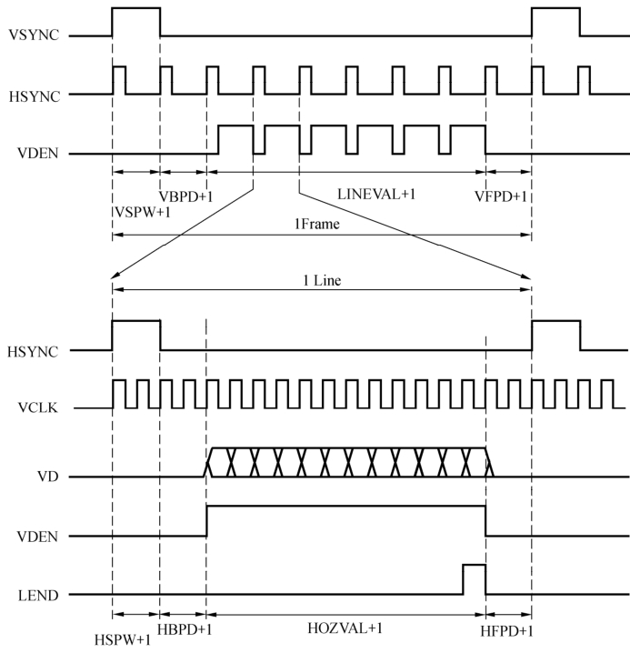
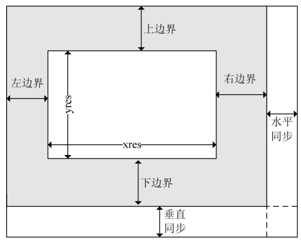

### 18.1 LCD硬件原理

利用液晶制成的显示器称为LCD，依据驱动方式可分为静态驱动、简单矩阵驱动以及主动矩阵驱动3种。其中，简单矩阵型又可再细分扭转向列型（TN）和超扭转式向列型（STN）两种，而主动矩阵型则以薄膜式晶体管型（TFT）为主流。表18.1列出了TN、STN和TFT显示器的区别。

**表18.1 TN、STN和TFT显示器的区别**

| 类 别 | TN | STN | TFT |
| :-----  | :-----  | :-----  | :-----  | :-----  | :-----  |
| 原理 | 液晶分子，扭转90° | 扭转180°～270° | 液晶分子，扭转90° |
| 特性 | 黑白、单色低对比 | 黑白、彩色，低对比 | 彩色（1667万色），可媲美CRT显示器的全彩，高对比 |
| 动画显示 | 否 | 否 | 是 |
| 视角 | 30°以下 | 40°以下 | 80°以下 |
| 面板尺寸 | 1～3英寸 | 1～12英寸 | 37英寸 |

TN型液晶显示技术是LCD中最基本的，其他种类的LCD都以TN型为基础改进而得。TN 型LCD显示质量很差，色彩单一，对比度低，反映速度很慢，故主要用于简单的数字符与文字的显示，如电子表及电子计算器等。

STN LCD的显示原理与TN类似，区别在于TN型的液晶分子将入射光旋转90°，而STN则可将入射光旋转180°～270°。STN改善了TN视角狭小的缺点，并提高了对比度，显示品质较TN高。

STN搭配彩色滤光片，将单色显示矩阵的任一像素分成3个子像素，分别透过彩色滤光片显示红、绿、蓝三原色，再经由三原色按比例调和，显示出逼近全彩模式的色彩。STN显示的画面色彩对比度仍较小，反应速度也较慢，可以作为一般的操作显示接口。

随后出现的DSTN通过双扫描方式来显示，显示效果相对STN而言有了较大幅度的提高。DSTN的反应速度可达到100ms，但是在电场反复改变电压的过程中，每一像素的恢复过程较慢。因此，当在屏幕画面快速变化时，会产生“拖尾”现象。

TN与STN型液晶显示器都是使用场电压驱动方式，如果显示尺寸加大，中心部位对电极变化的反应时间就会拉长，显示器的速度跟不上。为了解决这个问题，主动式矩阵驱动被提出，主动式TFT型的液晶显示器的结构较为复杂，它包括背光管、导光板、偏光板、滤光板、玻璃基板、配向膜、液晶材料和薄膜式晶体管等。

在TFT型LCD中，晶体管矩阵依显示信号开启或关闭液晶分子的电压，使液晶分子轴转向而成“亮”或“暗”的对比，避免了显示器对电场效应的依靠。因此，TFT LCD的显示质量较TN/STN更佳，画面显示对比度可达150:1以上，反应速度逼近30ms甚至更快，适用于PDA、笔记本电脑、数码相机、MP4等。

一块LCD屏显示图像不但需要LCD驱动器，还需要有相应的LCD控制器。通常LCD驱动器会以COF/COG的形式与LCD玻璃基板制作在一起，而LCD控制器则由外部电路来实现。许多MCU内部直接集成了LCD控制器，通过LCD控制器可以方便地控制STN和TFT屏。

TFT屏是目前嵌入式系统应用的主流，图18.1所示给出了TFT屏的典型时序。时序图中的VCLK、HSYNC和VSYNC分别为像素时钟信号（用于锁存图像数据的像素时钟）、行同步信号和帧同步信号，VDEN为数据有效标志信号，VD为图像的数据信号。

作为帧同步信号的VSYNC，每发出一个脉冲，都意味着新的一屏图像数据开始发送。而作为行同步信号的HSYNC，每发出一个脉冲都表明新的一行图像资料开始发送。在帧同步以及行同步的头尾都必须留有回扫时间。这样的时序安排起源于CRT显示器电子枪偏转所需要的时间，但后来成为实际上的工业标准，因此TFT屏也包含了回扫时间。

图18.2给出了LCD控制器中应该设置的TFT屏的参数，其中的上边界和下边界即为帧切换的回扫时间，左边界和右边界即为行切换的回扫时间，水平同步和垂直同步分别是行和帧同步本身需要的时间。xres和yres则分别是屏幕的水平和垂直分辨率，常见的嵌入式设备的LCD分辨率主要为320×240、640×480等。

