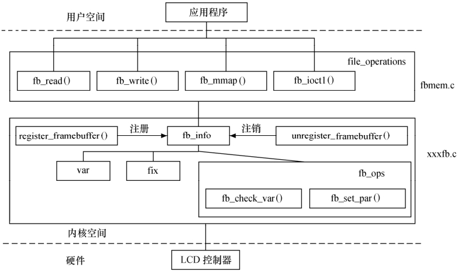

### 18.3 Linux帧缓冲设备驱动结构

图18.3所示为Linux帧缓冲设备驱动的主要结构，帧缓冲设备提供给用户空间的file_operations结构体由fbmem.c中的file_operations提供，而特定帧缓冲设备fb_info结构体的注册、注销以及其中成员的维护，尤其是fb_ops中成员函数的实现则由对应的xxxfb.c文件实现，fb_ops中的成员函数最终会操作LCD控制器硬件寄存器。

