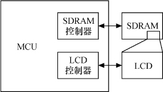

### 18.5 帧缓冲设备显示缓冲区的申请与释放

在嵌入式系统中，一种常见的方式是直接在RAM空间中分配一段显示缓冲区，典型结构如图18.4所示。

writecombining意味着“写合并”，它允许写入的数据被合并，并临时保存在写合并缓冲区（WCB）中，直到进行一次burst传输而不再需要多次single传输。通过dma_alloc_ writecombine()分配的显示缓冲区不会出现cache一致性问题，这一点类似于dma_alloc_ coherent()。

代码清单18.10 帧缓冲设备显示缓冲区的分配与释放

1 static int __init xxxfb_map_video_memory(struct xxxfb_info *fbi) 
 
 2 { 
 
 3 fbi->map_size = PAGE_ALIGN(fbi->fb->fix.smem_len + PAGE_SIZE); 
 
 4 fbi->map_cpu = dma_alloc_writecombine(fbi->dev, fbi->map_size, 
 
 5 &fbi->map_dma,GFP_KERNEL); /* 分配内存 */ 
 
 6 
 
 7 fbi->map_size = fbi->fb->fix.smem_len; /* 显示缓冲区大小 */ 
 
 8 
 
 9 if (fbi->map_cpu) { 
 
 10 memset(fbi->map_cpu, 0xf0, fbi->map_size); 
 
 11 
 
 12 fbi->screen_dma = fbi->map_dma; 
 
 13 fbi->fb->screen_base = fbi->map_cpu; 
 
 14 fbi->fb->fix.smem_start = fbi->screen_dma; 
 
 15 } 
 
 16 
 
 17 return fbi->map_cpu ? 0 : - ENOMEM; 
 
 18 } 
 
 19 
 
 20 static inline void xxxfb_unmap_video_memory(struct s3c2410fb_info *fbi) 
 
 21 { 
 
 22 /* 释放显示缓冲区 */ 
 
 23 dma_free_writecombine(fbi->dev,fbi->map_size,fbi->map_cpu, fbi->map_dma); 
 
 24 }

