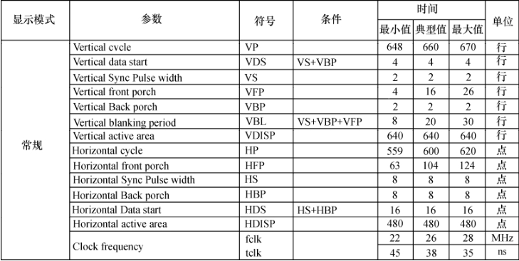

### 18.6.1 定时参数

FBI结构体可变参数var中的left_margin、right_margin、upper_margin、lower_margin、hsync_len 和vsync_len直接查LCD的数据手册就可以得到，图18.5所示为某LCD数据手册中直接抓图获得的定时信息。

由图18.5可知对该LCD而言，var中各参数的较合适值分别为：left_margin = 104，right_margin = 8，upper_margin = 16，lower_margin = 2，hsync_len = 8，vsync_len = 2。

