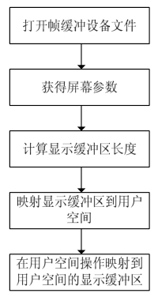

### 18.9 帧缓冲设备的用户空间访问

通过/dev/fbn，应用程序可进行的针对帧缓冲设备的操作主要有如下几种。

● 读/写dev/fbn：相当于读/写屏幕缓冲区。例如用cp /dev/fb0 tmp命令可将当前屏幕的内容复制到一个文件中，而命令cp tmp > /dev/fb0 则将图形文件tmp显示在屏幕上。

● 映射操作：对于帧缓冲设备，可通过mmap()映射操作将屏幕缓冲区的物理地址映射到用户空间的一段虚拟地址中，之后用户就可以通过读/写这段虚拟地址访问屏幕缓冲区，在屏幕上绘图了。而且若干个进程可以映射到同一个显示缓冲区。实际上，使用帧缓冲设备的应用程序都是通过映射操作来显示图形的。

● I/O控制：对于帧缓冲设备，对设备文件的ioctl()操作可读取/设置显示设备及屏幕的参数，如分辨率、显示颜色数、屏幕大小等。

如图18.6所示，在应用程序中，操作/dev/fbn的一般步骤如下。

（1）打开/dev/fbn设备文件。

（2）用ioctl()操作取得当前显示屏幕的参数，如屏幕分辨率、每个像素点的比特数和偏移。根据屏幕参数可计算屏幕缓冲区的大小。

（3）将屏幕缓冲区映射到用户空间。

（4）映射后就可以直接读/写屏幕缓冲区，进行绘图和图片显示了。

代码清单18.15所示为一段用户空间访问帧缓冲设备显示缓冲区的范例，包含打开和关闭帧缓冲设备、得到和设置可变参数、得到固定参数、生成与BPP对应的帧缓冲数据及填充显示缓冲区。

代码清单18.15 用户空间访问帧缓冲设备显示缓冲区范例

#include <unistd.h> 
 
 #include <stdlib.h> 
 
 #include <stdio.h> 
 
 #include <fcntl.h> 
 
 #include <linux/fb.h> 
 
 #include <sys/mman.h>

int main() 
 
 { 
 
 int fbfd = 0; 
 
 struct fb_var_screeninfo vinfo; 
 
 unsigned long screensize = 0; 
 
 char *fbp = 0; 
 
 int x = 0, y = 0; 
 
 int i = 0;

// Open the file for reading and writing 
 
 fbfd = open("/dev/fb0", O_RDWR); 
 
 if (!fbfd) { 
 
 printf("Error: cannot open framebuffer device.\n"); 
 
 exit(1); 
 
 } 
 
 printf("The framebuffer device was opened successfully.\n");

// Get variable screen information 
 
 if (ioctl(fbfd, FBIOGET_VSCREENINFO, &vinfo)) { 
 
 printf("Error reading variable information.\n"); 
 
 exit(1); 
 
 }

printf("%dx%d, %dbpp\n", vinfo.xres, vinfo.yres, vinfo.bits_per_pixel); 
 
 if (vinfo.bits_per_pixel != 16) { 
 
 printf("Error: not supported bits_per_pixel, it only supports 16 bit color\n"); 
 
 exit(1); 
 
 }

// Figure out the size of the screen in bytes 
 
 screensize = vinfo.xres * vinfo.yres * 2;

// Map the device to memory 
 
 fbp = (char *)mmap(0, screensize, PROT_READ | PROT_WRITE, MAP_SHARED, 
 
 fbfd, 0); 
 
 if ((int)fbp == -1) { 
 
 printf("Error: failed to map framebuffer device to memory.\n"); 
 
 exit(4); 
 
 } 
 
 printf("The framebuffer device was mapped to memory successfully.\n");

// Draw 3 rect with graduated RED/GREEN/BLUE 
 
 for (i = 0; i < 3; i++) { 
 
 for (y = i * (vinfo.yres / 3); y < (i + 1) * (vinfo.yres / 3); y++) { 
 
 for (x = 0; x < vinfo.xres; x++) {

long location = x * 2 + y * vinfo.xres * 2; 
 
 int r = 0, g = 0, b = 0; 
 
 unsigned short rgb;

if (i == 0) 
 
 r = ((x * 1.0) / vinfo.xres) * 32; 
 
 if (i == 1) 
 
 g = ((x * 1.0) / vinfo.xres) * 64; 
 
 if (i == 2)

b = ((x * 1.0) / vinfo.xres) * 32;

rgb = (r << 11) | (g << 5) | b; 
 
 *((unsigned short*)(fbp + location)) = rgb;

} 
 
 } 
 
 }

munmap(fbp, screensize); 
 
 close(fbfd); 
 
 return 0; 
 
 }

上述程序位于虚拟机的/home/lihacker/develop/svn/ldd6410-read-only/tests/framebuffer中，运行时会在屏幕上绘制R/G/B这3种颜色的由浅入深的变化情况。LDD6410的文件系统中已经集成了这个fb_test程序，可以直接运行查看效果。

