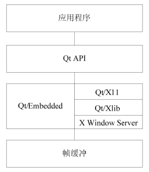

### 18.10.1 Qt-X11/QtEmbedded/Qtopia

Qt是Trolltech（奇趣科技，目前已被诺基亚收购）公司所开发的一个跨平台FrameWork环境，它采用类似C++的语法，在Microsoft Windows、MacOS X、Linux、Solaris、HP-UX、Tru64 (Digital UNIX)、Irix、FreeBSD、BSD/OS、SCO、AIX等平台上都可执行。

Trolltech也针对嵌入式环境推出了Qt/Embedded产品。与桌面版本不同，Qt/Embedded未采用X Server及X Library等角色，而是直接使用帧缓冲作为底层图形接口（如图18.7所示）。Qt/Embedded提供了丰富的窗口小部件（Widgets），并且还支持窗口部件的定制，因此它可以为用户提供漂亮的图形界面，许多基于Qt 的X Window程序可以非常方便地移植到Qt/Embedded版本上。

Qtopia是建立在Qt/Embedded上的一种开放源代码窗口系统，它与实际的产品相似，专门针对PDA、SmartPhone这类运行嵌入式Linux的移动计算设备和手持设备而开发的。Trolltech还发布了一款供应用开发人员使用的Linux手机“Qtopia Greenphone”。

在宿主机上可通过qvfb（虚拟帧缓冲）来模拟帧缓冲。qvfb是X窗口用来运行和测试Qtopia应用程序的系统程序，它使用了共享存储区域（虚拟的帧缓冲）来模拟帧缓冲并且在一个窗口中模拟一个应用来显示帧缓冲，允许我们在桌面及其上开发Qt嵌入式程序。

信号（Signal）和插槽（Slot）是Qt中一种用于对象间通信的调用机制，不同于传统的函数回调方式，信号和插槽是Qt中非常有特色的地方，是Qt编程区别于其他编程的标志。信号和插槽不是标准C++功能，C++编译器不能理解这些语句，必须经过特殊的工具对象编辑器MOC（Meta Object Compiler）将源代码中创建信号和插槽的语句翻译成C++编译器能够理解的代码。

Qt的窗口在事件发生后会激发信号。例如，一个按钮被点击时会激发一个“clicked”信号。程序员通过建立一个函数（称做一个插槽），然后调用connect()函数把这个插槽和一个信号连接起来，这样就完成了一个事件和响应代码的连接。信号与插槽机制并不要求类之间互相知道细节，这样就可以相对容易地开发出代码可高重用的类。

例如，如果一个退出按钮的clicked()信号被连接到了一个应用的退出函数quit()插槽。那么一个用户点击退出键将使应用程序终止运行，完成上述连接过程的代码如下。

connect( button, SIGNAL(clicked()), qApp, SLOT(quit()) );

代码清单18.16的应用程序创建一个hello窗口，该窗口显示一个动态字符串“Hello，World”，程序中添加了一个Qtimer定时器实例，以周期性刷新屏幕，从而得到动画的效果。

代码清单18.16 Qt/Embedded应用程序范例

1 /****************************************************** 
 
 2 ** 以下是 hello.h 的代码 
 
 3 *****************************************************/ 
 
 4 #ifndef HELLO_H 
 
 5 #define HELLO_H 
 
 6 #include <qvariant.h> 
 
 7 #include <qwidget.h> 
 
 8 class QVBoxLayout; 
 
 9 class QHBoxLayout; 
 
 10 class QGridLayout; 
 
 11 class Hello: public QWidget 
 
 12 { 
 
 13 Q_OBJECT public: 
 
 14 Hello(QWidget *parent = 0, const char *name = 0, WFlags fl = 0); 
 
 15 ～Hello(); 
 
 16 //以下是手动添加的代码 
 
 17 signals: void clicked(); 
 
 18 protected: 
 
 19 void mouseReleaseEvent(QMouseEvent*); 
 
 20 void paintEvent(QPaintEvent*); 
 
 21 private slots: void animate(); 
 
 22 private: 
 
 23 QString t; 
 
 24 int b; 
 
 25 }; 
 
 26 #endif // HELLO_H 
 
 27 
 
 28 /*************************************************************** 
 
 29 ** 以下是 hello.cpp 源代码 
 
 30 *************************************************************/ 
 
 31 #include "hello.h" 
 
 32 #include <qlayout.h> 
 
 33 #include <qvariant.h> 
 
 34 #include <qtooltip.h> 
 
 35 #include <qwhatsthis.h> 
 
 36 #include <qpushbutton.h>

37 #include <qtimer.h> 
 
 38 #include <qpainter.h> 
 
 39 #include <qpixmap.h> 
 
 40 /* 构造一个Hello窗口 */ 
 
 41 Hello::Hello(QWidget *parent, const char *name, WFlags fl): QWidget(parent, 
 
 42 name, fl) 
 
 43 { 
 
 44 if (!name) 
 
 45 setName("Hello"); 
 
 46 resize(240, 320); 
 
 47 setMinimumSize(QSize(240, 320)); 
 
 48 setMaximumSize(QSize(240, 320)); 
 
 49 setSizeIncrement(QSize(240, 320)); 
 
 50 setBaseSize(QSize(240, 320)); 
 
 51 QPalette pal; 
 
 52 QColorGroup cg; 
 
 53 cg.setColor(QColorGroup::Foreground, black); 
 
 54 cg.setColor(QColorGroup::Button, QColor(192, 192, 192)); 
 
 55 cg.setColor(QColorGroup::Light, white); 
 
 56 cg.setColor(QColorGroup::Midlight, QColor(223, 223, 223)); 
 
 57 cg.setColor(QColorGroup::Dark, QColor(96, 96, 96)); 
 
 58 cg.setColor(QColorGroup::Mid, QColor(128, 128, 128)); 
 
 59 cg.setColor(QColorGroup::Text, black); 
 
 60 cg.setColor(QColorGroup::BrightText, white); 
 
 61 cg.setColor(QColorGroup::ButtonText, black); 
 
 62 cg.setColor(QColorGroup::Base, white); 
 
 63 cg.setColor(QColorGroup::Background, white); 
 
 64 cg.setColor(QColorGroup::Shadow, black); 
 
 65 cg.setColor(QColorGroup::Highlight, black); 
 
 66 cg.setColor(QColorGroup::HighlightedText, white); 
 
 67 pal.setActive(cg); 
 
 68 cg.setColor(QColorGroup::Foreground, black); 
 
 69 cg.setColor(QColorGroup::Button, QColor(192, 192, 192)); 
 
 70 cg.setColor(QColorGroup::Light, white); 
 
 71 cg.setColor(QColorGroup::Midlight, QColor(220, 220, 220)); 
 
 72 cg.setColor(QColorGroup::Dark, QColor(96, 96, 96)); 
 
 73 cg.setColor(QColorGroup::Mid, QColor(128, 128, 128)); 
 
 74 cg.setColor(QColorGroup::Text, black); 
 
 75 cg.setColor(QColorGroup::BrightText, white); 
 
 76 cg.setColor(QColorGroup::ButtonText, black); 
 
 77 cg.setColor(QColorGroup::Base, white); 
 
 78 cg.setColor(QColorGroup::Background, white); 
 
 79 cg.setColor(QColorGroup::Shadow, black); 
 
 80 cg.setColor(QColorGroup::Highlight, black); 
 
 81 cg.setColor(QColorGroup::HighlightedText, white); 
 
 82 pal.setInactive(cg); 
 
 83 cg.setColor(QColorGroup::Foreground, QColor(128, 128, 128)); 
 
 84 cg.setColor(QColorGroup::Button, QColor(192, 192, 192)); 
 
 85 cg.setColor(QColorGroup::Light, white); 
 
 86 cg.setColor(QColorGroup::Midlight, QColor(220, 220, 220)); 
 
 87 cg.setColor(QColorGroup::Dark, QColor(96, 96, 96)); 
 
 88 cg.setColor(QColorGroup::Mid, QColor(128, 128, 128)); 
 
 89 cg.setColor(QColorGroup::Text, black); 
 
 90 cg.setColor(QColorGroup::BrightText, white); 
 
 91 cg.setColor(QColorGroup::ButtonText, QColor(128, 128, 128));

92 cg.setColor(QColorGroup::Base, white); 
 
 93 cg.setColor(QColorGroup::Background, white); 
 
 94 cg.setColor(QColorGroup::Shadow, black); 
 
 95 cg.setColor(QColorGroup::Highlight, black); 
 
 96 cg.setColor(QColorGroup::HighlightedText, white); 
 
 97 pal.setDisabled(cg); 
 
 98 setPalette(pal); 
 
 99 QFont f(font()); 
 
 100 f.setFamily("adobe-helvetica"); 
 
 101 f.setPointSize(29); 
 
 102 f.setBold(TRUE); 
 
 103 setFont(f); 
 
 104 setCaption(tr("")); 
 
 105 t = "Hello,World"; 
 
 106 b = 0; 
 
 107 QTimer *timer = new QTimer(this); //创建定时器 
 
 108 connect(timer, SIGNAL(timeout()), SLOT(animate())); //连接信号和插槽 
 
 109 timer->start(40); 
 
 110 } 
 
 111 
 
 112 /* 销毁对象，释放任何被分配的资源 */ 
 
 113 Hello:: ～Hello(){} 
 
 114 
 
 115 /* 每次定时器到期后调用插槽 */ 
 
 116 void Hello::animate() 
 
 117 { 
 
 118 b = (b + 1) &15; 
 
 119 repaint(FALSE); //重绘 
 
 120 } 
 
 121 
 
 122 /* 处理hello窗口的鼠标按钮释放事件 */ 
 
 123 void Hello::mouseReleaseEvent(QMouseEvent *e) 
 
 124 { 
 
 125 if (rect().contains(e->pos())) 
 
 126 emit clicked(); //激活clicked()信号 
 
 127 } 
 
 128 
 
 129 /* 处理hello窗口的重绘事件 */ 
 
 130 void Hello::paintEvent(QPaintEvent*) 
 
 131 { 
 
 132 static int sin_tbl[16] = 
 
 133 { 
 
 134 0, 38, 71, 92, 100, 92, 71, 38, 0, -38, -71, -92, -100, -92, 
 
 135 -71, -38 
 
 136 }; 
 
 137 if (t.isEmpty()) 
 
 138 return ; 
 
 139 // 1: 计算尺寸、位置 
 
 140 QFontMetrics fm = fontMetrics(); 
 
 141 int w = fm.width(t) + 20; 
 
 142 int h = fm.height() *2; 
 
 143 int pmx = width() / 2-w / 2; 
 
 144 int pmy = height() / 2-h / 2; 
 
 145 // 2: 创建pixmap，用窗口背景填充它 
 
 146 QPixmap pm(w, h);

147 pm.fill(this, pmx, pmy); 
 
 148 // 3: 绘制pixmap 
 
 149 QPainter p; 
 
 150 int x = 10; 
 
 151 int y = h / 2+fm.descent(); 
 
 152 int i = 0; 
 
 153 p.begin(&pm); 
 
 154 p.setFont(font()); 
 
 155 while (!t[i].isNull()) 
 
 156 { 
 
 157 int i16 = (b + i) &15; 
 
 158 p.setPen(QColor((15-i16) *16, 255, 255, QColor::Hsv)); 
 
 159 p.drawText(x, y - sin_tbl[i16] *h / 800, t.mid(i, 1), 1); 
 
 160 x += fm.width(t[i]); 
 
 161 i++; 
 
 162 } 
 
 163 p.end(); 
 
 164 // 4:复制pixmap到Hello窗口 
 
 165 bitBlt(this, pmx, pmy, &pm); 
 
 166 } 
 
 167 
 
 168 /**************************************************** 
 
 169 ** 以下是 main.cpp的源代码 
 
 170 ****************************************************/ 
 
 171 #include "hello.h" 
 
 172 #include <qapplication.h> 
 
 173 /* 
 
 174 The program starts here. It parses the command line and builds a message 
 
 175 string to be displayed by the Hello widget. 
 
 176 */ 
 
 177 #define QT_NO_WIZARD 
 
 178 int main(int argc, char **argv) 
 
 179 { 
 
 180 QApplication a(argc, argv); 
 
 181 Hello dlg; 
 
 182 QObject::connect(&dlg, SIGNAL(clicked()), &a, SLOT(quit())); 
 
 183 a.setMainWidget(&dlg); 
 
 184 dlg.show(); 
 
 185 return a.exec(); 
 
 186 }

