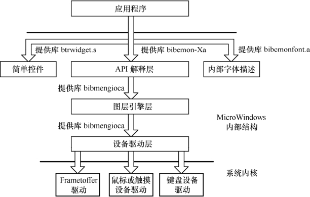
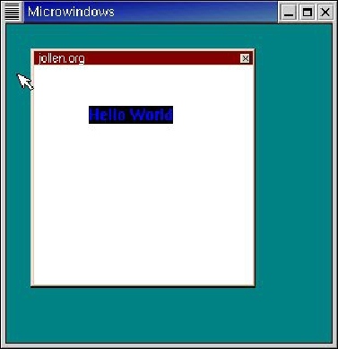

### 18.10.2 Microwindows/Nano-X

Microwindows是嵌入式系统中广为使用的一种图形用户接口，其官方网站是http://www. microwindows.org，Microwindows完全支持Linux的帧缓冲技术。这个项目的早期目标是在嵌入式Linux平台上提供和普通个人电脑上类似的图形用户界面。

Microwindows起源于NanoGUI项目，早期Microwindows有两个版本，一个版本包含了一组和微软的WIN32图形用户接口相似的API，这个版本就是Microwindows版本；另外一个版本是基于X-Windows的一组Xlib风格的API函数库，这个版本允许X11的二进制代码直接在Micro Windows的Nanx-X服务器上运行，称之为Nano-X。

如图18.8所示，Microwindows采用分层设计方法。在最底层，屏幕、鼠标/触摸屏以及键盘驱动程序提供了对物理设备访问的能力。在中间层，实现了一个可移植的图形引擎，支持行绘制、区域填充、剪切以及颜色模型等。在上层，实现多种API以适应不同的应用环境。

代码清单18.17所示为一个简单的Microwindows应用程序，它基于Nano-X API编写，创建一个窗口并显示“Hello World”，如图18.9所示。

代码清单18.17 Nano-X应用程序范例

1 #include <stdio.h> 
 
 2 #include <microwin/nano-X.h> 
 
 3 
 
 4 GR_WINDOW_ID wid; 
 
 5 GR_GC_ID gc; 
 
 6 
 
 7 void event_handler(GR_EVENT *event); 
 
 8 
 
 9 int main(void) 
 
 10 { 
 
 11 if (GrOpen() < 0) 
 
 12 { 
 
 13 fprintf(stderr, "GrOpen failed"); 
 
 14 exit(1); 
 
 15 } 
 
 16 
 
 17 gc = GrNewGC(); 
 
 18 GrSetGCForeground(gc, 0xFF0000); 
 
 19 //创建窗口 
 
 20 wid = GrNewWindowEx(GR_WM_PROPS_APPFRAME | 
 
 21 GR_WM_PROPS_CAPTION | 
 
 22 GR_WM_PROPS_CLOSEBOX, 
 
 23 "jollen.org", GR_ROOT_WINDOW_ID, 0, 0, 200, 
 
 24 200,0xFFFFFF); 
 
 25 //选择事件 
 
 26 GrSelectEvents(wid, GR_EVENT_MASK_CLOSE_REQ|GR_EVENT_MASK_EXPOSURE);

27 
 
 28 GrMapWindow(wid); 
 
 29 GrMainLoop(event_handler); //挂接事件处理函数 
 
 30 } 
 
 31 
 
 32 void event_handler(GR_EVENT *event) 
 
 33 { 
 
 34 switch (event->type) 
 
 35 { 
 
 36 case GR_EVENT_TYPE_EXPOSURE: //显示文本 
 
 37 GrText(wid, gc, 50, 50, "Hello World", - 1, GR_TFASCII); 
 
 38 break; 
 
 39 case GR_EVENT_TYPE_CLOSE_REQ: //关闭 
 
 40 GrClose(); 
 
 41 exit(0); 
 
 42 default: 
 
 43 break; 
 
 44 } 
 
 45 }

