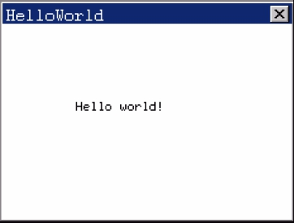

### 18.10.3 MiniGUI

MiniGUI是由北京飞漫软件技术有限公司开发的面向实时嵌入式系统的轻量级图形用户界面支持系统，1999年初遵循GPL条款发布第一个版本以来，已广泛应用于手持信息终端、机顶盒、工业控制系统及工业仪表、彩票机、金融终端等产品和领域。目前，MiniGUI已成为跨操作系统的图形用户界面支持系统，可在Linux/mClinux、eCos、mC/OS-II、VxWorks等操作系统上运行，已验证的硬件平台包括Intel x86、ARM、PowerPC、MIPS和M68K（DragonBall/ColdFire）等。

如图18.10所示，基于MiniGUI的应用程序一般通过ANSI C库以及MiniGUI自身提供的API来实现自己的功能；MiniGUI中的可移植层可将特定操作系统及底层硬件的细节隐藏起来，而上层应用程序则无须关心底层的硬件平台输出和输入设备。

为了适合不同的操作系统环境，MiniGUI 可配置成以下3种运行模式。

#### 1．MiniGUI-Threads

运行在 MiniGUI-Threads 上的程序可以在不同的线程中建立多个窗口，但所有的窗口在一个进程或者地址空间中运行。这种运行模式非常适合于大多数传统意义上的嵌入式操作系统，比如mC/OS-II、 eCos、VxWorks、pSOS等。当然，在Linux和mClinux上，

MiniGUI也能以MiniGUI-Threads模式运行。

#### 2．MiniGUI-Processes

和 MiniGUI-Threads相反，MiniGUI-Processes上的每个程序是单独的进程，每个进程也可以建立多个窗口，并且实现了多进程窗口系统。MiniGUI-Processes适合于具有完整UNIX特性的嵌入式操作系统，比如嵌入式Linux。

#### 3．MiniGUI-Standalone

在这种运行模式下，MiniGUI可以以独立进程的方式运行，既不需要多线程也不需要多进程的支持，这种运行模式适合功能单一的应用场合。

MiniGUI下的通信是一种类似于Win32的消息机制，如果有Win32图形用户界面程序的编程基础，编写MiniGUI程序将没有门槛。代码清单18.18所示为一个完整的MiniGUI应用程序，该程序在屏幕上创建一个大小为240´180的应用程序窗口，并在窗口客户区的中部显示“Hello world!”，如图18.11所示。

代码清单18.18 MiniGUI应用程序范例

1 #include <stdio.h> 
 
 2 #include <minigui/common.h> 
 
 3 #include <minigui/minigui.h> 
 
 4 #include <minigui/gdi.h> 
 
 5 #include <minigui/window.h> 
 
 6 static int HelloWinProc ( HWND hWnd, int message, WPARAM wParam, LPARAM lParam ) 
 
 7 { 
 
 8 HDC hdc; 
 
 9 switch (message) 
 
 10 { 
 
 11 case MSG_PAINT: 
 
 12 hdc = BeginPaint(hWnd); 
 
 13 TextOut(hdc, 60, 60, "Hello world!");//输出文本 
 
 14 EndPaint(hWnd, hdc); 
 
 15 return 0; 
 
 16 case MSG_CLOSE: 
 
 17 DestroyMainWindow(hWnd);//破坏窗口 
 
 18 PostQuitMessage(hWnd); //释放退出消息 
 
 19 return 0; 
 
 20 } 
 
 21 return DefaultMainWinProc(hWnd, message, wParam, lParam); 
 
 22 } 
 
 23 
 
 24 int MiniGUIMain(int argc, const char *argv[]) 
 
 25 { 
 
 26 MSG Msg; 
 
 27 HWND hMainWnd;//主窗口句柄 
 
 28 MAINWINCREATE CreateInfo;

29 #ifdef _MGRM_PROCESSES 
 
 30 JoinLayer(NAME_DEF_LAYER, "helloworld", 0, 0); 
 
 31 #endif 
 
 32 CreateInfo.dwStyle = WS_VISIBLE | WS_BORDER | WS_CAPTION; 
 
 33 CreateInfo.dwExStyle = WS_EX_NONE; 
 
 34 CreateInfo.spCaption = "HelloWorld"; 
 
 35 CreateInfo.hMenu = 0; 
 
 36 CreateInfo.hCursor = GetSystemCursor(0); 
 
 37 CreateInfo.hIcon = 0; 
 
 38 CreateInfo.MainWindowProc = HelloWinProc;//主窗口消息处理程序 
 
 39 CreateInfo.lx = 0; 
 
 40 CreateInfo.ty = 0; 
 
 41 CreateInfo.rx = 240; //水平尺寸 
 
 42 CreateInfo.by = 180; //垂直尺寸 
 
 43 CreateInfo.iBkColor = COLOR_lightwhite; 
 
 44 CreateInfo.dwAddData = 0; 
 
 45 CreateInfo.hHosting = HWND_DESKTOP; 
 
 46 hMainWnd = CreateMainWindow(&CreateInfo); //创建主窗口 
 
 47 if (hMainWnd == HWND_INVALID) 
 
 48 return - 1; 
 
 49 ShowWindow(hMainWnd, SW_SHOWNORMAL); 
 
 50 while (GetMessage(&Msg, hMainWnd)) 
 
 51 { 
 
 52 TranslateMessage(&Msg);//消息译码 
 
 53 DispatchMessage(&Msg); //派送消息 
 
 54 } 
 
 55 MainWindowThreadCleanup(hMainWnd); 
 
 56 return 0; 
 
 57 }

