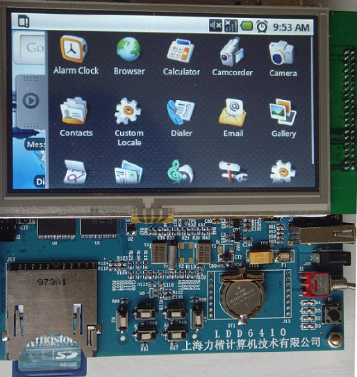
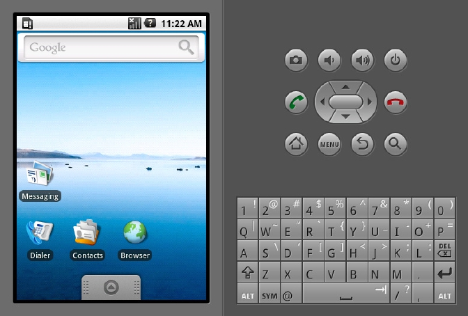

### 18.10.4 Android

Android是google推出的一个移动设备平台，其软件层次结构包括了一个操作系统（OS），中间件（MiddleWare）和应用程序（Application）。根据Android的软件框图，其软件层次结构自下而上分为以下几个层次。

（1）操作系统层（OS）。

（2）各种库（Libraries）和Android 运行时（RunTime）。

（3）应用程序框架（Application Framework）。

（4）应用程序（Applications）。

Android的应用程序主要涉及用户界面，通常以Java程序编写。Android本身提供了主屏幕（Home）、联系人、电话、浏览器等众多的核心应用。同时应用程序的开发者还可以使用应用程序框架层的API实现自己的程序。目前Android的应用开发非常热门，已有大量文档和书籍讲解，本书不再赘述。

LDD6410 整合了Android 1.6，LDD6410的Android本身作为Linux 文件系统的一部分进行管理。在系统启动后，运行根目录下的 android，系统将进入Android（如图18.12所示）。LDD6410 Android 支持按键、触摸屏和鼠标操作，显示设备可以是LCD（480*272）和VGA（1024*768@ 60Hz）。

在本书配套光盘中提供了Android 1.6 SDK android­sdk­linux_x86­1.6_r1.tgz，使用该SDK就可以生成支持LDD6410的Android，其步骤是：

（1）在PC上创建LDD6410虚拟机。

lihacker@lihacker­laptop: ～/develop/LDD6410/android­sdk­linux_x86­1.6_r1/ 
 
 tools$ ./android create avd ­n LDD6410 ­t 2 
 
 Android 1.6 is a basic Android platform. 
 
 Do you wish to create a custom hardware profile [no]y 
 
 Device ram size: The amount of physical RAM on the device, in megabytes. hw.ramSize 
 
 [96]:128 
 
 Touch­screen support: Whether there is a touch screen or not on the device. 
 
 hw.touchScreen [yes]: 
 
 Track­ball support: Whether there is a trackball on the device. hw.trackBall [yes]:n 
 
 Keyboard support: Whether the device has a QWERTY keyboard. 
 
 hw.keyboard [yes]:n 
 
 DPad support: Whether the device has DPad keys hw.dPad [yes]:y 
 
 GSM modem support: Whether there is a GSM modem in the device.

hw.gsmModem [yes]:n 
 
 Camera support: Whether the device has a camera. hw.camera [no]:n 
 
 Maximum horizontal camera pixels 
 
 hw.camera.maxHorizontalPixels [640]: Maximum vertical camera pixels hw.camera. 
 
 maxVerticalPixels [480]: 
 
 GPS support: Whether there is a GPS in the device. 
 
 hw.gps [yes]:n 
 
 Battery support: Whether the device can run on a battery. hw.battery [yes]:n 
 
 Accelerometer: Whether there is an accelerometer in the device. 
 
 hw.accelerometer [yes]:n 
 
 Audio recording support: Whether the device can record audio hw.audioInput [yes]: 
 
 Audio playback support: Whether the device can play audio 
 
 hw.audioOutput [yes]: 
 
 SD Card support: Whether the device supports insertion/removal of virtual SD Cards. 
 
 hw.sdCard [yes]: 
 
 Cache partition support: Whether we use a /cache partition on the device. 
 
 disk.cachePartition [yes]:n 
 
 Cache partition size disk.cachePartition.size [66MB]: 
 
 Abstracted LCD density: Must be one of 120, 160 or 240. A value used to roughly describe 
 
 the density of the LCD screen for automatic resource/asset selection. 
 
 hw.lcd.density [160]: 
 
 Created AVD 'LDD6410' based on Android 1.6, with the following hardware config: 
 
 hw.gps=no hw.dPad=yes hw.accelerometer=no hw.lcd.density=160 disk.cachePartition=no 
 
 hw.keyboard=no hw.trackBall=no hw.ramSize=128 hw.gsmModem=no hw.camera=no hw.battery=no

（2）在主机上创建一个sd card的image。

sudo ./mksdcard 128M sdcard.img

（3）在主机上启动Android模拟器，运行如下命令启动LDD6410虚拟机，如图18.3所示：

sudo ./emulator ­sdcard ./sdcard.img @LDD6410

启动adb shell连接LDD6410虚拟机，查看模拟器目标机上文件系统的挂载情况：

# mount 
 
 rootfs / rootfs ro 0 0

tmpfs /dev tmpfs rw,mode=755 0 0 
 
 devpts /dev/pts devpts rw,mode=600 0 0 
 
 proc /proc proc rw 0 0 
 
 sysfs /sys sysfs rw 0 0 
 
 tmpfs /sqlite_stmt_journals tmpfs rw,size=4096k 0 0 
 
 /dev/block/mtdblock0 /system yaffs2 ro 0 0 
 
 /dev/block/mtdblock1 /data yaffs2 rw,nosuid,nodev 0 0 
 
 /dev/block//vold/179:0 /sdcard vfat rw,dirsync,nosuid,nodev,noexec,uid=1000,gid=1015,fmask= 
 
 0702,dmask=0702,allow_utime=0020,c odepage=cp437,iocharset=iso8859­1,shortname=mixed,utf8 0 0

（4）提取Android 1.6。

把 busybox 放入模拟器目标机文件系统中：

./adb push ～/develop/svn/ldd6410/utils/busybox­1.15.1/_install/bin/busybox /data

我们现在把/system、/data、/sbin 目录以及根目录下的init、init.rc等都放入sdcard的image中：

# /data/busybox tar cvf /sdcard/android.tar /data /system /sbin /sqlite_stmt_journals 
 
 /init.rc 
 
 /init.goldfish.rc /init

进入/sdcard 目录看看得到的压缩文件：

# cd /sdcard 
 
 # ls ­l 
 
 ­­­­rwxr­x system sdcard_rw 78487552 2010­01­30 12:37 android.tar

在主机上以 loop 方式 mount sdcard 的 image，并将里面的文件放到LDD6410目标电路板的根文件系统即可。

