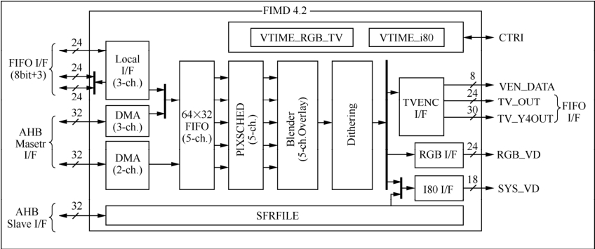
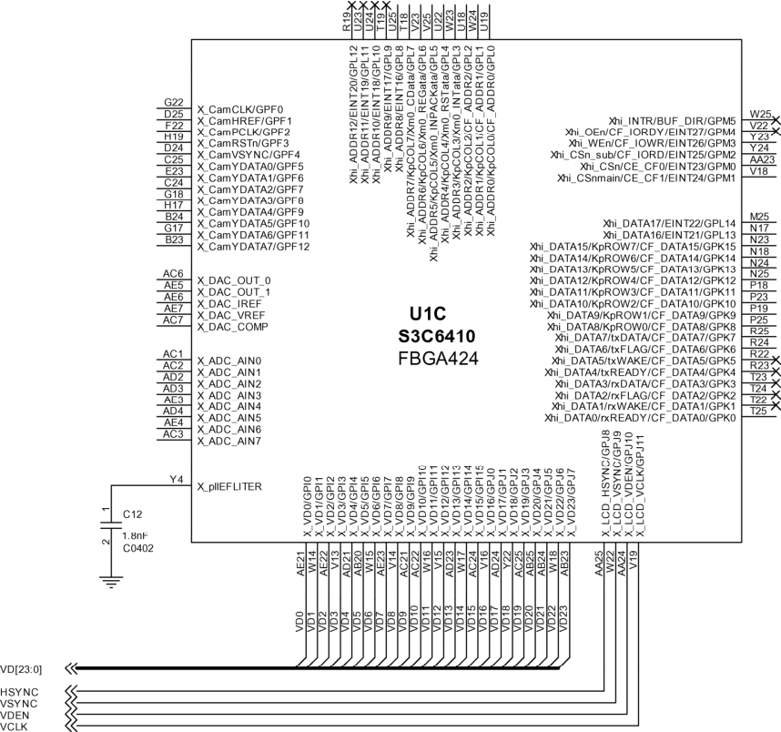
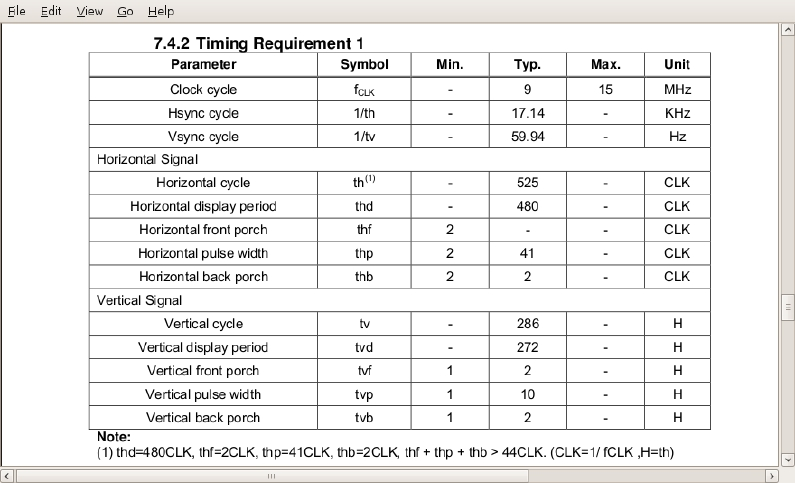

### 18.11 实例：S3C6410 LCD设备驱动

S3C6410内部集成了显示控制器，它可以将局部总线上来自后处理器（POST Processor）的图像数据和系统内存中的视频缓冲传输到外部的LCD接口上。图18.14给出了S3C6410显示控制器的框图，其LCD接口支持4种模式：传统的RGB接口、I80接口、NTSC/PAL标准电视接口和IT-R BT. 601接口。显示控制器针对视频数据的端口包括RGB_VD[23:0]、SYS_VD[17:0]和TV_OUT。

LDD6410开发板上可连接外部VGA显示器和东华、群创等LCD，VGA部分透过ADV7123芯片进行数字信号向模拟信号的转换，连接LCD则无需此转换过程，图18.15所示LDD6410开发板上S3C6410芯片外围的LCD接口信号。

在本书配套光盘Linux 2.6.28内核源代码的drivers/video/samsung目录下，包含了S3C6410 的LCD驱动。核心的工作由s3cfb.c、s3cfb_fimd4x.c等文件进行了实现，这些文件实现的主体内容是实现了framebuffer设备的注册、注销以及其中的fb_ops的功能函数，代码清单18.19抽取了s3cfb.c的框架。

代码清单18.19 S3C6410 LCD控制器驱动

1 struct fb_ops s3cfb_ops = { 
 
 2 .owner = THIS_MODULE, 
 
 3 .fb_check_var = s3cfb_check_var,

4 .fb_set_par = s3cfb_set_par, 
 
 5 .fb_blank = s3cfb_blank, 
 
 6 .fb_pan_display = s3cfb_pan_display, 
 
 7 .fb_setcolreg = s3cfb_setcolreg, 
 
 8 .fb_fillrect = cfb_fillrect, 
 
 9 .fb_copyarea = cfb_copyarea, 
 
 10 .fb_imageblit = cfb_imageblit, 
 
 11 #ifdef CONFIG_FRAMEBUFFER_CONSOLE 
 
 12 .fb_cursor = soft_cursor, 
 
 13 #endif 
 
 14 .fb_ioctl = s3cfb_ioctl, 
 
 15 }; 
 
 16 
 
 17 static void s3cfb_init_fbinfo(s3cfb_info_t *finfo, char *drv_name, int index) 
 
 18 { 
 
 19 ... 
 
 20 finfo->fb.fbops = &s3cfb_ops; 
 
 21 .. 
 
 22 } 
 
 23 
 
 24 static int __init s3cfb_probe(struct platform_device *pdev) 
 
 25 { 
 
 26 ... 
 
 27 fbinfo = framebuffer_alloc(sizeof(s3cfb_info_t), &pdev->dev); 
 
 28 ... 
 
 29 s3cfb_init_fbinfo(&s3cfb_info[index], driver_name, index); 
 
 30 ... 
 
 31 ret = s3cfb_init_registers(&s3cfb_info[index]); 
 
 32 ret = s3cfb_check_var(&s3cfb_info[index].fb.var, &s3cfb_info[index].fb); 
 
 33 ... 
 
 34 ret = register_framebuffer(&s3cfb_info[index].fb); 
 
 35 ... 
 
 36 } 
 
 37 
 
 38 static int s3cfb_remove(struct platform_device *pdev) 
 
 39 { 
 
 40 ... 
 
 41 unregister_framebuffer(&info[index].fb); 
 
 42 
 
 43 return 0; 
 
 44 } 
 
 45 
 
 46 static struct platform_driver s3cfb_driver = { 
 
 47 .probe = s3cfb_probe, 
 
 48 .remove = s3cfb_remove, 
 
 49 .suspend = s3cfb_suspend, 
 
 50 .resume = s3cfb_resume, 
 
 51 .driver = { 
 
 52 .name = "s3c-lcd", 
 
 53 .owner = THIS_MODULE, 
 
 54 }, 
 
 55 }; 
 
 56 
 
 57 int _ _devinit s3cfb_init(void) 
 
 58 {

59 return platform_driver_register(&s3cfb_driver); 
 
 60 } 
 
 61 static void __exit s3cfb_cleanup(void) 
 
 62 { 
 
 63 platform_driver_unregister(&s3cfb_driver); 
 
 64 } 
 
 65 
 
 66 module_init(s3cfb_init); 
 
 67 module_exit(s3cfb_cleanup);

由于通用的文件实现了核心的工作，对于具体的LCD面板和VGA而言，我们只需要进行定时和硬件参数的配置了。LDD6410开发板的东华4.3寸LCD面板（分辨率为480*272）的配置文件位于drivers/video/samsung/ s3cfb_wanxin.c，其代码如清单18.20。

代码清单18.20 LDD6410外接东华4.3寸LCD面板配置

1 #define S3CFB_HFP 2 /* front porch */ 
 
 2 #define S3CFB_HSW 41 /* hsync width */ 
 
 3 #define S3CFB_HBP 2 /* back porch */ 
 
 4 
 
 5 #define S3CFB_VFP 2 /* front porch */ 
 
 6 #define S3CFB_VSW 10 /* vsync width */ 
 
 7 #define S3CFB_VBP 2 /* back porch */ 
 
 8 
 
 9 #define S3CFB_HRES 480 /* horizon pixel x resolition */ 
 
 10 #define S3CFB_VRES 272 /* line cnt y resolution */ 
 
 11 
 
 12 #define S3CFB_HRES_VIRTUAL 480 /* horizon pixel x resolition */ 
 
 13 #define S3CFB_VRES_VIRTUAL (272*2)/* line cnt y resolution */ 
 
 14 
 
 15 #define S3CFB_HRES_OSD 480 /* horizon pixel x resolition */ 
 
 16 #define S3CFB_VRES_OSD 272 /* line cnt y resolution */ 
 
 17 
 
 18 #define S3CFB_VFRAME_FREQ 60 /* frame rate freq */ 
 
 19 
 
 20 #define S3CFB_PIXEL_CLOCK (S3CFB_VFRAME_FREQ * (S3CFB_HFP + S3CFB_HSW + S3CFB_HBP \ 
 
 21 + S3CFB_HRES) * (S3CFB_VFP + S3CFB_VSW + S3CFB_VBP + S3CFB_VRES)) 
 
 22 
 
 23 static void s3cfb_set_fimd_info(void) 
 
 24 { 
 
 25 ... 
 
 26 } 
 
 27 
 
 28 int s3cfb_wanxin_set_gpio(void) 
 
 29 { 
 
 30 ... 
 
 31 return 0; 
 
 32 } 
 
 33 
 
 34 
 
 35 void s3cfb_init_hw(void) 
 
 36 { 
 
 37 printk(KERN_INFO "WANXIN LCD will be initialized\n"); 
 
 38 
 
 39 s3cfb_set_fimd_info();

40 s3cfb_wanxin_set_gpio(); 
 
 41 }

S3CFB_HFP、S3CFB_HSW、S3CFB_HBP、S3CFB_VFP、S3CFB_VSW、S3CFB_VBP等宏的值都直接取材于该款LCD面板的数据手册中的7.4.2节，如图18.16所示。

LDD6410开发板外接VGA显示器的配置文件位于drivers/video/samsung/ s3cfb_vga.c，其中的S3CFB_HFP、S3CFB_HSW、S3CFB_HBP、S3CFB_VFP、S3CFB_VSW、S3CFB_VBP等宏的取值则直接来源于VESA（视频电子标准协会）工业标准。

光盘中附带的LDD6410工程源代码下的tests/framebuffer/fb_test.c文件实现了在电路板的4.3寸LCD显示器和1024*768分辨率VGA显示器上绘制色彩渐变的R、G、B三色矩形框的源代码，可以作为进一步学习framebuffer用户空间编程的实例。

