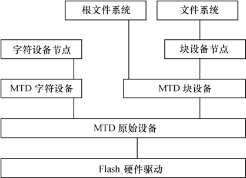

### 19.1.1 Linux MTD系统层次

在Linux系统中，提供了MTD（Memory Technology Device，内存技术设备）系统来建立Flash针对Linux的统一、抽象的接口。MTD将文件系统与底层的Flash存储器进行了隔离，使Flash驱动工程师无须关心Flash作为字符设备和块设备与Linux内核的接口。

如图19.1所示，在引入MTD后，Linux系统中的Flash设备驱动及接口可分为4层，从上到下依次是：设备节点、MTD设备层、MTD原始设备层和硬件驱动层，这4层的作用如下。

● 硬件驱动层：Flash硬件驱动层负责Flash硬件设备的读、写、擦除，Linux MTD设备的NOR Flash芯片驱动位于drivers/mtd/chips子目录下，NAND型Flash的驱动程序则位于/drivers/mtd/nand子目录下。

● MTD原始设备层：MTD原始设备层由两部分组成，一部分是MTD原始设备的通用代码，另一部分是各个特定的Flash的数据，例如分区。

● MTD设备层：基于MTD原始设备，Linux系统可以定义出MTD的块设备（主设备号31）和字符设备（设备号90），构成MTD设备层。MTD字符设备的定义在mtdchar.c中实现，通过注册一系列file_operation函数（lseek、open、close、read、write、ioctl）可实现对MTD设备的读写和控制。MTD块设备则是定义了一个描述MTD块设备的结构mtdblk_dev，并声明了一个名为mtdblks的指针数组，这数组中的每一个mtdblk_dev 和mtd_table中的每一个mtd_info一一对应。

● 设备节点：通过mknod在/dev子目录下建立MTD字符设备节点（主设备号为90）和MTD块设备节点（主设备号为31），用户通过访问此设备节点即可访问MTD字符设备和块设备。

