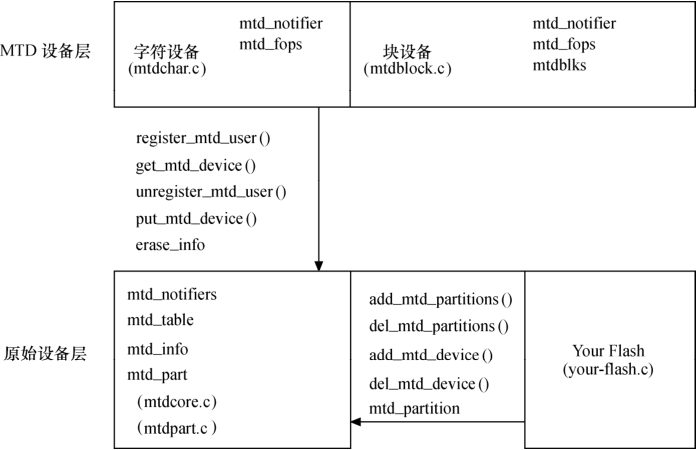

### 19.1.2 Linux MTD系统接口

如图19.2所示，在引入MTD后，底层Flash驱动直接与MTD原始设备层交互，利用其提供的接口注册设备和分区。

用于描述MTD原始设备的数据结构是mtd_info，这其中定义了大量关于MTD的数据和操作函数，这个结构体的定义如代码清单19.1所示。mtd_info是表示MTD原始设备的结构体，每个分区也被认为是一个mtd_info，例如，如果有两个MTD原始设备，而每个上有3个分区，在系统中就将共有6个mtd_info结构体，这些mtd_info的指针被存放在名为mtd_table的数组里。

代码清单19.1 mtd_info结构体

1 struct mtd_info { 
 
 2 u_char type; /* 内存技术的类型 */ 
 
 3 u_int32_t flags; /*标志位*/ 
 
 4 u_int32_t size; /*mtd设备的大小*/ 
 
 5 u_int32_t erasesize; /*主要的擦除块大小*/ 
 
 6 u_int32_t writesize; /*最小的可写单元的字节数*/ 
 
 7 u_int32_t oobsize; /* OOB字节数*/ 
 
 8 u_int32_t oobavail; /*可用的OOB字节数*/ 
 
 9 
 
 10 char *name; 
 
 11 int index; 
 
 12 struct nand_ecclayout *ecclayout; /*ECC布局结构体指针*/ 
 
 13 
 
 14 /*不同的erasesize的区域*/ 
 
 15 int numeraseregions; /*不同erasesize的区域的数目（通常是1）*/ 
 
 16 struct mtd_erase_region_info *eraseregions; 
 
 17 
 
 18 u_int32_t bank_size; 
 
 19 struct module *module; 
 
 20 int(*erase)(struct mtd_info *mtd, struct erase_info *instr); 
 
 21 
 
 22 /*针对eXecute-In-Place */ 
 
 23 int (*point) (struct mtd_info *mtd, loff_t from, size_t len, 
 
 24 size_t *retlen, void **virt, resource_size_t *phys); 
 
 25 
 
 26 /* 如果unpoint为空，不允许XIP */ 
 
 27 void (*unpoint) (struct mtd_info *mtd, loff_t from, size_t len); 
 
 28 
 
 29 int(*read)(struct mtd_info *mtd, loff_t from, size_t len, size_t *retlen, 
 
 30 u_char *buf); /*读Flash */

31 int(*write)(struct mtd_info *mtd, loff_t to, size_t len, size_t *retlen, 
 
 32 const u_char *buf); /*写Flash */ 
 
 33 int (*panic_write) (struct mtd_info *mtd, loff_t to, 
 
 34 size_t len, size_t *retlen, const u_char *buf); /*Kernel panic时继续写*/ 
 
 35 int (*read_oob) (struct mtd_info *mtd, loff_t 
 
 36 from,struct mtd_oob_ops *ops); /*读out-of-band */ 
 
 37 int (*write_oob) (struct mtd_info *mtd, loff_t to, 
 
 38 struct mtd_oob_ops *ops); /*写out-of-band */ 
 
 39 /* iovec-based 读写函数 */ 
 
 40 int (*writev) (struct mtd_info *mtd, const struct kvec 
 
 41 *vecs, unsigned long count, loff_t to, size_t *retlen); 
 
 42 
 
 43 /* Sync */ 
 
 44 void(*sync)(struct mtd_info *mtd); 
 
 45 
 
 46 /* 设备锁 */ 
 
 47 int(*lock)(struct mtd_info *mtd, loff_t ofs, size_t len); 
 
 48 int(*unlock)(struct mtd_info *mtd, loff_t ofs, size_t len); 
 
 49 /* 电源管理函数*/ 
 
 50 int(*suspend)(struct mtd_info *mtd); 
 
 51 void(*resume)(struct mtd_info *mtd); 
 
 52 
 
 53 /* 坏块管理函数*/ 
 
 54 int (*block_isbad) (struct mtd_info *mtd, loff_t ofs); 
 
 55 int (*block_markbad) (struct mtd_info *mtd, loff_t ofs); 
 
 56 ... 
 
 57 void *priv; /*私有数据*/ 
 
 58 ... 
 
 59 }

mtd_info的type字段给出底层物理设备的类型，包括MTD_RAM、MTD_ROM、MTD_ NORFLASH、MTD_NANDFLASH等。

flags字段标志可以是MTD_WRITEABLE、MTD_BIT_WRITEABLE、MTD_NO_ERASE、MTD_POWERUP_LOCK等的组合。针对ROM而言，不具有上述任何属性，因此MTD_CAP_ROM定义为0；MTD_CAP_RAM是MTD_WRITEABLE、MTD_BIT_WRITEABLE、MTD_NO_ERASE的组合；MTD_CAP_NORFLASH是MTD_WRITEABLE、MTD_BIT_WRITEABLE的组合，而对MTD_CAP_NANDFLASH则仅意味着MTD_WRITEABLE。

mtd_info中的read()、write()、read_oob()、write_oob()、erase()是MTD设备驱动要实现的主要函数，后面我们将看到，在NOR和NAND的驱动代码中几乎看不到mtd_info的成员函数（也即这些成员函数对于Flash芯片驱动是透明的），这是因为Linux在MTD的下层实现了针对NOR Flash和NAND Flash的通用的mtd_info成员函数。

某些内存技术支持带外数据（OOB），例如，NAND Flash每512字节就会有16个字节的“额外数据”，用于存放纠错码或文件系统元数据。这是因为，所有Flash器件都受“位翻转”现象的困扰，而NAND发生的概率比NOR大，因此NAND厂商推荐在使用NAND的时候最好要使用ECC（Error Checking and Correcting），汉明码是最简单的ECC。mtd_info的ecclayout类型即是描述OOB区域中ECC字节的布局情况。

Flash驱动中使用如下两个函数注册和注销MTD设备：

int add_mtd_device(struct mtd_info *mtd); 
 
 int del_mtd_device (struct mtd_info *mtd);

代码清单19.2所示的mtd_part结构体用于表示分区，其mtd_info结构体成员用于描述该分区，它会被加入到mtd_table（定义为struct mtd_info *mtd_table[MAX_MTD_DEVICES]）中，其大部分成员由其主分区mtd_part→master决定，各种函数也指向主分区的相应函数。

代码清单19.2 mtd_part结构体

1 struct mtd_part { 
 
 2 struct mtd_info mtd; /*分区的信息（大部分由其master决定）*/ 
 
 3 struct mtd_info *master; /*该分区的主分区*/ 
 
 4 u_int32_t offset; /*该分区的偏移地址*/ 
 
 5 int index; /*分区号*/ 
 
 6 struct list_head list; 
 
 7 int registered; 
 
 8 };

mtd_partition会在MTD原始设备层调用add_mtd_partions()时传递分区信息用，这个结构体的定义如代码清单19.3所示。

代码清单19.3 mtd_partition结构体

1 struct mtd_partition { 
 
 2 char *name; /* 标识字符串 */ 
 
 3 u_int32_t size; /* 分区大小 */ 
 
 4 u_int32_t offset; /* 主MTD空间内的偏移*/ 
 
 5 u_int32_t mask_flags; /* 掩码标志 */ 
 
 6 struct nand_ecclayout *ecclayout; /* OOB布局 */ 
 
 7 struct mtd_info **mtdp; 
 
 8 };

Flash驱动中使用如下两个函数注册和注销分区：

int add_mtd_partitions(struct mtd_info *master, struct mtd_partition *parts, int nbparts); 
 
 int del_mtd_partitions(struct mtd_info *master);

add_mtd_partitions()会对每一个新建分区建立一个新的mtd_part结构体，将其加入mtd_ partitions中，并调用add_mtd_device()将此分区作为MTD设备加入mtd_table。成功时返回0，如果分配mtd_part时内存不足，则返回-ENOMEM。

del_mtd_partitions()的作用是对于mtd_partitions上的每一个分区，如果它的主分区是master（参数master是被删除分区的主分区），则将它从mtd_partitions和mtd_table中删除并释放掉，这个函数会调用del_mtd_device()。

add_mtd_partitions()中新建的mtd_part需要依赖传入的mtd_partition参数对其进行初始化，如代码清单19.4所示。

代码清单19.4 add_mtd_partitions()函数

1 int add_mtd_partitions(struct mtd_info *master, 
 
 2 const struct mtd_partition *parts, 
 
 3 int nbparts) 
 
 4 { 
 
 5 struct mtd_part *slave; 
 
 6 u_int32_t cur_offset = 0; 
 
 7 int i; 
 
 8 
 
 9 printk(KERN_NOTICE "Creating %d MTD partitions on \"%s\":\n", nbparts, master→name); 
 
 10

11 for (i = 0; i < nbparts; i++) { 
 
 12 slave = add_one_partition(master, parts + i, i, cur_offset); 
 
 13 if (!slave) 
 
 14 return -ENOMEM; 
 
 15 cur_offset = slave→offset + slave→mtd.size; 
 
 16 } 
 
 17 
 
 18 return 0; 
 
 19 } 
 
 20 
 
 21 static struct mtd_part *add_one_partition(struct mtd_info *master, 
 
 22 const struct mtd_partition *part, int partno, 
 
 23 u_int32_t cur_offset) 
 
 24 { 
 
 25 struct mtd_part *slave; 
 
 26 
 
 27 /* allocate the partition structure */ 
 
 
 28 slave = kzalloc(sizeof(*slave), GFP_KERNEL); 
 
 29 ... 
 
 30 list_add(&slave→list, &mtd_partitions); 
 
 31 
 
 32 
 /* 设置分区的 
 MTD对象 
 */ 
 
 
 33 slave→ 
 mtd.type = master→type; 
 
 
 34 slave→ 
 mtd.flags = master→flags & ~part→mask_flags; 
 
 
 35 slave→ 
 mtd.size = part→size; 
 
 
 36 slave→ 
 mtd.writesize = master→writesize; 
 
 
 37 slave→ 
 mtd.oobsize = master→oobsize; 
 
 
 38 slave→ 
 mtd.oobavail = master→oobavail; 
 
 
 39 slave→ 
 mtd.subpage_sft = master→subpage_sft; 
 
 
 40 
 
 
 41 slave→ 
 mtd.name = part→name; 
 
 
 42 slave→ 
 mtd.owner = master→owner; 
 
 
 43 
 
 
 44 slave→ 
 mtd.read = part_read; 
 
 
 45 slave→ 
 mtd.write = part_write; 
 
 46 
 
 47 ... 
 
 48 
 
 49 if (slave→offset == MTDPART_OFS_APPEND) 
 
 50 slave→offset = cur_offset; 
 
 51 if (slave→offset == MTDPART_OFS_NXTBLK) { 
 
 52 slave→offset = cur_offset; 
 
 53 if ((cur_offset % master→erasesize) != 0) { 
 
 54 slave→offset= ((cur_offset / master→erasesize) + 1) * master→erasesize; 
 
 55 printk(KERN_NOTICE "Moving partition %d: " 
 
 56 "0x%08x → 0x%08x\n", partno, 
 
 57 cur_offset, slave→offset); 
 
 58 } 
 
 59 } 
 
 60 if (slave→mtd.size == MTDPART_SIZ_FULL) 
 
 61 slave→mtd.size = master→size - slave→offset; 
 
 62 
 
 63 ... 
 
 64 
 
 65 /* 注册分区 */

66 add_mtd_device(&slave→mtd);

67

68 return slave;

69 }

最后，为了使系统能支持MTD字符设备与块设备及MTD分区，在编译内核时应该包括相应的配置选项，如下所示。

Memory Technology Devices (MTD)--→ 
 
 <*> Memory Technology Device (MTD) support 
 
 [*] MTD partitioning support 
 
 …… 
 
 --- User Modules And Translation Layers 
 
 <*> Direct char device access to MTD devices 
 
 <*> Caching block device access to MTD devices 
 
 ……

