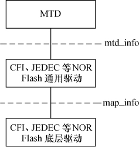
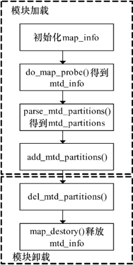

### 19.2 NOR Flash驱动

在Linux系统中，实现了针对CFI（公共Flash接口）、JEDEC（电子元件工业联合会）等接口的通用NOR驱动，这一层的驱动直接面向mtd_info的成员函数，这使得NOR的芯片级驱动变得十分简单，只需要定义具体的内存映射情况结构体map_info并使用指定接口类型调用do_map_ probe()。

NOR Flash驱动的核心是定义map_info结构体，它指定了NOR Flash的基址、位宽、大小等信息以及Flash的读写函数，该结构体对于NOR Flash驱动而言非常关键，甚至NOR Flash驱动的代码本质上可以被认作是根据map_info探测芯片的过程，其定义如代码清单19.7所示。

代码清单19.7 map_info结构体

1 struct map_info { 
 
 2 char *name; 
 
 3 unsigned long size; 
 
 4 unsigned long phys; 
 
 5 #define NO_XIP (-1UL) 
 
 6 
 
 7 void __iomem *virt; /* 虚拟地址 */ 
 
 8 void *cached; 
 
 9 
 
 10 int bankwidth; /* 总线宽度 */ 
 
 11 
 
 12 #ifdef CONFIG_MTD_COMPLEX_MAPPINGS 
 
 13 map_word(*read)(struct map_info *, unsigned long); 
 
 14 void(*copy_from)(struct map_info *, void *, unsigned long, ssize_t); 
 
 15 
 
 16 void(*write)(struct map_info *, const map_word, unsigned long); 
 
 17 void(*copy_to)(struct map_info *, unsigned long, const void *, ssize_t); 
 
 18 #endif 
 
 19 /* 缓存的虚拟地址 */ 
 
 20 void(*inval_cache)(struct map_info *, unsigned long, ssize_t); 
 
 21 
 
 22 void(*set_vpp)(struct map_info *, int); 
 
 23 
 
 24 unsigned long map_priv_1; 
 
 25 unsigned long map_priv_2; 
 
 26 void *fldrv_priv; 
 
 27 struct mtd_chip_driver *fldrv; 
 
 28 };

NOR Flash驱动在Linux中的实现非常简单，如图19.4所示，主要的工作如下。

（1）定义map_info的实例，初始化其中的成员，根据目标板的情况为name、size、bankwidth 和phys赋值。

（2）如果Flash要分区，则定义mtd_partition数组，将实际电路板中Flash分区信息记录于其中。

（3）以map_info和探测的接口类型（如"cfi_probe"、"jedec_probe"等）为参数调用do_map_ probe()，探测Flash得到mtd_info。

do_map_probe()的函数原型为：

struct mtd_info *do_map_probe(const char *name, struct map_info *map);

第一个参数为探测的接口类型，常见的调用方法如下。

do_map_probe("cfi_probe",&xxx_map_info); 
 
 do_map_probe("jedec_probe",&xxx_map_info); 
 
 do_map_probe("map_rom",&xxx_map_info);

do_map_probe()会根据传入的参数name通过get_mtd_chip_driver()得到具体的MTD驱动，调用与接口对应的probe()函数探测设备，如代码清单19.8所示。

代码清单19.8 do_map_probe()函数

1 struct mtd_info *do_map_probe(const char *name, struct map_info *map) 
 
 2 { 
 
 3 struct mtd_chip_driver *drv; 
 
 4 struct mtd_info *ret; 
 
 5 
 
 6 drv = get_mtd_chip_driver(name);/* 通过名称获得驱动 */ 
 
 7 
 
 8 if (!drv && !request_module("%s", name)) 
 
 9 drv = get_mtd_chip_driver(name); 
 
 10 
 
 11 if (!drv) 
 
 12 return NULL; 
 
 13

14 ret = drv→probe(map);/* 调用驱动的探测函数 */ 
 
 15 
 
 16 module_put(drv→module); 
 
 17 if (ret) 
 
 18 return ret; 
 
 19 
 
 20 return NULL; 
 
 21 }

利用map_info中的配置，do_map_probe()可以自动识别支持CFI或JEDEC接口的Flash芯片，MTD以后会自动采用适当的命令参数对Flash进行读写或擦除。

（4）在模块初始化时以mtd_info为参数调用add_mtd_device()或以mtd_info、mtd_partition数组及分区数为参数调用add_mtd_partitions()注册设备或分区。当然，在这之前可以调用parse_mtd_partitions()查看Flash上是否已有分区信息，并将查看出的分区信息通过add_mtd_partitions()注册。

（5）在模块卸载时调用第4行函数的“反函数”删除设备或分区。

代码清单19.9所示为一个最简单的NOR Flash驱动模板。

代码清单19.9 NOR Flash设备驱动模板

1 #define WINDOW_SIZE ... 
 
 2 #define WINDOW_ADDR ... 
 
 3 static struct map_info xxx_map = { /*map_info */ 
 
 4 .name = "xxx Flash", 
 
 5 .size = WINDOW_SIZE, /*大小*/ 
 
 6 .bankwidth = 1, /*总线宽度*/ 
 
 7 .phys = WINDOW_ADDR /*物理地址*/ 
 
 8 }; 
 
 9 
 
 10 static struct mtd_partition xxx_partitions[] = { /* mtd_partition */ 
 
 11 { 
 
 12 .name = "Drive A", 
 
 13 .offset = 0, /*分区的偏移地址*/ 
 
 14 .size = 0x0e0000 /*分区大小*/ 
 
 15 }, 
 
 16 ... 
 
 17 }; 
 
 18 
 
 19 #define NUM_PARTITIONS ARRAY_SIZE(xxx_partitions) 
 
 20 
 
 21 static struct mtd_info *mymtd; 
 
 22 
 
 23 static int __init init_xxx_map(void) 
 
 24 { 
 
 25 int rc = 0; 
 
 26 
 
 27 xxx_map.virt=ioremap_nocache(xxx_map.phys, xxx_map.size);/*物理→虚拟地址*/ 
 
 28 
 
 29 if (!xxx_map.virt) { 
 
 30 printk(KERN_ERR "Failed to ioremap_nocache\n"); 
 
 31 rc = -EIO; 
 
 32 goto err2; 
 
 33 } 
 
 34 
 
 35 simple_map_init(&xxx_map); 
 
 36

37 mymtd = do_map_probe("jedec_probe", &xxx_map);/*探测nor Flash */ 
 
 38 if (!mymtd) { 
 
 39 rc = -ENXIO; 
 
 40 goto err1; 
 
 41 } 
 
 42 
 
 43 mymtd→owner = THIS_MODULE; 
 
 44 add_mtd_partitions(mymtd, xxx_partitions, NUM_PARTITIONS);/*添加分区信息*/ 
 
 45 
 
 46 return 0; 
 
 47 
 
 48 err1: 
 
 49 map_destroy(mymtd); 
 
 50 iounmap(xxx_map.virt); 
 
 51 err2: 
 
 52 return rc; 
 
 53 } 
 
 54 
 
 55 static void _ _exit cleanup_xxx_map(void) 
 
 56 { 
 
 57 if (mymtd) { 
 
 58 del_mtd_partitions(mymtd);/*删除分区*/ 
 
 59 map_destroy(mymtd); 
 
 60 } 
 
 61 
 
 62 if (xxx_map.virt) { 
 
 63 iounmap(xxx_map.virt); 
 
 64 xxx_map.virt = NULL; 
 
 65 } 
 
 66 }

