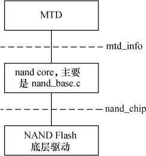
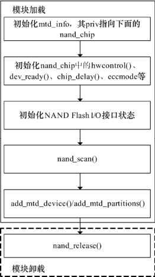

### 19.3 NAND Flash驱动

和NOR Flash非常类似，如图19.5所示，Linux内核在MTD的下层实现了通用的NAND驱动（主要通过drivers/mtd/nand/ nand_base.c文件实现），因此芯片级的NAND驱动不再需要实现mtd_info中的read()、write()、read_oob()、write_oob()等成员函数，而主体转移到了nand_chip数据结构。

MTD使用nand_chip数据结构表示一个NAND Flash芯片，这个结构体中包含了关于NAND Flash的地址信息、读写方法、ECC模式、硬件控制等一系列底层机制，其定义如代码清单19.10所示。

代码清单19.10 nand_chip结构体

1 struct nand_chip { 
 
 2 void __iomem *IO_ADDR_R; /* 读8位I/O线的地址，由板决定 */ 
 
 3 void __iomem *IO_ADDR_W; /* 写8位I/O线的地址，由板决定 */ 
 
 4

5 uint8_t (*read_byte)(struct mtd_info *mtd); 
 
 6 u16 (*read_word)(struct mtd_info *mtd); 
 
 7 void (*write_buf)(struct mtd_info *mtd, const uint8_t *buf, int len); 
 
 8 void (*read_buf)(struct mtd_info *mtd, uint8_t *buf, int len); 
 
 9 int (*verify_buf)(struct mtd_info *mtd, const uint8_t *buf, int len); 
 
 10 void (*select_chip)(struct mtd_info *mtd, int chip); /* 片选芯片 */ 
 
 11 int (*block_bad)(struct mtd_info *mtd, loff_t ofs, int getchip); /* 是否坏块 */ 
 
 12 int (*block_markbad)(struct mtd_info *mtd, loff_t ofs); /* 标记坏块 */ 
 
 13 void (*cmd_ctrl)(struct mtd_info *mtd, int dat, 
 
 14 unsigned int ctrl); /* 控制ALE/CLE/nCE，也用于写命令和地址 */ 
 
 15 int (*dev_ready)(struct mtd_info *mtd); /* 设备就绪 */ 
 
 16 void (*cmdfunc)(struct mtd_info *mtd, unsigned command, int column, int page_addr); 
 
 17 int (*waitfunc)(struct mtd_info *mtd, struct nand_chip *this); 
 
 18 void (*erase_cmd)(struct mtd_info *mtd, int page); 
 
 19 int (*scan_bbt)(struct mtd_info *mtd); 
 
 20 int (*errstat)(struct mtd_info *mtd, struct nand_chip *this, int state, int status, int page); 
 
 21 int (*write_page)(struct mtd_info *mtd, struct nand_chip *chip, 
 
 22 const uint8_t *buf, int page, int cached, int raw); 
 
 23 
 
 24 int chip_delay; 
 
 25 unsigned int options; 
 
 26 
 
 27 int page_shift; 
 
 28 int phys_erase_shift; 
 
 29 int bbt_erase_shift; 
 
 30 int chip_shift; 
 
 31 int numchips; 
 
 32 unsigned long chipsize; 
 
 33 int pagemask; 
 
 34 int pagebuf; 
 
 35 int subpagesize; 
 
 36 uint8_t cellinfo; 
 
 37 int badblockpos; 
 
 38 
 
 39 nand_state_t state; 
 
 40 
 
 41 uint8_t *oob_poi; 
 
 42 struct nand_hw_control *controller; 
 
 43 struct nand_ecclayout *ecclayout; 
 
 44 
 
 45 struct nand_ecc_ctrl ecc; 
 
 46 struct nand_buffers *buffers; 
 
 47 struct nand_hw_control hwcontrol; 
 
 48 
 
 49 struct mtd_oob_ops ops; 
 
 50 
 
 51 uint8_t *bbt; 
 
 52 struct nand_bbt_descr *bbt_td; 
 
 53 struct nand_bbt_descr *bbt_md; 
 
 54 
 
 55 struct nand_bbt_descr *badblock_pattern; 
 
 56 
 
 57 void *priv; 
 
 58 };

与NOR Flash类似，由于有了MTD层，完成一个NAND Flash驱动在Linux中的工作量也很小，如图19.6所示，主要的工作如下。

（1）如果Flash要分区，则定义mtd_partition数组，将实际电路板中Flash分区信息记录于其中。

（2）在模块加载时分配和nand_chip的内存，根据目标板NAND控制器的情况初始化nand_chip中的cmd_ctrl ()、dev_ready()、read_byte()、read_buf()、write_buf()、select_chip()、block_bad()、block_markbad()等成员函数（如果不赋值会使用nand_base.c中的默认函数，这里典型利用了面向对象的继承和重载的思想），注意将mtd_info的priv置为nand_chip。

（3）以mtd_info为参数调用nand_scan()函数探测NAND Flash的存在。nand_scan()函数的原型为：

int nand_scan (struct mtd_info *mtd, int maxchips);

nand_scan()函数会读取NAND芯片ID，并根据mtd→priv即nand_chip中的成员初始化mtd_info。

（4）如果要分区，则以mtd_info和mtd_partition为参数调用add_mtd_partitions()，添加分区信息。

代码清单19.11所示为一个简单的NAND Flash设备驱动模板。

代码清单19.11 NAND Flash设备驱动模板

1 #define CHIP_PHYSICAL_ADDRESS ... 
 
 2 #define NUM_PARTITIONS 2 
 
 3 static struct mtd_partition partition_info[] = { 
 
 4 { 
 
 5 .name = "Flash partition 1", .offset = 0, .size = 8 * 1024 * 1024 
 
 6 }, 
 
 7 { 
 
 8 .name = "Flash partition 2", .offset = MTDPART_OFS_NEXT, .size = 
 
 9 MTDPART_SIZ_FULL 
 
 10 } , 
 
 11 }; 
 
 12 int __init board_init(void) 
 
 13 { 
 
 14 struct nand_chip *this; 
 
 15 int err = 0; 
 
 16 /* 为MTD设备结构体和nand_chip分配内存 */

17 board_mtd = kmalloc(sizeof(struct mtd_info) + sizeof(struct nand_chip), 
 
 18 GFP_KERNEL); 
 
 19 if (!board_mtd) { 
 
 20 printk("Unable to allocate NAND MTD device structure.\n"); 
 
 21 err = - ENOMEM; 
 
 22 goto out; 
 
 23 } 
 
 24 /* 初始化结构体 */ 
 
 25 memset((char*)board_mtd, 0, sizeof(struct mtd_info) + sizeof(struct nand_chip)); 
 
 26 /* 映射物理地址 */ 
 
 27 baseaddr = (unsigned long)ioremap(CHIP_PHYSICAL_ADDRESS, 1024); 
 
 28 if (!baseaddr) { 
 
 29 printk("Ioremap to access NAND chip failed\n"); 
 
 30 err = - EIO; 
 
 31 goto out_mtd; 
 
 32 } 
 
 33 /* 获得私有数据（nand_chip）指针 */ 
 
 34 this = (struct nand_chip*)(&board_mtd[1]); 
 
 35 /* 将nand_chip赋予mtd_info私有指针 */ 
 
 36 board_mtd→priv = this; 
 
 37 /* 设置NAND Flash的I/O基地址 */ 
 
 38 this→IO_ADDR_R = baseaddr; 
 
 39 this→IO_ADDR_W = baseaddr; 
 
 40 /* 硬件控制函数 */ 
 
 41 this→cmd_ctrl = board_hwcontrol; 
 
 42 /* 初始化设备ready函数 */ 
 
 43 this→dev_ready = board_dev_ready; 
 
 44 /* 扫描以确定设备的存在 */ 
 
 45 if (nand_scan(board_mtd, 1)) { 
 
 46 err = - ENXIO; 
 
 47 goto out_ior; 
 
 48 } 
 
 49 /* 添加分区 */ 
 
 50 add_mtd_partitions(board_mtd, partition_info, NUM_PARTITIONS); 
 
 51 goto out; 
 
 52 out_ior: iounmap((void*)baseaddr); 
 
 53 out_mtd: kfree(board_mtd); 
 
 54 out: return err; 
 
 55 } 
 
 56 
 
 57 static void _ _exit board_cleanup(void) 
 
 58 { 
 
 59 /* 释放资源，注销设备 */ 
 
 60 nand_release(board_mtd); 
 
 61 /* unmap物理地址 */ 
 
 62 iounmap((void*)baseaddr); 
 
 63 /* 释放MTD设备结构体 */ 
 
 64 kfree(board_mtd); 
 
 65 } 
 
 66 
 
 67 /* 硬件控制 */ 
 
 68 static void board_hwcontrol(struct mtd_info *mtd, int dat, unsigned int ctrl) 
 
 69 { 
 
 70 ... 
 
 71 if (ctrl & NAND_CTRL_CHANGE) { 
 
 72 if (ctrl & NAND_NCE) { 
 
 73 ...

74 } 
 
 75 
 
 76 /* 返回设备ready状态 */ 
 
 77 static int board_dev_ready(struct mtd_info *mtd) 
 
 78 { 
 
 79 return xxx_read_ready_bit(); 
 
 80 }

最后要强调的是，在NAND芯片级驱动中，如果在nand_chip中没有赋值，将使用如代码清单19.12所示的默认分布。因此，若不使用默认分布，在NAND驱动中，应该根据实际NAND控制器和NAND芯片的情况给nand_chip的nand_ecc_ctrl结构体类型成员ecc赋值，定义OOB的分布和模式。

代码清单19.12 NAND驱动默认的OOB分布

1 /* 页大小为256、512、2K、4K字节情况下默认的ECC布局 */ 
 
 2 
 
 3 static struct nand_ecclayout nand_oob_8 = { 
 
 4 .eccbytes = 3, 
 
 5 .eccpos = {0, 1, 2}, 
 
 6 .oobfree = { 
 
 7 {.offset = 3, 
 
 8 .length = 2}, 
 
 9 {.offset = 6, 
 
 10 .length = 2}} 
 
 11 }; 
 
 12 
 
 13 static struct nand_ecclayout nand_oob_16 = { 
 
 14 .eccbytes = 6, 
 
 15 .eccpos = {0, 1, 2, 3, 6, 7}, 
 
 16 .oobfree = { 
 
 17 {.offset = 8, 
 
 18 . length = 8}} 
 
 19 }; 
 
 20 
 
 21 static struct nand_ecclayout nand_oob_64 = { 
 
 22 .eccbytes = 24, 
 
 23 .eccpos = { 
 
 24 40, 41, 42, 43, 44, 45, 46, 47, 
 
 25 48, 49, 50, 51, 52, 53, 54, 55, 
 
 26 56, 57, 58, 59, 60, 61, 62, 63}, 
 
 27 .oobfree = { 
 
 28 {.offset = 2, 
 
 29 .length = 38}} 
 
 30 }; 
 
 31 
 
 32 static struct nand_ecclayout nand_oob_128 = { 
 
 33 .eccbytes = 104, 
 
 34 .eccpos = { 
 
 35 24, 25, 26, 27, 28, 29, 30, 31, 
 
 36 32, 33, 34, 35, 36, 37, 38, 39, 
 
 37 40, 41, 42, 43, 44, 45, 46, 47, 
 
 38 48, 49, 50, 51, 52, 53, 54, 55, 
 
 39 56, 57, 58, 59, 60, 61, 62, 63, 
 
 40 64, 65, 66, 67, 68, 69, 70, 71, 
 
 41 72, 73, 74, 75, 76, 77, 78, 79, 
 
 42 80, 81, 82, 83, 84, 85, 86, 87, 
 
 43 88, 89, 90, 91, 92, 93, 94, 95, 
 
 44 96, 97, 98, 99, 100, 101, 102, 103,

45 104, 105, 106, 107, 108, 109, 110, 111, 
 
 46 112, 113, 114, 115, 116, 117, 118, 119, 
 
 47 120, 121, 122, 123, 124, 125, 126, 127}, 
 
 48 .oobfree = { 
 
 49 {.offset = 2, 
 
 50 .length = 22}} 
 
 51 };

上述代码中的eccpos表明ECC校验码在OOB区域的存放位置，eccbytes是校验码的长度，oobfree则是除了校验码之外可用的OOB字节。

nand_ecc_ctrl 结构体的mode字段定义ECC的放置模式，包括MTD_NANDECC_OFF（不使用ECC）、NAND_ECC_SOFT（使用软件ECC）、NAND_ECC_HW（使用硬件ECC）等。如果NAND控制器支持通过硬件进行ECC校验，则最好使用NAND_ECC_HW。

内核中包含了一个NAND模拟器nandsim，使用一片内存区域模拟NAND，在没有电路板的情况下，可以使用nandsim模拟NAND芯片。YAFFS和YAFFS2中分别包含了nandemul和nandemul2k（用于模拟页大小为2KB的NAND），也可以模拟NAND。

