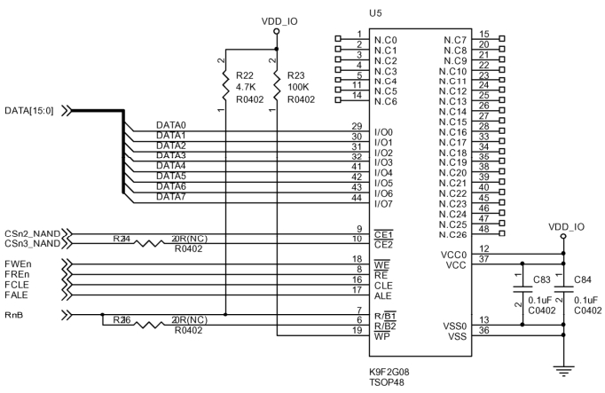

### 19.5.1 S3C6410 NAND控制器硬件描述

S3C6410处理器集成了一个NAND控制器，它支持页大小为512字节和2048字节的SLC或MLC NAND Flash。对SLC工艺Flash，支持1-bit的硬件ECC，对MLC工艺Flash，支持4-bit 或8-bit的硬件ECC。

LDD6410开发板连接了一块K9F2G08的NAND Flash，其原理如图19.7所示，使用的驱动是drivers/mtd/nand/s3c_nand.c，它同时支持S3C64XX、S5P64XX、S5PC1XX处理器，对应的内核配置选项为MTD_NAND_S3C，如果要使用硬件ECC功能，还需要使能MTD_NAND_S3C_HWECC。

