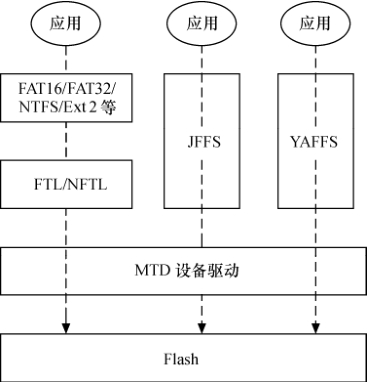

### 19.6.1 Flash转换层

由于无法重复地在Flash的同一块存储位置做写入操作（必须事先擦除该块后才能再写入），因此一般在硬盘上使用的文件系统，如VFAT、NTFS、EXT2、EXT3等将无法直接用在Flash上，为了沿用这些文件系统，则必须透过一层转换层（Translation Layer）来将逻辑块地址（Logical Block Address）对应到Flash存储器的物理位置，使系统能把Flash当作普通的硬盘一样处理，我们称这层为FTL（Flash Translation Layer）。FTL应用于NOR Flash，而NFTL则应用于NAND Flash，如图19.8所示。

一个闪存转换层的最简单的实现就是将模拟的块设备一对一地映射到闪存上。举例来说，当上层的文件系统要写一个块设备的扇区时，闪存转换层要做下面的操作来完成这个写请求。

（1）将这个扇区所在擦除块的数据读到内存中，放在缓存中。

（2）将缓存中与这个扇区对应的内容用新的内容替换。

（3）对该擦除块执行擦除操作。

（4）将缓冲中的数据写回该擦除块。

这种实现方式的缺点如下。

● 效率低，对一个扇区的更新要重写整个擦除块上的数据，造成数据带宽很大的浪费。可行的办法是只有当文件系统的写请求超过了一个擦除块的边界的时候，才去执行对闪存的擦除、写回操作（这种更新方式也叫out-of-place）。

● 没有提供磨损平衡，那些被频繁更新的数据所在擦除块将首先变成坏块。

● 非常不安全，很容易引起数据的丢失。如果在上面的第（3）步和第（4）步之间发生了突然掉电，那么整个擦除块中的数据就全部丢失了。

为了解决上面这种实现方式的问题，闪存转换层不能只是简单地实现块设备与闪存的一一映射，它还需要将模拟块设备的扇区存储在闪存的不同位置，并且维持扇区到闪存的映射关系。而为了进行垃圾回收（Garbage Collection），闪存转换层必须能理解上层文件系统的语义。这样实现导致的最大问题就是效率不高，具体来说，闪存转换层为了能理解上层文件系统的语义，必须对文件系统的每个写请求进行解析，因此导致写操作的性能下降。另外，从软件的架构上来讲，要求文件系统下面的一层去理解文件系统的语义，也不太合理。因此，在Flash上，应尽可能地避免使用传统的依赖闪存转换层的文件系统，最好应采用专门的针对Flash的文件系统。

