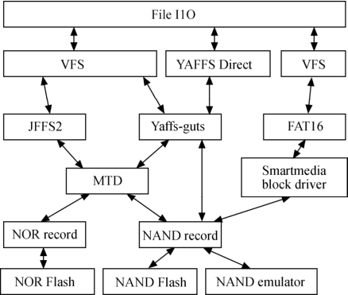

### 19.6.4 YAFFS/YAFFS2

YAFFS（Yet Another Flash File System，http:/*www.yaffs.net）文件系统是专门针对NAND闪存设计的嵌入式文件系统，目前有YAFFS和YAFFS2两个版本，两个版本的主要区别之一在于YAFFS2能够更好地支持大容量的NAND Flash芯片，而前者只针对页大小为512字节的NAND。

YAFFS文件系统有些类似于JFFS/JFFS2文件系统，与之不同的是JFFS1/2文件系统最初是针对NOR Flash的应用场合设计的，而NOR Flash和NAND Flash本质上有较大的区别，所以尽管JFFS1/2文件系统也能应用于NAND Flash，但由于它在内存占用和启动时间方面针对NOR的特性做了一些取舍，所以对NAND来说通常并不是最优的方案。NAND上的每一页数据都有额外的空间用来存储附加信息，YAFFS正好利用了该空间中一部分来存储文件系统相关的内容。

YAFFS和JFFS都提供了写均衡、垃圾收集等底层操作，它们的不同之处如下。

● JFFS是一种日志文件系统，通过日志机制保证文件系统的稳定性。YAFFS仅仅借鉴了日志系统的思想，不提供日志机能，所以稳定性不如JFFS，但是资源占用少。

● JFFS中使用多级链表管理需要回收的脏块，并且使用系统生成伪随机变量决定要回收的块，通过这种方法能提供较好的写均衡，在YAFFS中是从头到尾对块搜索，所以在垃圾收集上JFFS的速度慢，但是能延长NAND的寿命。

● JFFS支持文件压缩，适合存储容量较小的系统；YAFFS不支持压缩，更适合存储容量较大的系统。

● YAFFS还带有NAND芯片驱动，并为嵌入式系统提供了直接访问文件系统的API，用户可以不使用Linux中的MTD和VFS，直接对文件进行操作（如图19.8）。尽管如此，NAND Flash大多还是采用MTD+YAFFS的模式。

● YAFFS使用OOB组织文件结构信息，而JFFS直接将节点信息保存在NAND数据区域里面，因此YAFFS在mount时只需读取OOB，其mount时间远小于JFFS。

在Linux 2.6内核下，YAFFS文件系统的移植非常简单，主要包括以下工作。

（1）复制YAFFS源代码到Linux源码树。

只需要在内核中建立YAFFS 目录fs/yaffs，并把下载的YAFFS代码复制到该目录下面（YAFFS代码包括yaffs_ecc.c、yaffs_fileem.c、yaffs_fs.c、yaffs_guts.c、yaffs_mtdif.c、yaffs_ramem.c），下载的YAFFS源代码已包含了Kconfig和Makefile，因此只需要修改fs目录下的Kconfig和Makefile并引用fs/yaffs中的对应文件即可，方法是：在fs/Kconfig中增加source "fs/yaffs/Kconfig"；在fs/Makefile中增加obj-$(CONFIG_YAFFS_FS) += yaffs/。

（2）配置内核编译选项。

在采用make menuconfig等方式配置内核编译选项时，除了应该选中MTD系统及目标板上Flash的驱动以外，也必须选中对YAFFS的支持，如下所示：

File systems --→ 
 
 Miscellaneous filesystems --→ 
 
 <*> Yet Another Flash Filing System(YAFFS) file system support 
 
 [*] NAND mtd support 
 
 [*] Use ECC functions of the generic MTD-NAND driver

[*] Use Linux file caching layer 
 
 [*] Turn off debug chunk erase check 
 
 [*] Cache short names in RAM

（3）挂载YAFFS。

YAFFS源代码包的utils 目录下包含了mkyaffs工具，可以用它格式化Flash，例如运行mkyaffs /dev/mtd3将用YAFFS文件系统格式化NAND的第3个分区，之后我们可以运行如下命令挂载YAFFS：

mount –t yaffs /dev/mtdblock3 /mnt/nand

此后，对/mnt/nand的操作就是对/dev/mtdblock3的操作。

如果运行如下命令将根文件系统复制到/mnt/Flash0：

mount –t yaffs /dev/mtdblock3 /mnt/nand 
 
 cp (our_rootfs) /mnt/Flash0 
 
 umount /mnt/nand

则重新启动，并修改Linux启动参数中root为（仅仅是举例，具体系统的启动命令行很可能会有改变）：

param set linux_cmd_line "noinitrd root=/dev/mtdblock3 init=/linuxrc console=ttyS0"

之后就可以直接以/dev/mtdblock3中的根文件系统启动了。

YAFFS2的移植方法与YAFFS类似，而且，目前我们已经没有必要再移植YAFFS了，因为YAFFS2的源码直接包含了对YAFFS的支持。LDD6410开发板对NAND采用了YAFFS2文件系统，其内核已完整支持YAFFS2。

YAFFS源代码的下载地址为：

http:/*www.aleph1.co.uk/cgi-bin/viewcvs.cgi/yaffs.tar.gz?view=tar

YAFFS2源代码的下载地址为：

http:/*www.aleph1.co.uk/cgi-bin/viewcvs.cgi/yaffs2.tar.gz?view=tar

YAFFS2源代码包的utils 目录下包含了mkyaffsimage、mkyaffs2image工具的源代码，编译即可生成mkyaffsimage、mkyaffs2image工具。YAFFS不支持大页的NAND Flash，一般只用于页大小为512Byte的NAND Flash，对于页大小为2KB的NAND Flash而言，只能使用YAFFS2。

运行“mkyaffsimage dir imagename”可以制作出YAFFS文件系统的镜像。需要注意的是，使用mkyaffsimage制作出来的YAFFS映像文件与通常的文件系统的映像文件不同，因为在image文件里除了以512字节为单位的一个页的数据外，同时紧跟在后还包括了16字节为单位的NAND OOB数据，因此，YAFFS映像的下载工具必须将映像中的额外数据写入到NAND的OOB中。

nandwrite工具“名义上”可以支持YAFFS映像的烧录，但是考虑到实际上NAND ECC模式和分布的不确定性，而mkyaffsimage生成的映像采用固定的OOB区域分布，因此，为了完全支持自适应的YAFFS映像烧录，必须在烧录工具中先解析NAND驱动的OOB layout，再将记录在YAFFS映像中的OOB数据转换为适合于在系统中NAND存放的形式。

对于各种文件系统而言，如果想在启动过程中将Flash的xxxfs文件系统分区挂载到某个目录，可以通过修改启动的rc脚本或/etc/fstab来完成，需在启动rc脚本中增加“mount –t xxxfs /dev/mtdblock3 /mnt/Flash0”类似语句，或在fstab中增加“/dev/mtdblock3 /mnt/Flash0 xxxfs defaults 0 0”类似语句。

