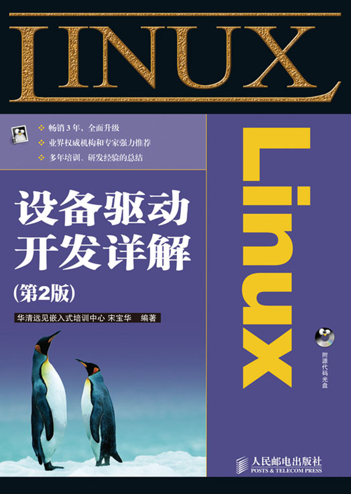

# 第1章 Linux设备驱动概述及开发环境构建

#### 本章导读

本章将介绍Linux设备驱动开发的基本概念，并对本书所基于的平台和开发环境进行讲解。

1.1节阐明了设备驱动的概念和作用。

1.2节和1.3节分别讲解在无操作系统情况下和有操作系统情况下设备驱动的设计，通过对两者不同的分析讲解设备驱动与硬件和操作系统的关系。

1.4节对Linux操作系统的设备驱动进行了概要性的介绍，给出了设备驱动与整个软硬件系统的关系，分析了Linux设备驱动的重点、难点和学习方法。

1.5节对本书所基于的LDD6410 ARM11开发板和开发环境的安装进行了介绍。

本章的最后给出了一个设备驱动的“Hello World”实例，即最简单的LED驱动在无操作系统情况下和Linux操作系统下的实现。

