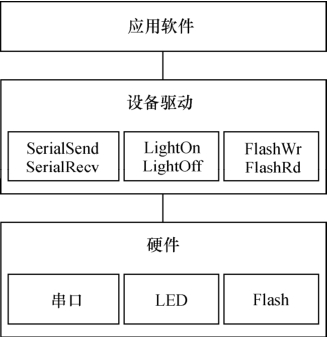
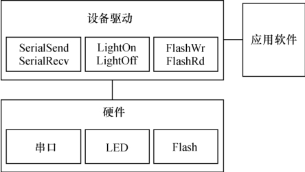
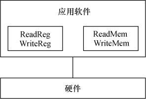

### 1.2 无操作系统时的设备驱动

并不是任何一个计算机系统都一定要运行操作系统，在许多情况下，操作系统都不必存在。对于功能比较单一、控制并不复杂的系统，譬如ASIC内部、公交车的刷卡机、电冰箱、微波炉、简单的手机和小灵通等，并不需要多任务调度、文件系统、内存管理等复杂功能，用单任务架构完全可以良好地支持它们的工作。一个无限循环中夹杂对设备中断的检测或者对设备的轮询是这种系统中软件的典型架构，如代码清单1.1。

代码清单1.1 单任务软件典型架构

1 int main(int argc, char* argv[]) 
 
 2 { 
 
 3 while (1) 
 
 4 { 
 
 5 if (serialInt == 1) 
 
 6 /*有串口中断*/ 
 
 7 { 
 
 8 ProcessSerialInt(); /*处理串口中断*/ 
 
 9 serialInt = 0; /*中断标志变量清0*/ 
 
 10 } 
 
 11 if (keyInt == 1) 
 
 12 /*有按键中断*/ 
 
 13 { 
 
 14 ProcessKeyInt(); /*处理按键中断*/ 
 
 15 keyInt = 0; /*中断标志变量清0*/ 
 
 16 } 
 
 17 status = CheckXXX(); 
 
 18 switch (status) 
 
 19 { 
 
 20 ... 
 
 21 } 
 
 22 ... 
 
 23 } 
 
 24 }

在这样的系统中，虽然不存在操作系统，但是设备驱动则无论如何都必须存在。一般情况下，每一种设备驱动都会定义为一个软件模块，包含.h文件和.c文件，前者定义该设备驱动的数据结构并声明外部函数，后者进行驱动的具体实现。譬如，可以如代码清单1.2那样定义一个串口的驱动。

代码清单1.2 无操作系统情况下串口的驱动

1 /********************** 
 
 2 *serial.h文件 
 
 3 **********************/ 
 
 4 extern void SerialInit(void); 
 
 5 extern void SerialSend(const char buf*,int count); 
 
 6 extern void SerialRecv(char buf*,int count); 
 
 7 
 
 8 /********************** 
 
 9 *serial.c文件 
 
 10 **********************/ 
 
 11 /*初始化串口*/ 
 
 12 void SerialInit(void) 
 
 13 { 
 
 14 ... 
 
 15 } 
 
 16 /*串口发送*/ 
 
 17 void SerialSend(const char buf*,int count) 
 
 18 { 
 
 19 ... 
 
 20 } 
 
 21 /*串口接收*/

22 void SerialRecv(char buf*,int count) 
 
 23 { 
 
 24 ... 
 
 25 } 
 
 26 /*串口中断处理函数*/ 
 
 27 void SerialIsr(void) 
 
 28 { 
 
 29 ... 
 
 30 serialInt = 1; 
 
 31 }

其他模块想要使用这个设备的时候，只需要包含设备驱动的头文件serial.h，然后调用其中的外部接口函数。如我们要从串口上发送“Hello World”字符串，使用语句SerialSend（“Hello World”，11）即可。

由此可见，在没有操作系统的情况下，设备驱动的接口被直接提交给了应用软件工程师，应用软件没有跨越任何层次就直接访问了设备驱动的接口。驱动包含的接口函数也与硬件的功能直接吻合，没有任何附加功能。图1.1所示为无操作系统情况下硬件、驱动与应用软件的关系。

有的工程师把单任务系统设计成了如图1.2所示的结构，即设备驱动和具体的应用软件模块之间平等，驱动中包含了业务层面上的处理，这显然是不合理的，不符合软件设计中高内聚、低耦合的要求。

另一种不合理的设计是直接在应用中操作硬件的寄存器，而不单独设计驱动模块，如图1.3所示。这种设计意味着系统中不存在或未能充分利用可被重用的驱动代码。

