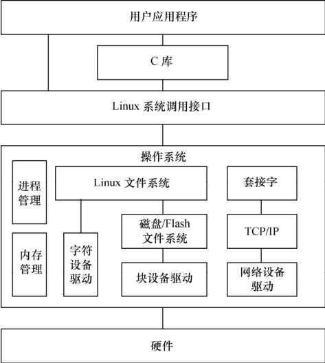

### 1.4.2 Linux设备驱动与整个软硬件系统的关系

如图1.5所示，除网络设备外，字符设备与块设备都被映射到Linux文件系统的文件和目录，通过文件系统的系统调用接口open()、write()、read()、close()等即可访问字符设备和块设备。所有的字符设备和块设备都被统一地呈现给用户。块设备比字符设备复杂，在它上面会首先建立一个磁盘/Flash文件系统，如FAT、EXT3、YAFFS2、JFFS2、UBIFS等。FAT、EXT3、YAFFS2、JFFS2、UBIFS定义了文件和目录在存储介质上的组织。

应用程序可以使用Linux的系统调用接口编程，但也可使用C库函数，出于代码可移植性的目的，后者更值得推荐。C库函数本身也通过系统调用接口而实现，如C库函数fopen()、fwrite()、 fread()、fclose()分别会调用操作系统的API open()、write()、read()、close()。

