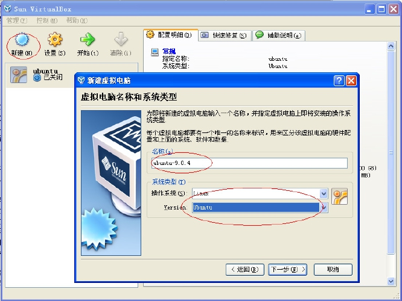
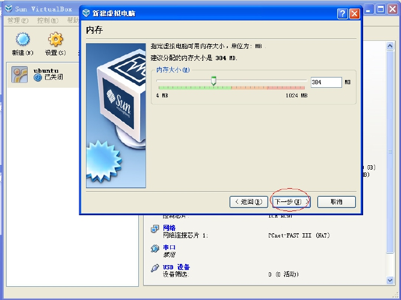
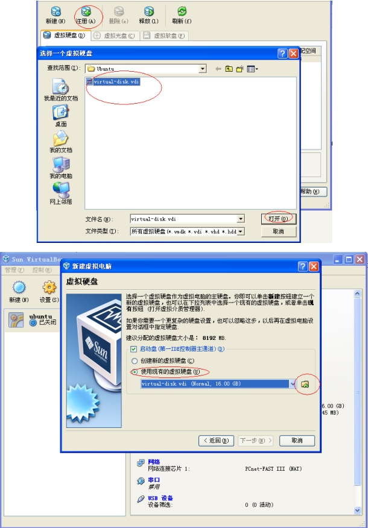
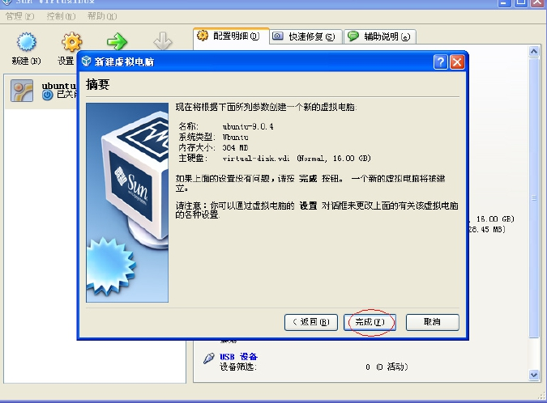

### 1.5.1 PC上的Linux环境

本书配套光盘提供了一个Ubuntu的VirtualBox虚拟机映像，该虚拟机上安装了所有本书涉及的源代码、工具链和各种开发工具，读者无需再安装和配置任何环境。该虚拟机可运行于Windows等操作系统中，运行方法如下。

（1）解压缩安装盘内的虚拟机磁盘映像virtual-disk.rar到本地硬盘得到virtual-disk.vdi（至少需要16GB的空闲磁盘空间）。

（2）安装安装盘内的VirtualBox虚拟机软件。

（3）建立一个虚拟机。

① 单击“新建”按钮，指定虚拟机使用Linux Ubuntu系统，如图1.6所示。

② 单击“下一步”按钮，如图1.7所示，使用推荐的内存384MB。

③ 指定虚拟机磁盘映像为第一步解压缩得到的virtual-disk.vdi，如图1.8所示。

④ 完成设置，如图1.9所示。

之后就可以启动虚拟机，账号和密码都是“lihacker”。本书配套源代码都位于lihacker主目录的develop目录下，几个主要项目针对/home/lihacker/develop/的子目录如下。

LDD6410开发板内核源代码：svn/ldd6410-2-6-28-read-only/linux-2.6.28-samsung。

LDD6410开发板U-BOOT源代码：svn/ldd6410-read-only/s3c-u-boot-1.1.6。

LDD6410开发板文件系统用的busybox、jpegview、mplayer、appweb等：svn/ldd6410-readonly/utils。

LDD6410开发板及常用Linux用户空间驱动测试程序：svn/ldd6410-read-only/tests。

书中globalmem、globalfifo等驱动实例：svn/ldd6410-read-only/training/kernel。

Android的源代码：git/myandroid。

NDK：android-ndk-r3。

eclipse：单击桌面上的“android-eclipse”图标，即可运行附带ADT的eclipse开发工具。

