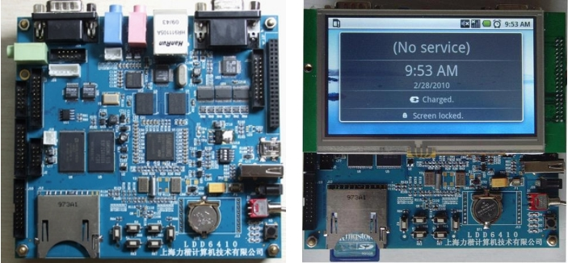

### 1.5.2 LDD6410开发板

LDD6410是本书专配的一款高端ARM11处理器开发板（其结构如图1.10所示，实物如图1.11所示），采用三星公司最新推出S3C6410处理器，芯片拥有强大的内部资源和视频处理能力，板上集成了丰富的外围接口，其主要特点如下。

（1）运行于533MHz的ARM11处理器（最高主频可达到667MHz）。

（2）运行于266MHz的DDR内存，128MB。

（3）1MB NOR Flash。

（4）256MB NAND Flash。

（5）WM9714 AC97声卡。

（6）VGA输出接口（可达1024×768@60Hz）。

（7）TV输出接口。

（8）USB 2.0 OTG接口及USB 1.1 host接口。

（9）SD/SDIO接口，支持SD卡和SDIO设备。

（10）DM9000百兆网卡。

（11）4.3寸LCD（分辨率为480×272）、触摸屏。

（12）S3C6410芯片内嵌图形加速，JPEG、多媒体编解码。

（13）6个GPIO按键。

（14）可扩展Camera、WiFi、3G modem等模块。

（15）可扩展外部矩阵键盘。

配套电路板提供了如下软件。

（1）工具链：提供了arm-linux-gcc、arm-linux-gdb、gdbserver、strace用于Android开发的eclipse（带ADT插件）、JDK和NDK。

（2）U-BOOT：U-BOOT源代码包含独立的LDD6410文件，支持从SD卡、NAND启动，支持DM9000网卡引导。

（3）Linux内核、BSP和驱动：Linux 2.6.28内核、源代码，包含独立的LDD6410 BSP和完整的设备驱动。

（4）文件系统：基于新版Busybox 1.15.1，文件系统集成jpegview、mplayer、appweb等大量应用，集成了按键、鼠标、触摸屏、LCD等测试程序，作为驱动的用户应用案例。

（5）Android：提供Android源代码和文件系统、内核电源管理补丁源代码、内核Android驱动源代码。LDD6410的Android系统支持按键、触摸屏和鼠标操作，支持使用LCD和VGA进行显示。

（6）QT：LDD6410支持Qt/Embedded 4.5.3，移植了Ts_lib和Tslib, ts_calibration，支持使用触摸屏进行操作。

LDD6410支持从SD卡或NAND启动，通过电路板上的SW1可设置LDD6410的启动模式。从SD卡启动设备为全ON；从NAND启动时，将1、2设置为ON，3、4设置为OFF。

LDD6410开发板的详细使用方法，请见配套光盘中的“LDD6410开发板用户手册”。

