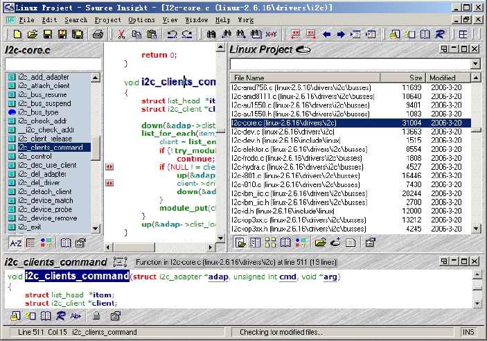
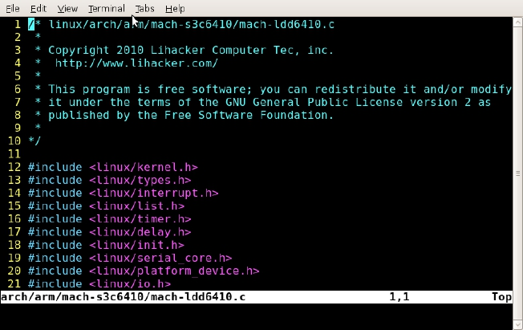

### 1.5.5 源代码阅读和编辑

源代码是学习Linux的最权威资料，在Windows上阅读Linux源代码的最佳工具是Source Insight，在其中建立一个工程，并将Linux的所有源代码加入该工程，同步这个工程之后，我们将可以非常方便地在代码之间进行关联阅读，如图1.12所示。

网站http://lxr.linux.no/提供了内核版本2.6.11到最新版Linux源代码的交叉索引，在其中输入Linux内核中的函数、数据结构或变量的名称就可以直接得到以超链接形式给出的定义和引用它的所有位置。还有一些网站也提供了Linux内核中函数、变量和数据结构的搜索能力，在google中搜索“linux identifier search”可得。

在Linux主机上阅读和编辑Linux源码的常用方式是vim + cscope或者vim + ctags，vim是一个文本编辑器，而cscope和ctags则可建立代码索引，建议读者尽快使用基于文本界面全键盘操作的vim编辑器，如图1.13所示。

