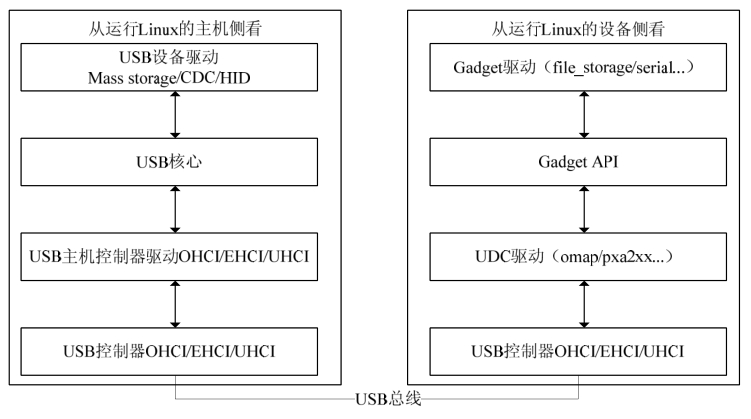

### 20.1.1 主机侧与设备侧USB驱动

USB采用树形拓扑结构，主机侧和设备侧的USB控制器分别称为主机控制器（Host Controller）和USB设备控制器（UDC），每条总线上只有一个主机控制器，负责协调主机和设备间的通信，而设备不能主动向主机发送任何消息。如图20.1所示，在Linux系统中，USB驱动可以从两个角度去观察，一个角度是主机侧，一个角度是设备侧。

如图20.1的左侧所示，从主机侧的观念去看，在Linux驱动中，USB驱动处于最底层的是USB主机控制器硬件，在其之上运行的是USB主机控制器驱动，主机控制器之上为USB核心层，再上层为USB设备驱动层（插入主机上的U盘、鼠标、USB转串口等设备驱动）。因此，在主机侧的层次结构中，要实现的USB驱动包括两类：USB主机控制器驱动和USB设备驱动，前者控制插入其中的USB设备，后者控制USB设备如何与主机通信。Linux内核USB核心负责USB驱动管理和协议处理的主要工作。主机控制器驱动和设备驱动之间的USB核心非常重要，其功能包括：通过定义一些数据结构、宏和功能函数，向上为设备驱动提供编程接口，向下为USB主机控制器驱动提供编程接口；通过全局变量维护整个系统的USB设备信息；完成设备热插拔控制、总线数据传输控制等。

如图20.1的右侧所示，Linux内核中USB设备侧驱动程序分为3个层次：UDC驱动程序、Gadget API和Gadget驱动程序。UDC驱动程序直接访问硬件，控制USB设备和主机间的底层通信，向上层提供与硬件相关操作的回调函数。当前Gadget API是UDC驱动程序回调函数的简单包装。Gadget驱动程序具体控制USB设备功能的实现，使设备表现出“网络连接”、“打印机”或“USB Mass Storage”等特性，它使用Gadget API控制UDC实现上述功能。Gadget API把下层的UDC驱动程序和上层的Gadget驱动程序隔离开，使得在Linux系统中编写USB设备侧驱动程序时能够把功能的实现和底层通信分离。

