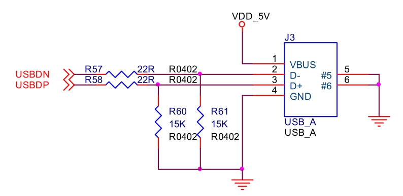

### 20.2.2 实例：S3C6410 USB 1.1主机驱动

S3C6410内部集成了2个USB控制器，1个是USB 1.1主机控制器，支持低速和全速USB设备，另外1个是USB 2.0支持OTG的USB控制器。

S3C6410的USB1.1主机控制器驱动由drivers/usb/host/ohci-hcd.c（服务于各种SoC情况下的OHCI主机驱动通用部分）和drivers/usb/host/ohci-s3c2410.c（服务于S3C2410、S3C64XX和S5PC1XX）文件共同完成，前者通过“#include "ohci-s3c2410.c"”语句包含了后者，详细情况如下：

#if defined(CONFIG_ARCH_S3C2410)||defined(CONFIG_ARCH_S3C64XX)|| defined(CONFIG_ARCH_S5PC1XX) 
 
 #include "ohci-s3c2410.c" 
 
 #define PLATFORM_DRIVER ohci_hcd_s3c2410_driver 
 
 #endif

drivers/usb/host/ohci-hcd.c只是根据定义的CPU体系结构引用对应的platform_driver并注册之，对于S3C6410为ohci_hcd_s3c2410_driver。

S3C6410 USB1.1主机控制器驱动的hc_driver结构体中的大多数成员函数都是通用的ohci_xxx()函数，而start()、hub_status_data()、hub_control()函数则针对S3C6410而编写的，如代码清单20.9所示。

代码清单20.9 S3C2410主机控制器驱动的hc_driver结构体

1 static const struct hc_driver ohci_s3c2410_hc_driver = { 
 
 2 .description = hcd_name, 
 
 3 .product_desc = "S3C24XX OHCI",

4 .hcd_priv_size = sizeof(struct ohci_hcd), 
 
 5 
 
 6 /* 通用硬件联接 */ 
 
 7 .irq = ohci_irq, 
 
 8 .flags = HCD_USB11 | HCD_MEMORY, /* USB 1.1标准，hc寄存器位于内存 */ 
 
 9 
 
 10 /* 基本的生命周期操作 */ 
 
 11 .start = ohci_s3c2410_start, 
 
 12 .stop = ohci_stop, 
 
 13 
 
 14 /* 管理I/O请求和相关的设备资源 */ 
 
 15 .urb_enqueue = ohci_urb_enqueue, 
 
 16 .urb_dequeue = ohci_urb_dequeue, 
 
 17 .endpoint_disable = ohci_endpoint_disable, 
 
 18 
 
 19 /* 调度支持 */ 
 
 20 .get_frame_number = ohci_get_frame, 
 
 21 
 
 22 /* 根Hub支持 */ 
 
 23 .hub_status_data = ohci_s3c2410_hub_status_data, 
 
 24 .hub_control = ohci_s3c2410_hub_control, 
 
 25 #ifdef CONFIG_PM 
 
 26 .bus_suspend = ohci_bus_suspend, 
 
 27 .bus_resume = ohci_bus_resume, 
 
 28 #endif 
 
 29 .start_port_reset = ohci_start_port_reset, 
 
 30 };

hc_driver的start()成员函数用于初始化OHCI并启动主机控制器，如代码清单20.10所示。

代码清单20.10 S3C6410 USB1.1主机控制器驱动的start()函数

1 static int ohci_s3c2410_start (struct usb_hcd *hcd) 
 
 2 { 
 
 3 struct ohci_hcd *ohci = hcd_to_ohci (hcd); 
 
 4 int ret; 
 
 5 
 
 6 if ((ret = ohci_init(ohci)) < 0) /* 初始化ohci_hcd */ 
 
 7 return ret; 
 
 8 
 
 9 if ((ret = ohci_run (ohci)) < 0) { /* 启动ohci_hcd */ 
 
 10 err ("can't start %s", hcd→self.bus_name); 
 
 11 ohci_stop (hcd); 
 
 12 return ret; 
 
 13 } 
 
 14 
 
 15 return 0; 
 
 16 }

hc_driver的hub_control()成员函数ohci_s3c2410_hub_control()中的主体是调用通用的ohci_ hub_control()函数，hub_status_data()成员函数ohci_s3c2410_hub_status_data()的主体是调用通用的ohci_hub_status_data()函数。

LDD6410开发板USB 1.1主机接口原理如图20.3，对于LDD6410开发板而言，在内核中开启“OHCI HCD support”、“ USB Human Interface Device (full HID) support”和“USB Mass Storage support”选项可以使我们支持USB 1.1主机、U盘以及HID设备。

当插入一个 USB 鼠标，控制台会打印类似信息：

usb 11: configuration #1 chosen from 1 choice input: USB Mouse as /class/input/input2 
 
 genericusb 0003:1267:0201.0001: input: USB HID v1.00 Mouse [USB Mouse] on usb 
 
 s3c24xx1/input0

拔出 USB 鼠标后，控制台打印：

usb 11: USB disconnect, address 2

插入一个 U 盘，控制台会打印类似信息：

usb 11: new full speed USB device using s3c2410ohci and address 4 
 
 usb 11: configuration #1 chosen from 1 choice 
 
 scsi0 : SCSI emulation for USB Mass Storage devices 
 
 # scsi 0:0:0:0: DirectAccess Lenovo USB Flash Drive 1100 PQ: 0 ANSI: 0 CCS 
 
 sd 0:0:0:0: [sda] 7831552 512byte hardware sectors: (4.00 GB/3.73 GiB) 
 
 sd 0:0:0:0: [sda] Write Protect is off 
 
 sd 0:0:0:0: [sda] Assuming drive cache: write through 
 
 sd 0:0:0:0: [sda] 7831552 512byte hardware sectors: (4.00 GB/3.73 GiB) 
 
 sd 0:0:0:0: [sda] Write Protect is off 
 
 sd 0:0:0:0: [sda] Assuming drive cache: write through sda: sda1 
 
 sd 0:0:0:0: [sda] Attached SCSI removable disk sd 0:0:0:0: Attached scsi generic sg0 
 
 type 0

通过mount命令来挂载这个U盘：

# mount /dev/sda1 t vfat /mnt

