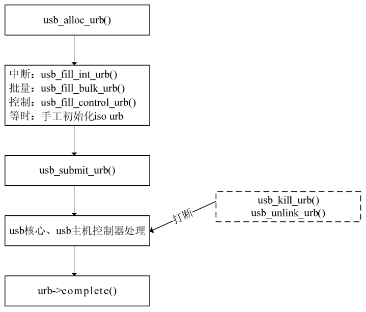

### 20.3.2 USB请求块（URB）

#### 1．urb结构体

USB请求块（USB request block，urb）是USB设备驱动中用来描述与USB设备通信所用的基本载体和核心数据结构，非常类似于网络设备驱动中的sk_buff结构体。

代码清单20.13 urb结构体

1 struct urb { 
 
 2 /* 私有的：只能由USB核心和主机控制器访问的字段 */ 
 
 3 struct kref kref; /*urb引用计数 */ 
 
 4 void *hcpriv; /* 主机控制器私有数据 */ 
 
 5 atomic_t use_count; /* 并发传输计数 */ 
 
 6 u8 reject; /* 传输将失败*/ 
 
 7 int unlink; /* unlink错误码 */ 
 
 8 
 
 9 /* 公共的： 可以被驱动使用的字段 */ 
 
 10 struct list_head urb_list; /* 链表头*/ 
 
 11 struct usb_anchor *anchor; 
 
 12 struct usb_device *dev; /* 关联的USB设备 */ 
 
 13 struct usb_host_endpoint *ep; 
 
 14 unsigned int pipe; /* 管道信息 */ 
 
 15 int status; /* URB的当前状态 */ 
 
 16 unsigned int transfer_flags; /* URB_SHORT_NOT_OK | ...*/ 
 
 17 void *transfer_buffer; /* 发送数据到设备或从设备接收数据的缓冲区 */ 
 
 18 dma_addr_t transfer_dma; /*用来以DMA方式向设备传输数据的缓冲区 */ 
 
 19 int transfer_buffer_length;/*transfer_buffer或transfer_dma 指向缓冲区的大小 */ 
 
 20 
 
 21 int actual_length; /* URB结束后，发送或接收数据的实际长度 */ 
 
 22 unsigned char *setup_packet; /* 指向控制URB的设置数据包的指针*/ 
 
 23 dma_addr_t setup_dma; /*控制URB的设置数据包的DMA缓冲区*/ 
 
 24 int start_frame; /*等时传输中用于设置或返回初始帧*/ 
 
 25 int number_of_packets; /*等时传输中等时缓冲区数量 */ 
 
 26 int interval; /* URB被轮询到的时间间隔（对中断和等时urb有效） */ 
 
 27 int error_count; /* 等时传输错误数量 */ 
 
 28 void *context; /* completion函数上下文 */ 
 
 29 usb_complete_t complete; /* 当URB被完全传输或发生错误时，被调用 */ 
 
 30 /*单个URB一次可定义多个等时传输时，描述各个等时传输 */ 
 
 31 struct usb_iso_packet_descriptor iso_frame_desc[0]; 
 
 32 };

#### 2．urb处理流程

USB设备中的每个端点都处理一个urb队列，在队列被清空之前，一个urb的典型生命周期如下。

（1）被一个USB设备驱动创建。

创建urb结构体的函数为：

struct urb *usb_alloc_urb(int iso_packets, int mem_flags);

iso_packets是这个urb应当包含的等时数据包的数目，若为0表示不创建等时数据包。mem_flags参数是分配内存的标志，和kmalloc()函数的分配标志参数含义相同。如果分配成功，该函数返回一个urb结构体指针，否则返回0。

urb结构体在驱动中不能静态创建，因为这可能破坏USB核心给urb使用的引用计数方法。

usb_alloc_urb()的“反函数”为：

void usb_free_urb(struct urb *urb);

该函数用于释放由usb_alloc_urb()分配的urb结构体。

（2）初始化，被安排给一个特定USB设备的特定端点。

对于中断urb，使用usb_fill_int_urb()函数来初始化urb，如下所示：

void usb_fill_int_urb(struct urb *urb, struct usb_device *dev, 
 
 unsigned int pipe, void *transfer_buffer, 
 
 int buffer_length, usb_complete_t complete, 
 
 void *context, int interval);

urb参数指向要被初始化的urb的指针；dev指向这个urb要被发送到的USB设备；pipe是这个urb要被发送到的USB设备的特定端点；transfer_buffer是指向发送数据或接收数据的缓冲区的指针，和urb一样，它也不能是静态缓冲区，必须使用kmalloc()来分配；buffer_length是transfer_buffer指针所指向缓冲区的大小；complete指针指向当这个 urb完成时被调用的完成处理函数；context是完成处理函数的“上下文”；interval是这个urb应当被调度的间隔。

上述函数参数中的pipe使用usb_sndintpipe()或usb_rcvintpipe()创建。

对于批量urb，使用usb_fill_bulk_urb()函数来初始化urb，如下所示：

void usb_fill_bulk_urb(struct urb *urb, struct usb_device *dev, 
 
 unsigned int pipe, void *transfer_buffer, 
 
 int buffer_length, usb_complete_t complete, 
 
 void *context);

除了没有对应于调度间隔的interval参数以外，该函数的参数和usb_fill_int_urb()函数的参数含义相同。

上述函数参数中的pipe使用usb_sndbulkpipe()或者usb_rcvbulkpipe()函数来创建。

对于控制 urb，使用usb_fill_control_urb()函数来初始化urb，如下所示：

void usb_fill_control_urb(struct urb *urb, struct usb_device *dev, 
 
 unsigned int pipe, unsigned char *setup_packet, 
 
 void *transfer_buffer, int buffer_length, 
 
 usb_complete_t complete, void *context);

除了增加了新的setup_packet参数以外，该函数的参数和usb_fill_bulk_urb()函数的参数含义相同。setup_packet参数指向即将被发送到端点的设置数据包。

上述函数参数中的pipe使用usb_sndctrlpipe()或usb_rcvictrlpipe()函数来创建。

等时urb没有像中断、控制和批量urb的初始化函数，我们只能手动地初始化urb，而后才能提交给USB核心。代码清单20.14给出了初始化等时urb的例子，它来自drivers/usb/media/usbvideo.c文件。

代码清单20.14 初始化等时urb

1 for (i = 0; i < USBVIDEO_NUMSBUF; i++) { 
 
 2 int j, k; 
 
 3 struct urb *urb = uvd→sbuf[i].urb; 
 
 4 urb→dev = dev; 
 
 5 urb→context = uvd; 
 
 6 urb→pipe = usb_rcvisocpipe(dev, uvd→video_endp);/*端口*/ 
 
 7 urb→interval = 1; 
 
 8 urb→transfer_flags = URB_ISO_ASAP; /*urb被调度*/ 
 
 9 urb→transfer_buffer = uvd→sbuf[i].data;/*传输buffer*/ 
 
 10 urb→complete = usbvideo_IsocIrq; /* 完成函数 */ 
 
 11 urb→number_of_packets = FRAMES_PER_DESC; /*urb中的等时传输数量*/

12 urb→transfer_buffer_length = uvd→iso_packet_len *FRAMES_PER_DESC; 
 
 13 for (j = k = 0; j < FRAMES_PER_DESC; j++, k += uvd→iso_packet_len) { 
 
 14 urb→iso_frame_desc[j].offset = k; 
 
 15 urb→iso_frame_desc[j].length = uvd→iso_packet_len; 
 
 16 } 
 
 17 }

（3）被USB设备驱动提交给USB 核心。

在完成第（1）、（2）步的创建和初始化urb后，urb便可以提交给USB核心，通过usb_submit_urb()函数来完成，如下所示：

int usb_submit_urb(struct urb *urb, int mem_flags);

urb参数是指向urb的指针，mem_flags参数与传递给kmalloc()函数参数的意义相同，它用于告知USB核心如何在此时分配内存缓冲区。

在提交urb到USB核心后，直到完成函数被调用之前，不要访问urb中的任何成员。

usb_submit_urb()在原子上下文和进程上下文中都可以被调用，mem_flags变量需根据调用环境进行相应的设置，如下所示。

● GFP_ATOMIC：在中断处理函数、底半部、tasklet、定时器处理函数以及urb完成函数中，在调用者持有自旋锁或者读写锁时以及当驱动将current→state修改为非 TASK_ RUNNING时，应使用此标志。

● GFP_NOIO：在存储设备的块I/O和错误处理路径中，应使用此标志；

● GFP_KERNEL：如果没有任何理由使用GFP_ATOMIC和GFP_NOIO，就使用GFP_ KERNEL。

如果usb_submit_urb()调用成功，即urb的控制权被移交给USB核心，该函数返回0；否则，返回错误号。

（4）提交由USB核心指定的USB主机控制器驱动。

（5）被USB主机控制器处理，进行一次到USB设备的传送。

第（4）～（5）步由USB核心和主机控制器完成，不受USB设备驱动的控制。

（6）当urb完成，USB主机控制器驱动通知USB设备驱动。

在如下3种情况下，urb将结束，urb完成函数将被调用。

● urb被成功发送给设备，并且设备返回正确的确认。如果urb→status为0，意味着对于一个输出urb，数据被成功发送；对于一个输入urb，请求的数据被成功收到。

● 如果发送数据到设备或从设备接收数据时发生了错误，urb→status将记录错误值。

● urb 被从USB 核心“去除连接”，这发生在驱动通过usb_unlink_urb()或usb_kill_urb()函数取消urb，或urb虽已提交，而USB设备被拔出的情况下。

usb_unlink_urb()和usb_kill_urb()这两个函数用于取消已提交的urb，其参数为要被取消的urb指针。对usb_unlink_urb()而言，如果urb结构体中的URB_ASYNC_UNLINK（即异步unlink）的标志被置位，则对该urb的usb_unlink_urb()调用将立即返回，具体的unlink动作将在后台进行。否则，此函数一直等到urb被解开链接或结束时才返回。usb_kill_urb()会彻底终止urb的生命周期，它通常在设备的disconnect()函数中被调用。

当urb生命结束时（处理完成或被解除链接），通过urb结构体的status成员可以获知其原因，如0表示传输成功，-ENOENT表示被usb_kill_urb()杀死，-ECONNRESET表示被usb_unlink_urb()杀死，-EPROTO表示传输中发生了bitstuff错误或者硬件未能及时收到响应数据包，-ENODEV表示USB设备已被移除，-EXDEV表示等时传输仅完成了一部分等。

对以上urb的处理步骤进行一个总结，图20.5给出了一个urb的整个处理流程，虚线框的usb_unlink_urb()和usb_kill_urb()并非一定会发生，它只是在urb正在被USB核心和主机控制器处理时，被驱动程序取消的情况下才发生。

#### 3．简单的批量与控制URB

有时USB驱动程序只是从USB设备上接收或向USB设备发送一些简单的数据，这时候，没有必要将urb创建、初始化、提交、完成处理的整个流程走一遍，而可以使用两个更简单的函数，如下所示。

（1）usb_bulk_msg()。

usb_bulk_msg()函数创建一个USB批量urb 并将它发送到特定设备，这个函数是同步的，它一直等待urb完成后才返回。usb_bulk_msg()函数的原型为：

int usb_bulk_msg(struct usb_device *usb_dev, unsigned int pipe, 
 
 void *data, int len, int *actual_length, 
 
 int timeout);

usb_dev参数为批量消息要发送的USB设备的指针，pipe为批量消息要发送到的USB设备的端点，data参数为指向要发送或接收的数据缓冲区的指针，len参数为data参数所指向的缓冲区的长度，actual_length用于返回实际发送或接收的字节数，timeout是发送超时，以jiffies为单位，0意味着永远等待。

如果函数调用成功，返回0；否则，返回1个负的错误值。

（2）usb_control_msg()函数。

usb_control_msg()函数与usb_bulk_msg()函数类似，不过它提供驱动发送和结束USB控制信息而非批量信息的能力，该函数的原型为：

int usb_control_msg(struct usb_device *dev, unsigned int pipe, _ _u8 request, 
 
 _ _u8 requesttype, _ _u16 value, _ _u16 index, void *data, _ _u16 size, int timeout);

dev指向控制消息发往的USB设备，pipe是控制消息要发往的USB设备的端点，request是这个控制消息的USB请求值，requesttype是这个控制消息的USB请求类型，value是这个控制消息的USB消息值，index是这个控制消息的USB消息索引值，data指向要发送或接收的数据缓冲区，size是data参数所指向的缓冲区的大小，timeout是发送超时，以jiffies为单位，0意味着永远等待。

参数request、requesttype、value和index与USB规范中定义的USB控制消息直接对应。

如果函数调用成功，该函数返回发送到设备或从设备接收到的字节数；否则，返回一个负的错误值。

对usb_bulk_msg()和usb_control_msg()函数的使用要特别慎重，由于它们是同步的，因此不能在中断上下文和持有自旋锁的情况下使用。而且，该函数也不能被任何其他函数取消，因此，务必要使得驱动程序的disconnect()函数掌握足够的信息，以判断和等待该调用的结束。

