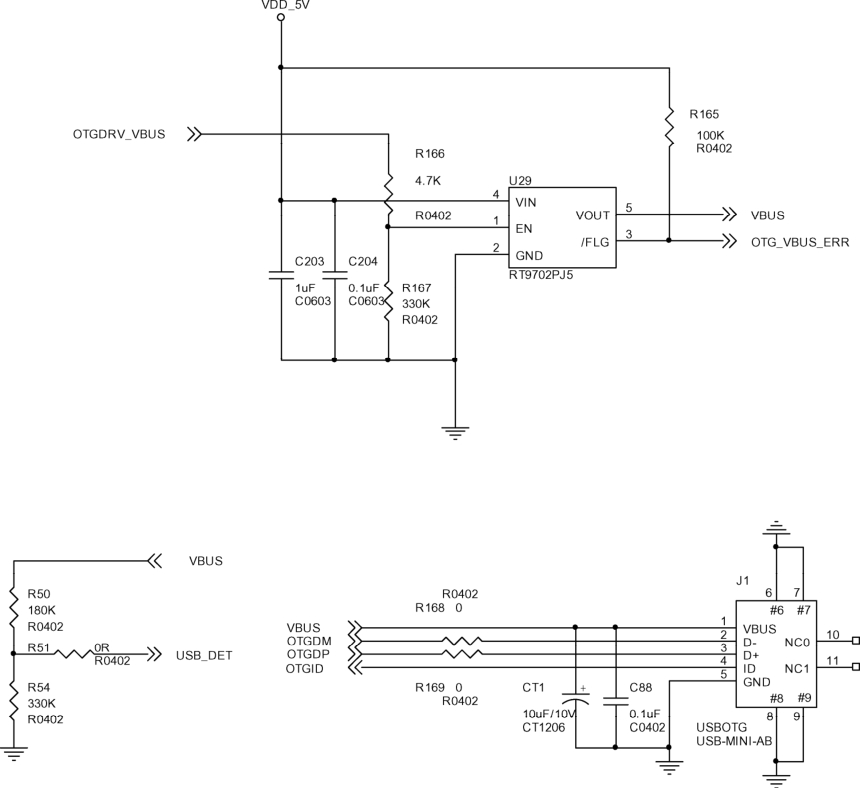

### 20.4.3 实例：file storage gadget驱动

file storage gadget驱动由drivers/usb/gadget/file_storage.c文件实现，它完成的主要工作如下。

（1）实现usb_gadget_driver实例及其中的成员函数bind()、unbind()、disconnect()、setup()等。

（2）准备作为U盘外设的设备描述符usb_device_descriptor、配置描述符usb_config_descriptor、接口描述符usb_interface_descriptor、端点描述符usb_endpoint_descriptor等。

（3）完成与虚拟文件系统VFS的交互，将文件作为U盘映像，透过vfs_read()、vfs_write()读写文件，并透过usb_request在主机与gadget间交换数据。

在LDD6410开发板上，USB 2.0 OTG的原理如图20.6所示。当LDD6410开发板内核配置选中drivers/usb/gadget/s3c_udc_otg.c和 drivers/usb/gadget/file_storage.c的情况下，通过加载g_file_storage模块并传入一个映像名作为参数，即可开启LDD6410开发板的U盘功能。

LDD6410开发板的/demo目录包含一个做好的映像vfat.img，因此加载g_file_storag的命令为：

# modprobe g_file_storage file=/demo/vfat.img stall=0 removable=1 
 
 g_file_storage gadget: Filebacked Storage Gadget, version: 7 August 2007 
 
 g_file_storage gadget: Number of LUNs=1 g_file_storage gadgetlun0: ro=0, file: 
 
 /demo/vfat.img Registered gadget driver 'g_file_storage'

vfat.img可以在PC上通过dd和mkfs.vfat命令得到：

$ dd if=/dev/zero of=vfat.img bs=1M count=20

20+0 records in

20+0 records out

20971520 bytes (21 MB) copied, 0.195482 s, 107 MB/s

$ sudo losetup /dev/loop0 vfat.img

$ sudo mkfs.vfat /dev/loop0

mkfs.vfat 2.11 (12 Mar 2005)

Loop device does not match a floppy size, using default hd params

$ mkdir vfat_mount_point

$ sudo mount t vfat /dev/loop0 vfat_mount_point

这样之后可以把需要的文件拷入vfat_mount_point目录，完成后umount vfat_mount_point目录并删除 loop0：

$ sudo umount vfat_mount_point

$ sudo losetup -d /dev/loop0

