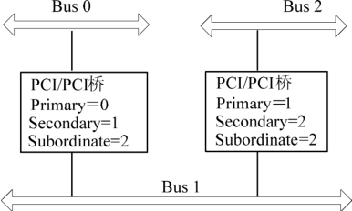
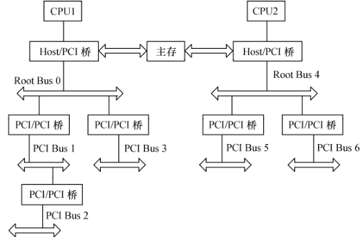
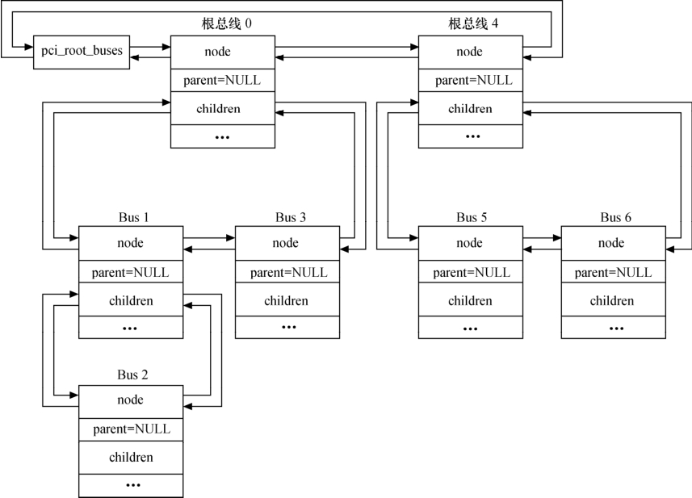

### 21.1.1 PCI总线的Linux描述

PCI是CPU和外围设备通信的高速传输总线。PCI规范能够实现32位并行数据传输，工作频率为33MHz或66MHz，最大吞吐率达266MB/s。PCI的衍生物包括CardBus、mini-PCI、PCI-Express、cPCI等。

从本书第2章的图2.16可以看出，PCI总线体系结构是一种层次式的体系结构。在这种层次式体系结构中，PCI桥设备占据着重要的地位，它将父总线与子总线连接在一起，从而使整个系统看起来像一颗倒置的树型结构。树的顶端是系统的CPU，它通过一个较为特殊的PCI桥设备——Host/PCI桥设备与根PCI总线连接起来。

作为一种特殊的PCI设备，PCI桥包括以下几种。

● Host/PCI桥：用于连接CPU与PCI根总线，第1个根总线的编号为0。在PC中，内存控制器也通常被集成到Host/PCI桥设备芯片中，因此，Host/PCI桥通常也被称为“北桥芯片组（North Bridge Chipset）”。

● PCI/ISA桥：用于连接旧的ISA总线。通常，PCI中的类似i8359A中断控制器这样的设备也会被集成到PCI/ISA桥设备中，因此，PCI/ISA桥通常也被称为“南桥芯片组（South Bridge Chipset）”。

● PCI-to-PCI桥：用于连接PCI主总线（primary bus）与次总线（secondary bus）。PCI桥所处的PCI总线称为“主总线”（即次总线的父总线），桥设备所连接的PCI总线称为“次总线”（即主总线的子总线）。

在Linux系统中，PCI总线用pci_bus来描述，这个结构体记录了本PCI总线的信息以及本PCI总线的父总线、子总线、桥设备信息，这个结构体的定义如代码清单21.1所示。

代码清单21.1 pci_bus结构体

1 struct pci_bus { 
 
 2 struct list_head node; /* 链表元素node */ 
 
 3 struct pci_bus *parent; /*指向该PCI总线的父总线，即PCI桥所在的总线 */ 
 
 4 struct list_head children; /* 描述了这条PCI总线的子总线链表的表头 */ 
 
 5 struct list_head devices; /* 描述了这条PCI总线的逻辑设备链表的表头 */ 
 
 6 struct pci_dev *self; /* 指向引出这条PCI总线的桥设备的pci_dev结构 */ 
 
 7 struct resource *resource[PCI_BUS_NUM_RESOURCES]; 
 
 8 /* 指向应路由到这条PCI总线的地址空间资源 */ 
 
 9 
 
 10 struct pci_ops *ops; /* 这条PCI总线所使用的配置空间访问函数 */ 
 
 11 void *sysdata; /* 指向系统特定的扩展数据 */ 
 
 12 struct proc_dir_entry *procdir;/*该PCI总线在/proc/bus/pci中对应的目录项*/ 
 
 13 
 
 14 unsigned char number; /* 这条PCI总线的总线编号 */ 
 
 15 unsigned char primary; /* 桥设备的主总线 */ 
 
 16 unsigned char secondary; /* PCI总线的桥设备的次总线号 */ 
 
 17 unsigned char subordinate;/*PCI总线的下属PCI总线的总线编号最大值*/ 
 
 18

19 char name[48]; 
 
 20 
 
 21 unsigned short bridge_ctl; 
 
 22 pci_bus_flags_t bus_flags; 
 
 23 struct device *bridge; 
 
 24 struct class_device class_dev; 
 
 25 struct bin_attribute *legacy_io; 
 
 26 struct bin_attribute *legacy_mem; 
 
 27 unsigned int is_added:1; 
 
 28 };

假定一个如图21.1所示的PCI总线系统，根总线0上有一个PCI桥，它引出子总线Bus 1，Bus 1上又有一个PCI桥引出Bus 2。

在上图中，Bus 0总线的pci_bus结构体中的number、primary、secondary都应该为0，因为它是通过Host/PCI桥引出的根总线；Bus 1总线的pci_bus结构体中的number和secondary都为1，但是它的primary应该为0；Bus 2总线的pci_bus结构体中的number和secondary都应该为2，而其primary则应该等于1。这3条总线的subordinate值都应该等于2。

系统中当前存在的所有根总线都通过其pci_bus结构体中的node成员链接成一条全局的根总线链表，其表头由list类型的全局变量pci_root_buses来描述。而根总线下面的所有下级总线则都通过其pci_bus结构体中的node成员链接到其父总线的children链表中。这样，通过这两种PCI总线链表，Linux内核就将所有的pci_bus结构体以一种倒置树的方式组织起来。假定对于如图21.2所示的多根PCI总线体系结构，它所对应的总线链表结构将如图21.3所示。

