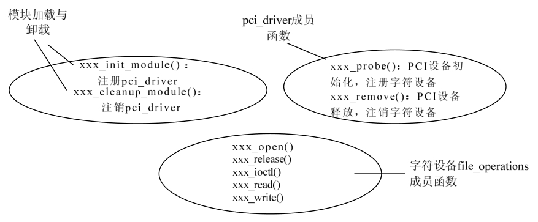
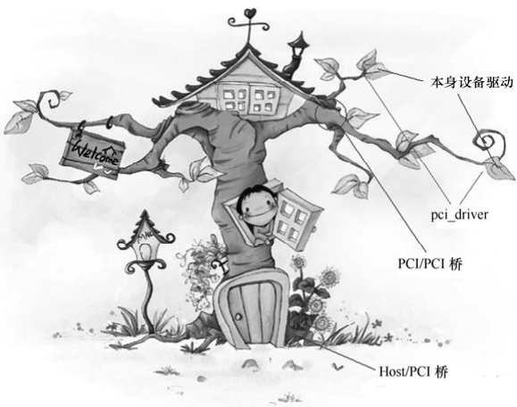

### 21.2.1 PCI设备驱动的组成

从本质上讲PCI只是一种总线，具体的PCI设备可以是字符设备、网络设备、USB主机控制器等，因此，一个通过PCI总线与系统连接的设备的驱动至少包含以下两部分内容。

● PCI驱动。

● 设备本身的驱动。

PCI驱动只是为了辅助设备本身的驱动，它不是目的，而是手段。例如，对于通过PCI总线与系统连接的字符设备，则驱动中除了要实现PCI驱动部分外，其主体仍然是设备作为字符设备本身的驱动，即实现file_operations成员函数并注册cdev。分析Linux内核可知，在/drivers/block/、/drivers/atm/、/drivers/char/、/drivers/i2c/、/drivers/ieee1394/、/drivers/media/、/drivers/mtd/、/drivers/net/、/drivers/serial/、/drivers/video/、/sound/等目录中均广泛分布着PCI设备驱动。

在Linux内核中，用pci_driver结构体来定义PCI驱动，该结构体中包含了PCI设备的探测/移除、挂起/恢复等函数，其定义如代码清单21.5所示。pci_driver和前面说的platform_driver、i2c_driver、usb_driver的地位非常相似，都是起到挂接总线的作用。

代码清单21.5 pci_driver结构体

1 struct pci_driver { 
 
 2 struct list_head node; 
 
 3 char *name; 
 
 4 struct module *owner;

5 const struct pci_device_id *id_table; /*不能为NULL，以便probe函数调用*/ 
 
 6 /* 新设备添加 */ 
 
 7 int(*probe)(struct pci_dev *dev, const struct pci_device_id *id); 
 
 8 void(*remove)(struct pci_dev *dev); /* 设备移出 */ 
 
 9 int(*suspend)(struct pci_dev *dev, pm_message_t state); /* 设备挂起 */ 
 
 10 int (*suspend_late) (struct pci_dev *dev, pm_message_t state); 
 
 11 int (*resume_early) (struct pci_dev *dev); 
 
 12 int(*resume)(struct pci_dev *dev); /* 设备唤醒 */ 
 
 13 void(*shutdown)(struct pci_dev *dev); 
 
 14 struct pm_ext_ops *pm; 
 
 15 struct pci_error_handlers *err_handler; 
 
 16 struct device_driver driver; 
 
 17 struct pci_dynids dynids; 
 
 18 };

对pci_driver的注册和注销通过如下函数来实现：

int pci_register_driver(struct pci_driver *driver); 
 
 void pci_unregister_driver(struct pci_driver *drv);

pci_driver的probe()函数要完成PCI设备的初始化及其设备本身身份（字符、TTY、网络等）驱动的注册。当Linux内核启动并完成对所有PCI设备进行扫描、登录和分配资源等初始化操作的同时，会建立起系统中所有PCI设备的拓扑结构，probe()函数将负责硬件的探测工作并保存配置信息。

下面以一个PCI接口字符设备为例，给出PCI设备驱动的完整模板。其一部分代码实现pci_driver成员函数，一部分代码实现字符设备的file_operations成员函数，如代码清单21.6所示。

代码清单21.6 PCI设备驱动的程序模板

1 /* 指明该驱动程序适用于哪一些PCI设备 */ 
 
 2 static struct pci_device_id xxx_pci_tbl [] __initdata = { 
 
 3 {PCI_VENDOR_ID_DEMO, PCI_DEVICE_ID_DEMO, 
 
 4 PCI_ANY_ID, PCI_ANY_ID, 0, 0, DEMO}, 
 
 5 {0,} 
 
 6 }; 
 
 7 MODULE_DEVICE_TABLE(pci, xxx_pci_tbl); 
 
 8 
 
 9 /* 中断处理函数 */ 
 
 10 static void xxx_interrupt(int irq, void *dev_id, struct pt_regs *regs) 
 
 11 { 
 
 12 ... 
 
 13 } 
 
 14 
 
 15 /* 字符设备file_operations open成员函数 */ 
 
 16 static int xxx_open(struct inode *inode, struct file *file) 
 
 17 { 
 
 18 /* 申请中断，注册中断处理程序 */ 
 
 19 request_irq(xxx_irq, &xxx_interrupt, ...)); 
 
 20 ... 
 
 21 } 
 
 22 
 
 23 /* 字符设备file_operations ioctl成员函数 */ 
 
 24 static int xxx_ioctl(struct inode *inode, struct file *file, unsigned int cmd, unsigned long arg) 
 
 25 { 
 
 26 ...

27 } 
 
 28 
 
 29 /* 字符设备file_operations read、write、mmap等成员函数 */ 
 
 30 
 
 31 /* 设备文件操作接口 */ 
 
 32 static struct file_operations xxx_fops = { 
 
 33 owner: THIS_MODULE, /* xxx_fops所属的设备模块 */ 
 
 34 read: xxx_read, /* 读设备操作*/ 
 
 35 write: xxx_write, /* 写设备操作*/ 
 
 36 ioctl: xxx_ioctl, /* 控制设备操作*/ 
 
 37 mmap: xxx_mmap, /* 内存重映射操作*/ 
 
 38 open: xxx_open, /* 打开设备操作*/ 
 
 39 release: xxx_release /* 释放设备操作*/ 
 
 40 }; 
 
 41 
 
 42 /* pci_driver的probe成员函数 */ 
 
 43 static int _ _init xxx_probe(struct pci_dev *pci_dev, const struct pci_device_id *pci_id) 
 
 44 { 
 
 45 pci_enable_device(pci_dev); /* 启动PCI设备 */ 
 
 46 
 
 47 /* 读取PCI配置信息 */ 
 
 48 iobase = pci_resource_start (pci_dev,1); 
 
 49 ... 
 
 50 
 
 51 pci_set_master(pci_dev);//设置成总线主DMA模式 
 
 52 
 
 53 pci_request_regions(pci_dev);/* 申请I/O资源 */ 
 
 54 
 
 55 /* 注册字符设备 */ 
 
 56 cdev_init(xxx_cdev,&xxx_fops); 
 
 57 register_chrdev_region(xxx_dev_no, 1, ...); 
 
 58 cdev_add(xxx_cdev); 
 
 59 
 
 60 return 0; 
 
 61 } 
 
 62 
 
 63 /* pci_driver的remove成员函数 */ 
 
 64 static int _ _init xxx_release(struct pci_dev *pdev) 
 
 65 { 
 
 66 pci_release_regions(pdev);/* 释放I/O资源 */ 
 
 67 pci_disable_device (pdev);/* 禁止PCI设备 */ 
 
 68 unregister_chrdev_region(xxx_dev_no, 1); /* 释放占用的设备号 */ 
 
 69 cdev_del(&xxx_dev.cdev); /* 注销字符设备 */ 
 
 70 ... 
 
 71 return 0; 
 
 72 } 
 
 73 
 
 74 /* 设备模块信息 */ 
 
 75 static struct pci_driver xxx_pci_driver = { 
 
 76 name: xxx_MODULE_NAME, /* 设备模块名称 */ 
 
 77 id_table: xxx_pci_tbl, /* 能够驱动的设备列表 */ 
 
 78 probe: xxx_probe, /* 查找并初始化设备 */ 
 
 79 remove: xxx_remove /* 卸载设备模块 */ 
 
 80 }; 
 
 81

82 static int _ _init xxx_init_module (void) 
 
 83 { 
 
 84 pci_register_driver(&xxx_pci_driver); 
 
 85 } 
 
 86 static void _ _exit xxx_cleanup_module (void) 
 
 87 { 
 
 88 pci_unregister_driver(&xxx_pci_driver); 
 
 89 } 
 
 90 /*驱动模块加载函数 */ 
 
 91 module_init(xxx_init_module); 
 
 92 /* 驱动模块卸载函数 */ 
 
 93 module_exit(xxx_cleanup_module);

上述代码清单的第1～7行给出了本驱动所支持的PCI设备的列表，如同在USB设备驱动中定义usb_device_id结构体数组一样，在PCI设备驱动中，也需要定义一个pci_device_id结构体数组。pci_device_id用于标识一个PCI设备。它的成员包括：厂商ID、设备ID、子厂商ID、子设备ID、类别、类别掩码（类可分为基类、子类）和私有数据。每一个PCI设备的驱动程序都有一个pci_device_id的数组，用于告诉PCI核心自己能够驱动哪些设备，pci_device_id结构体的定义如代码清单21.7所示。

代码清单21.7 pci_device_id结构体

1 struct pci_device_id { 
 
 2 _ _u32 vendor, device; /* 厂商和设备ID或PCI_ANY_ID*/ 
 
 3 _ _u32 subvendor, subdevice; /* 子厂商ID或PCI_ANY_ID */ 
 
 4 _ _u32 class, class_mask; /* (类、子类、prog-if) 三元组 */ 
 
 5 kernel_ulong_t driver_data; /* 驱动私有数据 */ 
 
 6 };

将代码清单21.6中的各个函数进行归类，可得出该驱动的组成，如图21.4所示。

图21.5所示的树中，树根是主机/PCI桥，树叶是具体的PCI设备，树叶本身与树枝通过pci_driver连接，而树叶本身的驱动，读写、控制树叶则需要通过其树叶设备本身所属类设备驱动来完成。

由此我们看出，对于USB、PCI设备这种挂接在总线上的设备而言，USB、PCI只是它们的“工作单位”，它们需要向“工作单位”注册（注册usb_driver、pci_driver），并接收“工作单位”的管理（被调入probe()、调出disconnect()/remove()、放假suspend()/shutdown()、继续上班resume()等），但是其本身可能是一个工程师、一个前台或一个经理，因此，做好工程师、前台或经理是其主体工作，这部分对应于字符设备驱动、tty设备驱动、网络设备驱动等。

