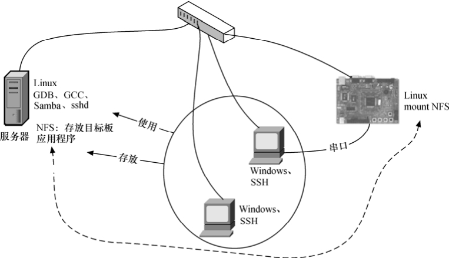
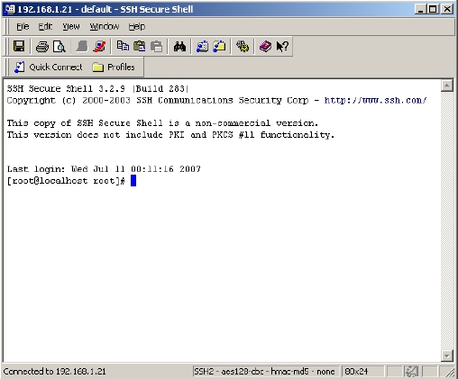
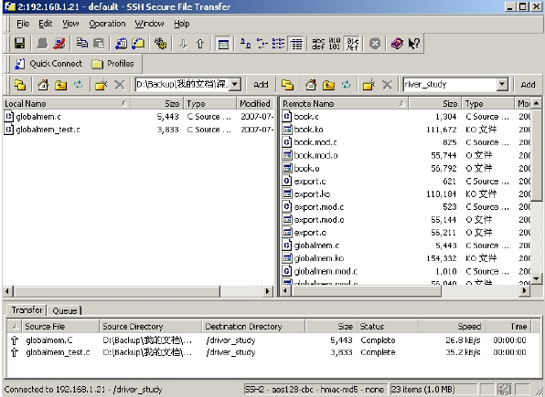

### 22.1.1 实验室建设

在公司或学校的实验室中，PC的性能一般来说不会太高，用PC来编译Linux内核和模块的速度总是受限。相反地，服务器的资源相对比较充分，CPU以及磁盘性能都较高，因此在服务器上进行内核、驱动及应用程序的编译开发都将更加快捷，而且使用服务器更便于统一管理实验室内的所有开发者。图22.1所示为一种常见的小型Linux实验室环境。

Linux服务器上启动了Samba和sshd进程，各工程师在自己的Windows或Linux客户机上通过SSH用自己的用户名和密码登录服务器便可以使用服务器上的GCC、GDB等软件（Windows下SSH Secure Shell界面如图22.2所示）。同时，SSH软件提供了类似于FTP的文件共享功能（Windows下SSH Secure File Transfer界面如图22.3所示），方便在客户端和服务器端复制文件。

目标板、服务器和客户端全部通过交换机连接，同时客户端连接目标板的串口作为控制台。在调试Linux应用程序时，目标板erver与调试用的GDB，目标板与服务器的NFS挂接都借助网络通信解决。编写完成的应用程序或内核模块可直接存放在服务器的NFS服务目录内，而该目录可被目标板上的Linux系统mount到本身的一个目录内。

