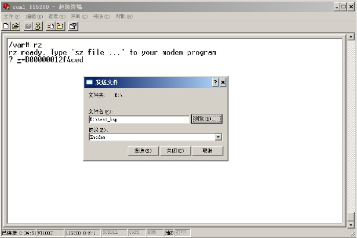
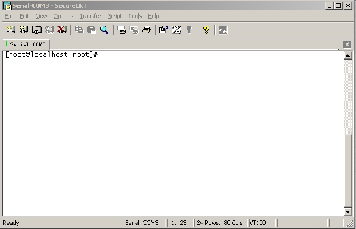
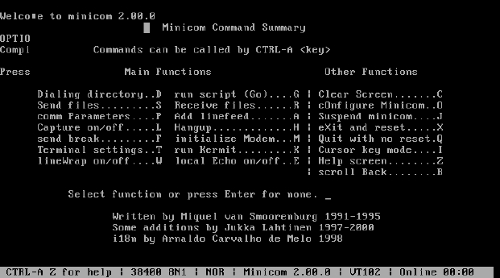

### 22.1.3 串口工具

在嵌入式Linux的调试过程中，目标机往往会提供给主机一个串口控制台，驱动工程师在80%以上的情况下都是通过串口与目标机通信。因此，好用的串口工具将大大提高工程师的生产效率。

在Windows环境下，其附件内自带了超级终端，超级终端包括了对VT100、ANSI等终端仿真功能以及对xmodem、ymodem、zmodem等协议的支持，如图22.4所示。

在调试过程中，经常需要保存串口打印信息的历史记录，这时候可以使用“传送”菜单下的“捕获文字”功能来实现。

SecureCRT是比超级终端更强大且更方便的工具，它将SSH的安全登录、数据传送性能和Windows终端仿真提供的可靠性、可用性和可配置性结合在一起，其界面如图22.5所示。鉴于SecureCRT具备比超级终端更强大且好用的功能，建议直接用SecureCRT替代超级终端。

在开发过程中，为执行自动化的串口发送操作，可以使用SecureCRT的VBScript脚本功能，让其运行一段脚本，自动捕获接收到的串口信息并向串口上发送指定的数据或文件。代码清单22.1所示的脚本等待接收到“CCC”字符串后通过xmodem协议发送file.bin文件，之后，当接收到“y/n”时，选择“y”。

代码清单22.1 SecureCRT VBScript脚本范例

1 #$language = "VBScript" 
 
 2 #$interface = "1.0" 
 
 3 
 
 4 Sub main 
 
 5 Dir = "d:\baohua\" 
 
 6 ' turn on synchronous mode so we don't miss any data 
 
 7 crt.Screen.Synchronous = True 
 
 8 'wait "CCC" string then send file 
 
 9 crt.Screen.WaitForString "CCC" 
 
 10 crt.FileTransfer.SendXmodem Dir & "file.bin" 
 
 11 'wait "y/n" string then send "y" 
 
 12 crt.Screen.WaitForString "y/n" 
 
 13 crt.Screen.Send "y" & VbCr 
 
 14 End Sub

另外，在Windows下环境下，也可以选用PuTTY工具，该工具非常小巧，功能很强大，支持串口、Telnet和SSH等，其官方网址为：http://www.chiark.greenend.org.uk/~sgtatham/putty/。

Minicom是Linux系统下常用的类似于Windows下超级终端的工具，当要发送文件或设置串口时，需先按下“CTRL+A”，紧接着按下“Z”键激活菜单，如图22.6所示。

除了Minicom以外，在Linux系统下，也可以直接使用C-Kermit。运行kermit命令即可启动C-Kermit。在使用C-Kermit连接目标板之前，需先进行串口设置，如下所示：

set line /dev/ttyS0 
 
 set speed 115200 
 
 set carrier-watch off 
 
 set handshake none 
 
 set flow-control none 
 
 robust 
 
 set file type bin 
 
 set file name lit 
 
 set rec pack 1000 
 
 set send pack 1000 
 
 set window 5

之后，使用以下命令就可以连接到目标板：

connect

在kermit的使用过程中，会涉及串口控制台和kermit功能模式之间的切换，从串口控制台切换到kermit的方法是按下“Ctrl + \”，然后再按下“C”。

假设我们在串口控制台上敲入命令使得目标板进入文件接收等待状态，此后可按下“Ctrl + \ ”，再按“C”，切换到kermit，运行“send /file_name”命令传输文件。文件传输结束后，再运行“c”命令将进入串口控制台。

