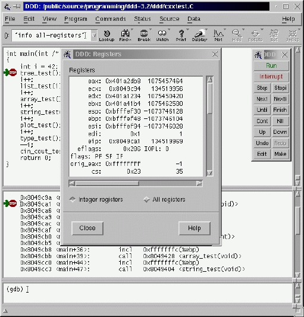
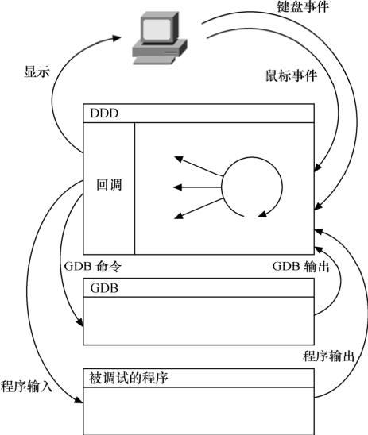
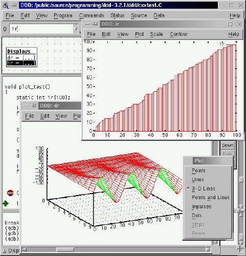

### 22.2.2 DDD图形界面调试工具

GDB本身是一种命令行调试工具，但是通过DDD（Data Display Debugger，http://www.gnu. org/software/ddd/），可以被图形界面化。DDD可以作为GDB、DBX、WDB、Ladebug、JDB、XDB、Perl Debugger或Python Debugger的可视化图形前端，其特有的图形数据显示功能（Graphical Data Display）可以把数据结构按照图形的方式显示出来。

DDD最初源于1990年Andreas Zeller编写的VSL结构化语言，后来经过一些程序员的努力，演化成今天的模样。DDD的功能非常强大，可以调试用C\C++、Ada、Fortran、Pascal、Modula-2 和Modula-3编写的程序；可以超文本方式浏览源代码；能够进行断点设置、回溯调试和历史记录编辑；具有程序在终端运行的仿真窗口，具备在远程主机上进行调试的能力；能够显示各种数据结构之间的关系，并将数据结构以图形化形式显示；具有GDB/DBX/XDB的命令行界面，包括完全的文本编辑、历史纪录、搜寻引擎等。

DDD的主界面如图22.7所示，和Visual Studio等集成开发环境非常相近，而且DDD包含了Visual Studio所不包含的部分功能。

在设计DDD的时候，设计人员决定把它与GDB之间的耦合度尽可能降低。因为像GDB这样的开源软件，更新比商业软件快。所以为了使GDB的变化不会影响到DDD，在DDD中，GDB是作为独立的进程运行的，通过命令行接口与DDD进行交互。

图22.8显示了用户、DDD、GDB和被调试进程之间的关系，DDD和GDB之间的所有通信都是异步进行的。在DDD中发出的GDB命令都会与一个回调例程相连，放入命令队列中。这个回调例程在合适的时间会处理GDB的输出。例如，如果用户手动输入一条GDB的命令，DDD就会把这条命令与显示GDB输出的一个回调例程连起来。一旦GDB命令完成，就会触发回调例程，GDB的输出就会显示在DDD的命令窗口中。

DDD在事件循环时等待用户输入和GDB输出，同时等着GDB进入等待输入状态。当GDB可用时，下一条命令就会从命令队列中取出，送给GDB。GDB到达的输出由上次命令的回调过程来处理。这种异步机制避免了DDD在等待GDB输出时发生阻塞现象，到达的事件可以在任何时间得到处理。

不可否认的是，DDD和GDB的分离使得DDD运行速度相对来说比较慢，但是这种方法带来了灵活性和兼容性的好处。例如，用户可以把GDB调试器换成其他调试器，如DBX等。另外，GDB和DDD的分离使得用户可以在不同的机器上分别运行GDB和DDD。

在DDD中，可以直接在底部的控制台中输入GDB命令，也可以通过菜单和鼠标来以图形方式触发GDB命令的运行，使用方法甚为简单，因此这里不再赘述。除了基本的GDB命令外，DDD中的Plot工具可以用于将数组以二维或三维坐标系中点、曲线或曲面的方式显示出来，如图22.9所示，这在某些场合下会非常有用。dsp工程师应该不会陌生，因为在dsp程序调试中，在集成开发环境中绘制数组曲线是十分常见的用法。

DDD不仅可用于调试PC上的应用程序，也可调试目标板子，方法是用如下命令启动DDD：

ddd -debugger arm-linux-gdb <要调试的程序>

