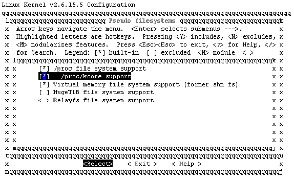
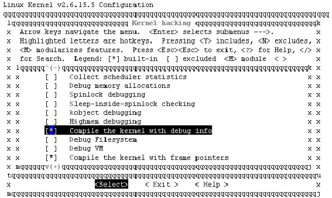

### 22.8.1 kcore

GDB调试器可以把内核作为一个应用程序来调试，在这种方式中，需要给GDB指定未压缩的内核映像的文件名和“core文件”的名字。对于一个正在运行的内核，“core文件”就是运行时的内存映像/proc/kcore（kcore代表整个内核地址空间，对应于所有的物理内存）。因此，使用GDB 和kcore调试内核的典型命令如下：

gdb /usr/src/linux/vmlinux /proc/kcore

第一个参数是非压缩的ELF核心可执行文件的名字，不能是zImage、bzImage。第二个参数是内核档案的名称，如同其他/proc中的文件，/proc/kcore是在被读的时候才产生的。

在“gdb <path>/vmlinux /proc/kcore”这种调试方式中，可用print命令打印变量，如“print jiffies”。当从GDB打印数据时间，GDB会缓存已经读取的数据，但是由于内核正在执行，各种数据项在不同时间有不同的值，GDB的缓存可能导致连续多次读取同一变量得到相同的值。例如，多次显示jiffies：

(gdb) print jiffies 
 
 $ 
 3 = 153729 
 
 (gdb) print jiffies 
 
 $ 
 4 = 153729 
 
 (gdb) print jiffies 
 
 $ 
 5 = 153729

虽然jiffies已经变更了，但每次print出来的都是第1次的值153729。为避免此问题，我们可以在需要刷新GDB缓存时发出“core-file /proc/kcore”命令，这将导致调试器使用新的“core文件”并且丢弃旧信息。当执行“core-file /proc/kcore”命令后，再运行“print jiffies”，值会发生变化，如下所示：

(gdb) core-file /proc/kcore 
 
 Core was generated by 'ro root=/dev/sda1 hdc=ide-scsi'. 
 
 #0 0x00000000 in globalmem_fops () 
 
 (gdb) print jiffies 
 
 $ 
 6 = 178683

$6比$3、$4、$5要大，这说明新的值被print出来了。

为了使Linux系统中包含/proc/kcore文件，必须在编译时包含“/proc/kcore support”（如图22.10所示），而为了给GDB提供symbol信息，必须设定CONFIG_DEBUG_INFO选项来编译内核（如图22.11所示）。

在“gdb <path>/vmlinux /proc/kcore”这种调试方式中，GDB的绝大多数功能都不能使用，如修改内核变量的值、设置断点、单步执行等，而22.9.2和22.9.3小节将要介绍的KDB和KGDB方式则可支持这些功能。

值得一提的是，可加载模块的symbol并未包含在vmlinux中，必须使用一些辅助方法才能调试模块。Linux可加载模块是ELF格式的可执行映像，它们被分成几个段，有3个典型的与模块调试相关的段。

● .text：这个段包含模块的可执行程序代码。

● .bss/.data：这两个段包含模块的变量，在编译时未初始化的变量在.bss 中，而被初始化过的变量在.data段里。

当一个模块被加载后，/sys/module/目录下会新增一个对应于该模块的目录，如“insmod globalmem.ko”后，将生成/sys/module/globalmem，在该目录下又包含一个sections目录，运行“ls –a”命令可以获得该目录下包含的文件：

[root@localhost sections]# ls -a 
 
 . .bss .gnu.linkonce.this_module .rodata.str1.1 .symtab __versions 
 
 .. .data .rodata .strtab .text

通过cat其中的.text、.data、.bss可以得到我们感兴趣的3个段的地址，如下所示：

[root@localhost sections]# cat .text 
 
 0xc3816000 
 
 [root@localhost sections]# cat .bss 
 
 0xc3816b88 
 
 [root@localhost sections]# cat .data 
 
 0xc3816a94

之后就可以借用GDB的add-symbol-file来添加模块的符号信息，这样之后便可以查看模块中的变量了，如下所示：

(gdb) add-symbol-file globalmem.ko 0xc3816000\ 
 
 -s .bss 0xc3816b88\ 
 
 -s .data 0xc3816a94 
 
 add symbol table from file "globalmem.ko" at 
 
 .text_addr = 0xc3816000 
 
 .bss_addr = 0xc3816b88

.data_addr = 0xc3816a94 
 
 (y or n) y 
 
 Reading symbols from globalmem.ko...done. 
 
 
 (gdb) p globalmem_major （查看 
 globalmem.ko中的变量 
 ） 
 
 $ 
 7 = 254

