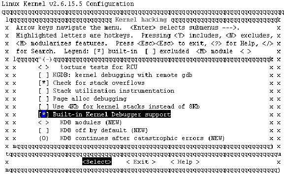

### 22.8.2 KDB

KDB项目由Silicon Graphics维护，为使内核内嵌KDB，需要从Silicon Graphics的FTP站点下载与内核版本有关的补丁，一个是公共补丁（包含了对通用内核代码的更改），另一个是特定于体系结构的补丁，下载地址为ftp://oss.sgi.com/www/projects/kdb/download。给内核打上KDB补丁之后，内核“Kernel hacking”编译选项中就会包含与KDB相关的内容，如图22.12所示，选中“Built-in Kernel Debugger support”，并根据实际需求选择默认的KDB状态为OFF 或ON。

如果编译期间没有选中CONFIG_KDB_OFF（即选择了“KDB off by default”），那么在默认情况下KDB是活动的。否则，需要显式地激活它，通过在引导期间将KDB=on标志传递给内核或者通过执行如下命令可激活KDB：

#echo "1" >/proc/sys/kernel/kdb

反过来，如果默认情况下KDB是打开的，那么将KDB = off标志传递给内核或者执行如下命令将会取消激活KDB：

#echo "0" >/proc/sys/kernel/kdb

在引导期间还可以将另一个标志传递给内核，即KDB = early。early标志将导致在引导过程的初始阶段就把控制权传递给KDB，这将非常有利于工程师在引导过程初始阶段进行内核调试。

在两种情况下KDB会被调用：当KDB处于打开状态时，只要内核中有紧急情况就会自动调用它；其次，按下键盘上的“Pause”键也可手工调用KDB。使用KDB可进行内存和寄存器修改、设置断点和跟踪堆栈等。

KDB中进行内存显示和修改的常用命令是md和mm。md命令以一个地址/符号和行计数line-count为参数，显示从该地址开始的line-count行的内存。如果没有指定line-count，那么就使用环境变量所指定的默认值。如果没有指定地址，那么md就从上一次打印的地址继续。mm命令用于修改内存内容，它以地址/符号和新内容作为参数，用新的内容替换指定地址处的内容。

例如，如下命令可显示从0xc000000开始的15行内存：

kdb> md 0xc000000 15

如下命令可将内存位置为0xc000000上的内容更改为0x10：

kdb> mm 0xc000000 0x10

rd命令用于显示处理器寄存器的内容，rm命令用于修改寄存器的内容。它以寄存器名称和新的内容作为参数，用新的内容修改寄存器。寄存器名称与特定的体系结构有关。目前，不能修改控制寄存器。

KDB中常用的断点命令有bp、bc、bd、be和bl。bp命令以一个地址/符号作为参数，当遇到该断点时则系统停止执行并将控制权交予KDB；bl命令列出当前的断点集，它包含了启用和禁用的断点；be命令用于启用断点，该命令的参数是断点号；bc命令用于从断点表中去除断点，它以断点号或“*”作为参数，为“*”意味着去除所有断点。

例如，执行如下命令将对函数sys_write()设置断点：

kdb> bp sys_write

执行如下命令可列出断点表中的所有断点：

kdb> bl

执行如下命令可清除断点号为1的断点：

kdb> bc 1

KDB中主要的堆栈跟踪命令有bt、btp、btc和bta。bt命令提供有关当前线程的堆栈的信息；btp命令以进程标识作为参数，并对这个特定进程进行堆栈回溯；btc命令对每个活动CPU上正在运行的进程执行堆栈回溯，它从第一个活动CPU开始执行bt，然后切换到下一个活动CPU，依次类推；bta命令对处于某种特定状态的所有进程执行回溯，可以有选择性地将各种参数传递给该命令，回溯选项包括D（不可中断状态）、R（正运行）、S（可中断休眠）、T（已跟踪或已停止）、Z（僵死）和U（不可运行）。bta命令若不带任何参数，会对所有进程执行回溯。

除此之外，在内核调试过程中其他的常用KDB命令如下。

● id命令：以地址/符号作为参数，它对从该地址开始的指令进行反汇编，环境变量IDCOUNT确定要显示输出的行数。

● ss命令：单步执行指令然后将控制返回给KDB。ssb是该指令的一个变体，它执行从当前指令指针地址开始的指令（在屏幕上打印指令），直到它遇到将引起分支转移的指令为止。

● go命令：让系统继续正常执行，直到遇到断点为止。

● reboot命令：立刻重新引导系统。

● ll命令：以地址、偏移量和另一个KDB命令作为参数，它对链表中的每个元素反复执行作为参数的这个命令。

例如，如下命令将反汇编从schedule()开始的指令（所显示的行数取决于环境变量IDCOUNT）：

kdb> id schedule

