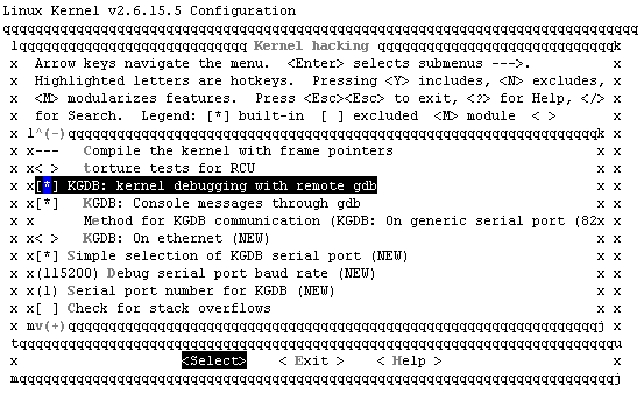

### 22.8.3 KGDB

gdb <path>/vmlinux /proc/kcore方式在调试模块时缺少一些至关重要的功能，KDB尽管克服了部分缺陷，但是它只能在汇编代码级进行调试，而本小节要介绍的KGDB则能很方便地在源码级对内核进行调试。KGDB采用的正是嵌入式系统中远程调试的思路，主机和目标机之间通过串口或网口进行通信。

MontaVista Linux直接提供了对KGDB的支持，而开源社区的内核中必须打上相应版本的KGDB补丁（即kgdb stub，这种方式俗称“插桩”），如X86 PC上需要打的补丁包括：core-lite.patch、i386-lite.patch、8250.patch、eth.patch、i386.patch和core.patch。KGDB内核补丁的下载地址为：http://kgdb.linsyssoft.com/downloads.htm。

打上KGDB补丁后，运行make menuconfig时需选择关于KGDB的编译项目，包括选择“KGDB: kernel debugging with remote gdb”、“KGDB: Console messages through gdb”并设置串口通信方式，如图22.13所示。

在VmWare中同时启动两个虚拟机就可以模拟KGDB的使用环境，在主机上运行如下命令设置串口波特率：

stty ispeed 115200 ospeed 115200 -F /dev/ttyS0

修改目标机的/etc/grub.conf，增加如下项目：

title Linux-2.6.15.5-kgdb 
 
 root (hd0,0) 
 
 kernel /boot/vmlinuz-2.6.15.5-kgdb ro root=/dev/sda1 hdc=ide-scsi kgdbwait

kgdbwait的含义是启动时就等待主机的GDB连接。

依次运行如下命令就可以启动调试并连接至目标机：

<root#> gdb ./vmlinux 
 
 GNU gdb Red Hat Linux (6.0post-0.20040223.17rh) 
 
 Copyright 2004 Free Software Foundation, Inc. 
 
 GDB is free software, covered by the GNU General Public License, and you are 
 
 welcome to change it and/or distribute copies of it under certain conditions. 
 
 Type "show copying" to see the conditions. 
 
 There is absolutely no warranty for GDB. Type "show warranty" for details. 
 
 This GDB was configured as "i386-redhat-linux-gnu"...Using host libthread_db library 
 
 "/lib/tls/libthread_db.so.1". 
 
 (gdb) set remotebaud 115200 
 
 (gdb) target remote /dev/ttyS0 //连接目标机 
 
 Remote debugging using /dev/ttyS0 
 
 breakpoint () at kernel/kgdb.c:1212 
 
 1212 atomic_set(&kgdb_setting_breakpoint, 0); 
 
 warning: shared library handler failed to enable breakpoint 
 
 (gdb)

之后，在主机上，我们可以使用GDB就像调试应用程序一样调试加载了KGDB的目标机上的内核。

为进行可加载模块的调试，需要使用gdbmod并借助一些技巧来在模块加载的时候获取symbol信息。首先需要设置solib-search-path变量的路径，如运行“set solib-search-path /driver_study”命令后，再加载globalmem.ko，接着运行“info sharedlibrary”命令，如果看到相应的模块信息，就可以在主机上调试加载后的globalmem.ko模块中的C代码了。

最后，需要注意到KGDB的工作是以目标系统的串口或网口正常工作为前提的，作为一种软件“插桩”的调试方式，在调试过程中如果出现死机问题，主机上将无法定位。

