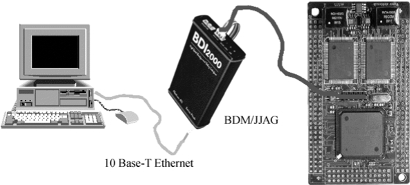

### 22.9 使用仿真器调试内核

本节以BDI2000为例来讲解如何使用仿真器调试Linux内核。BDI2000是一种最常见的功能强大的仿真器，使用它可以直接调试Linux内核。在典型的调试环境中，BDI2000、主机、目标机这3者的关系如图22.14所示。

除了支持免费的GDB以外，BDI2000还支持商业级的MontaVista DevRocket、LinuxScope （Eclipse GDB）调试器。

为使用BDI2000调试目标板内核，在BDI2000和目标板启动加电后，BDI2000端需完成如下工作。

（1）配置BDI2000，修改.cfg文件，确保目标机的正常初始化。

（2）主机通过telnet登录BDI2000，例如，若主机的/etc/hosts中包含了“bdi”节点，则运行“telnet bdi”即可登录到BDI2000。

（3）设置内核运行时的第一个断点，通常在函数start_kernel()，如“[BDI2000] bi XXXXXXXX”。

通过grep start_kernel System.map可以获得start_kernel()的具体位置，代替上面的XXXXXXXX。

（4）执行内核代码 “[BDI2000] go”。

以上第（3）、（4）步的运行是以目标板已加载Linux内核到RAM为前提的，如果没有加载，则需借助仿真器和主机端加载。

相应地，主机端需完成如下工作。

（1）通过GDB启动内核调试，如运行：

arm-linux-gdb vmlinux

（2）连接仿真器，使用GDB的“target remote”命令：

target remote bdi:2001

之后，就可以在GDB中像调试应用程序一样调试目标板上运行的Linux内核了。

