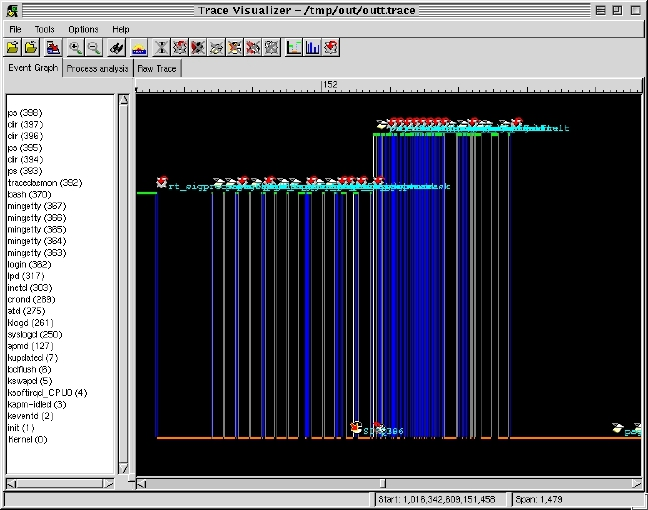

### 22.11 Linux性能监控与调优工具

除了保证程序的正确性以外，项目开发中往往还关心性能和稳定性。这时候，我们往往要对内核、应用程序或整个系统进行性能优化。性能优化中常用的手段如下。

#### 1．使用top、vmstat、iostat、sysctl等常用工具

top命令显示处理器的活动状况。缺省情况下，显示占用CPU最多的任务，并且每隔5s做一次刷新；iostat命令分析各个磁盘的传输闲忙状况；vmstat 命令报告关于内核线程、虚拟内存、磁盘、陷阱和CPU活动的统计信息；netstat是用来检测网络信息的工具；sar用于收集、报告或者保存系统活动信息，sar显示数据、sar1和sar2用于收集和保存数据。

sysctl是一个可用于改变正在运行中的Linux系统的接口。用sysctl可以读取设置超过几百个系统变量，例如“sysctl –a”会读取所有变量。

sysctl的实现原理是：所有的内核参数在/proc/sys形成一个树状结构，sysctl系统调用调用到的内核函数是sys_sysctl，匹配项目后，最后的读写在do_sysctl_strategy中完成，如

echo “1” > /proc/sys/net/ipv4/ip_forward

就等价于：

sysctl –w net.ipv4.ip_forward =”1”

#### 2．使用高级分析手段，如OProfile、gprof

OProfile可以帮助用户识别诸如模块的占用时间、循环的展开、高速缓存的使用率低、低效的类型转换和冗余操作、错误预测转移等问题。它收集有关处理器事件的信息，其中包括TLB的故障、停机、存储器访问以及cache命中和未命中的指令的攫取数量。

OProfile支持两种采样方式：基于事件的采样（event based）和基于时间的采样（time based）。基于事件的采样是OProfile只记录特定事件（比如L2 cache miss）的发生次数，当达到用户设定的定值时oprofile就记录一下（采一个样）。这种方式需要CPU内部有性能计数器（performace counter）。基于时间的采样是OProfile借助OS时钟中断的机制，每个时钟中断OProfile都会记录一次（采一次样）。引入的目的在于，提供对没有性能计数器CPU的支持。其精度相对于基于事件的采样要低。因为要借助OS时钟中断的支持，对禁用中断的代码OProfile不能对其进行分析。

OProfile在Linux上分两部分，一个是内核模块(oprofile.ko)，一个为用户空间的守护进程(oprofiled)。前者负责访问性能计数器或者注册基于时间采样的函数，并采样置于内核的缓冲区内。后者在后台运行，负责从内核空间收集数据，写入文件。其运行步骤如下。

（1） 初始化 opcontrol --init

（2） 配置 opcontrol --setup --event=...

（3） 启动 opcontrol --start

（4） 运行待分析之程序 xxx

（5） 取出数据

opcontrol --dump

opcontrol --stop

（6） 分析结果 opreport -l ./xxx

GNU gprof可以打印出程序运行中各个函数消耗的时间，可以帮助程序员找出众多函数中耗时最多的函数；产生程序运行时候的函数调用关系，包括调用次数，可以帮助程序员分析程序的运行流程。

GNU gprof的实现原理为通过在编译和链接程序的时候（使用 -pg 编译和链接选项），gcc 在应用程序的每个函数中都加入名为mcount（或“_mcount”，或“_ _mcount”，依赖于编译器或操作系统）的函数，也就是说应用程序里的每一个函数都会调用mcount，而mcount会在内存中保存一张函数调用图，并通过函数调用堆栈的形式查找子函数和父函数的地址。这张调用图也保存了所有与函数相关的调用时间，调用次数等的所有信息。

GNU gprof的基本用法如下。

（1）使用-pg编译和链接应用程序。

（2）执行应用程序使之生成供gprof 分析的数据。

（3）使用gprof 程序分析应用程序生成的数据。

#### 3．进行内核跟踪，如LTT

LTT（Linux Trace Toolkit）是一个用于跟踪系统详细运行状态和流程的工具，它可以跟踪记录系统中的特定事件。这些事件包括：系统调用的进入和退出；陷阱/中断（trap / irq）的进入和退出；进程调度事件；内核定时器；进程管理相关事件：创建、唤醒、信号处理等；文件系统相关事件：open/read/write /seek / ioctl等；内存管理相关事件：内存分配/释放等；其他IPC/socket/网络等事件。而这些记录我们可以通过图形的方式查看，如图20.15所示。

#### 4．使用LTP进行压力测试

LTP（Linux Test Project，官方网站http://ltp.sourceforge.net/）是一个由SGI发起并由IBM负责维护的合作计划。它的目的是为开源社区提供测试套件来验证Linux的可靠性、健壮性和稳定性。它通过压力测试来判断系统的稳定性和可靠性，工程中我们可使用 LTP 测试套件对Linux操作系统进行超长时间的测试，它可进行文件系统压力测试、硬盘 I/O 测试、内存管理压力测试、IPC压力测试、SCHED测试、命令功能的验证测试、系统调用功能的验证测试等。

#### 5．使用benchmark评估系统系统

可用于Linux的benchmark包括lmbench、UnixBench、AIM9、Netperf、SSLperf、dbench、Bonnie、Bonnie++、Iozone、BYTEmark等，用于评估操作系统、网络、IO子系统、CPU等的性能，参考网址http://lbs.sourceforge.net/列出了许多benchmark工具。

