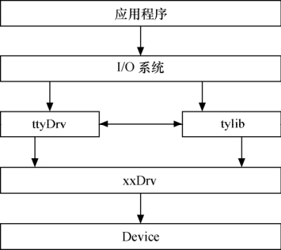
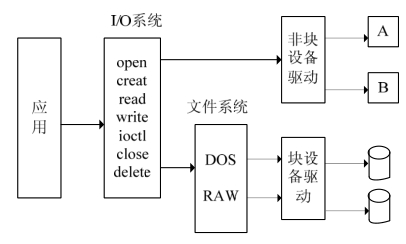
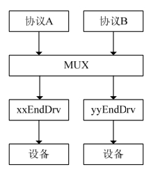
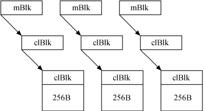
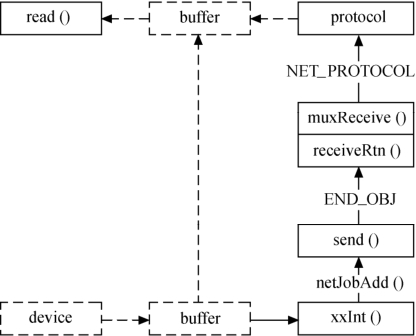
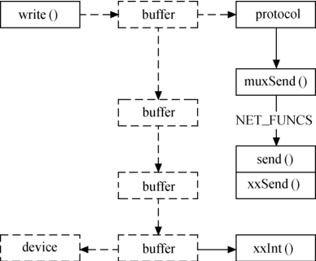
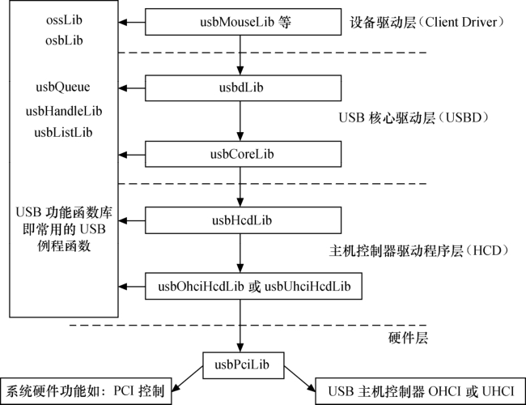

### 23.4 Linux与其他操作系统之间的驱动移植

在公司的项目更替过程中，可能会出现操作系统的更换，譬如类似的产品中，以前用VxWorks 或Windows CE，现在想改用Linux。以前同类产品的VxWorks/WinCE运行稳定，且设备驱动也被经过严格测试，现在要换成Linux了，是不是VxWorks/WinCE下的工作就完全作废了呢？

在采用原操作系统的系统中，底层的硬件操作代码已经经过验证，这一部分可以被Linux利用；VxWorks、WindowsCE等操作系统驱动的架构和Linux的驱动架构有一定的相似性，经过适当的修改，就可以被移植到Linux中。

本节将以VxWorks为例讲解VxWorks驱动向Linux驱动的移植方法。代码清单23.14所示为VxWorks下的LPT并口这一典型的字符设备驱动的骨干。

代码清单23.14 VxWorks下的LPT驱动

1 LOCAL int lptOpen(LPT_DEV *pDev, char *name, int mode); 
 
 2 LOCAL int lptRead(LPT_DEV *pDev, char *pBuf, int size); 
 
 3 LOCAL int lptWrite(LPT_DEV *pDev, char *pBuf, int size); 
 
 4 LOCAL STATUS lptIoctl(LPT_DEV *pDev, int function, int arg); 
 
 5 LOCAL void lptIntr(LPT_DEV *pDev); 
 
 6 LOCAL void lptInit(LPT_DEV *pDev); 
 
 7 
 
 8 /*初始化设备驱动*/ 
 
 9 STATUS lptDrv(int channels, /* LPT通道 */ 
 
 10 LPT_RESOURCE *pResource /* LPT资源 */ 
 
 11 ) 
 
 12 { 
 
 13 int ix; 
 
 14 LPT_DEV *pDev; 
 
 15 
 
 16 /* 检查驱动是否已被安装 */ 
 
 17 if (lptDrvNum > 0) 
 
 18 return (OK);

19 
 
 20 if (channels > N_LPT_CHANNELS) 
 
 21 return (ERROR); 
 
 22 
 
 23 for (ix = 0; ix < channels; ix++, pResource++) 
 
 24 { 
 
 25 pDev = &lptDev[ix]; 
 
 26 
 
 27 pDev->created = FALSE; 
 
 28 pDev->autofeed = pResource->autofeed; 
 
 29 pDev->inservice = FALSE; 
 
 30 
 
 31 if (pResource->regDelta == 0) 
 
 32 pResource->regDelta = 1; 
 
 33 
 
 34 pDev->data = LPT_DATA_RES(pResource); 
 
 35 pDev->stat = LPT_STAT_RES(pResource); 
 
 36 pDev->ctrl = LPT_CTRL_RES(pResource); 
 
 37 pDev->intCnt = 0; 
 
 38 pDev->retryCnt = pResource->retryCnt; 
 
 39 pDev->busyWait = pResource->busyWait; 
 
 40 pDev->strobeWait = pResource->strobeWait; 
 
 41 pDev->timeout = pResource->timeout; 
 
 42 pDev->intLevel = pResource->intLevel; 
 
 43 
 
 44 /* 创建二进制信号量 */ 
 
 45 pDev->syncSem = semBCreate(SEM_Q_FIFO, SEM_EMPTY); 
 
 46 /* 创建互斥信号量 */ 
 
 47 pDev->muteSem = semMCreate(SEM_Q_PRIORITY | SEM_DELETE_SAFE 
 
 48 | SEM_INVERSION_SAFE); 
 
 49 /* 连接中断 */ 
 
 50 (void)intConnect((VOIDFUNCPTR*)INUM_TO_IVEC(pResource->intVector), 
 
 51 (VOIDFUNCPTR)lptIntr, (int)pDev); 
 
 52 
 
 53 sysIntEnablePIC(pDev->intLevel); /* 开中断 */ 
 
 54 
 
 55 lptInit(&lptDev[ix]); 
 
 56 } 
 
 57 
 
 58 /* 注册驱动 */ 
 
 59 lptDrvNum = iosDrvInstall(lptOpen, (FUNCPTR)NULL, lptOpen, 
 
 60 (FUNCPTR)NULL,lptRead, lptWrite, lptIoctl); 
 
 61 
 
 62 return (lptDrvNum == ERROR ? ERROR ： OK); 
 
 63 } 
 
 64 
 
 65 
 
 66 /* lptOpen - 打开LPT */ 
 
 67 LOCAL int lptOpen(LPT_DEV *pDev, char *name, int mode) 
 
 68 { 
 
 69 return ((int)pDev); 
 
 70 } 
 
 71 
 
 72 /* lptRead - 读并口 */ 
 
 73 LOCAL int lptRead(LPT_DEV *pDev, char *pBuf, int size)

74 { 
 
 75 return (ERROR); 
 
 76 } 
 
 77 
 
 78 /* lptWrite - 写并口 
 
 79 * 返回值： 被写入的字节数, 或者ERROR 
 
 80 */ 
 
 81 LOCAL int lptWrite(LPT_DEV *pDev, char *pBuf, int size) 
 
 82 { 
 
 83 int byteCnt = 0; 
 
 84 BOOL giveup = FALSE; 
 
 85 int retry; 
 
 86 int wait; 
 
 87 
 
 88 if (size == 0) 
 
 89 return (size); 
 
 90 
 
 91 semTake(pDev->muteSem, WAIT_FOREVER);//获取互斥 
 
 92 
 
 93 retry = 0; 
 
 94 while ((sysInByte(pDev->stat) &S_MASK) != (S_SELECT | S_NODERR | S_NOBUSY)) 
 
 95 { 
 
 96 if (retry++ > pDev->retryCnt) 
 
 97 { 
 
 98 if (giveup) 
 
 99 { 
 
 100 errnoSet(S_ioLib_DEVICE_ERROR); 
 
 101 semGive(pDev->muteSem); 
 
 102 return (ERROR); 
 
 103 } 
 
 104 else 
 
 105 { 
 
 106 lptInit(pDev); 
 
 107 giveup = TRUE; 
 
 108 } 
 
 109 } 
 
 110 wait = 0; 
 
 111 while (wait != pDev->busyWait) 
 
 112 wait++; 
 
 113 } 
 
 114 
 
 115 retry = 0; 
 
 116 do 
 
 117 { 
 
 118 wait = 0; 
 
 119 sysOutByte(pDev->data, *pBuf); 
 
 120 while (wait != pDev->strobeWait)wait++; 
 
 121 sysOutByte(pDev->ctrl, sysInByte(pDev->ctrl) | C_STROBE | C_ENABLE); 
 
 122 while (wait) 
 
 123 wait--; 
 
 124 sysOutByte(pDev->ctrl, sysInByte(pDev->ctrl) &~C_STROBE); 
 
 125 
 
 126 if (semTake(pDev->syncSem, pDev->timeout *sysClkRateGet()) == ERROR) 
 
 127 { 
 
 128 if (retry++ > pDev->retryCnt)

129 { 
 
 130 errnoSet(S_ioLib_DEVICE_ERROR); 
 
 131 semGive(pDev->muteSem);//释放互斥 
 
 132 return (ERROR); 
 
 133 } 
 
 134 } 
 
 135 else 
 
 136 { 
 
 137 pBuf++; 
 
 138 byteCnt++; 
 
 139 } 
 
 140 }while (byteCnt < size) ; 
 
 141 
 
 142 semGive(pDev->muteSem);//释放互斥 
 
 143 
 
 144 return (size); 
 
 145 } 
 
 146 
 
 147 /* lptIoctl - 设备特定的控制 */ 
 
 148 LOCAL STATUS lptIoctl(LPT_DEV *pDev, /* 要控制的设备 */ 
 
 149 int function, /* 命令 */ 
 
 150 int arg /* 参数 */ 
 
 151 ) 
 
 152 { 
 
 153 int status = OK; 
 
 154 
 
 155 semTake(pDev->muteSem, WAIT_FOREVER); 
 
 156 switch (function) 
 
 157 { 
 
 158 case LPT_SETCONTROL: 
 
 159 sysOutByte(pDev->ctrl, arg); 
 
 160 break; 
 
 161 
 
 162 case LPT_GETSTATUS: 
 
 163 *(int*)arg = sysInByte(pDev->stat); 
 
 164 break; 
 
 165 
 
 166 default: 
 
 167 (void)errnoSet(S_ioLib_UNKNOWN_REQUEST); 
 
 168 status = ERROR; 
 
 169 break; 
 
 170 } 
 
 171 semGive(pDev->muteSem); 
 
 172 
 
 173 return (status); 
 
 174 } 
 
 175 
 
 176 /* lptIntr - 中断处理函数 */ 
 
 177 LOCAL void lptIntr(LPT_DEV *pDev) 
 
 178 { 
 
 179 pDev->inservice = TRUE; 
 
 180 pDev->intCnt++; 
 
 181 semGive(pDev->syncSem); //释放同步信号量 
 
 182 pDev->inservice = FALSE; 
 
 183 sysOutByte(pDev->ctrl, sysInByte(pDev->ctrl) &~C_ENABLE);

184 } 
 
 185 
 
 186 /* lptInit - 初始化LPT端口 */ 
 
 187 LOCAL void lptInit(LPT_DEV *pDev) 
 
 188 { 
 
 189 sysOutByte(pDev->ctrl, 0); /* init */ 
 
 190 taskDelay(sysClkRateGet() >> 3); /* hold min 50 mili sec */ 
 
 191 if (pDev->autofeed) 
 
 192 sysOutByte(pDev->ctrl, C_NOINIT | C_SELECT | C_AUTOFEED); 
 
 193 else 
 
 194 sysOutByte(pDev->ctrl, C_NOINIT | C_SELECT); 
 
 195 }

上述驱动和Linux下的字符设备驱动很多相似之处，有如下体现。

● 同样包含了open()、read()、write()、ioctl()等函数，而且同样要注册驱动（使用iosDrvInstall()）；

● 同样包含中断号和中断处理函数的绑定过程，只是用intConnect()，而不是request_irq()；

● 为了避免并发和竞争或进行同步，同样定义了信号量和互斥，只是信号量和互斥的名字发生了变化，而且用semBCreate()、semMCreate()这样的函数来创建。在访问临界资源时，也一样用互斥加以保护。

两者的差异如下。

● 内核对象、API的名称和参数有很大不同，VxWorks与Linux对等地位的函数的返回值也不相同。表23.2所示为VxWorks和Linux在同步、互斥和中断方面的对比。

**表23.2 VxWorks和Linux同步/互斥/中断对比**

| 事 项 | VxWorks | Linux |
| :-----  | :-----  | :-----  | :-----  | :-----  |
| 临界资源保护 | 互斥（二进制信号量） | 自旋锁、信号量 |
| 中断 | 没有顶底半部的概念，但是中断服务程序也通过semGive()和MsgQSend()等方式唤醒任务去完成中断引发的事务 | 有顶底半部的概念，顶半部通过软中断、tasklet、workqueue触发底半部，也可以只是wake_up一个进程 |
| 同步 | 同步semGive()、MsgQSend()进行 | 通过等待队列、完成量进行 |

● VxWorks中的命名习惯和Linux系统不同，VxWorks常用“xxxYyyZzz”命名方式，而Linux常用“xxx_yyy_zzz”命名规则。

● VxWorks对外设的访问中不会出现类似ioremap()这样的物理地址到虚拟地址的映射过程。尽管VxWorks也能支持带MMU的处理器，但是对系统中的所有任务而言，其进行的是完全相同的物理地址到虚拟地址映射。

因此，在移植VxWorks驱动到Linux驱动的过程中，可以借鉴其流程，但是必须要替换API、函数和变量命名等。

除了简单的字符设备外，VxWorks下的TTY设备、MTD设备、块设备等驱动的架构都和Linux下的架构有一定相似性，但是，由于VxWorks是一种完全定位于嵌入式系统的轻量级操作系统，因此，总体而言，VxWorks设备驱动的架构要比Linux架构简单。由于VxWorks中并不存在内核空间和用户空间的界限，很多时候，驱动甚至可以不遵循架构，直接给应用程序提供接口。

接下来分析几个典型的VxWorks设备驱动的框架结构。

#### 1．串行设备

VxWorks下串行设备驱动的结构如图23.1所示，I/O系统（VxWorks的I/O系统类似于Linux的VFS，都是向用户提供统一的文件操作接口open()、write()、read()、ioctl()、close()等）不直接与串行设备驱动打交道，而是通过ttyDrv进行。

ttyDrv是一个虚拟的设备驱动，它与tylib一起，用于处理I/O系统与底层实际设备之间的通信。它们完成的工作包括在驱动表中添加相应的驱动条目、创建设备标识符，实现与上层标准I/O函数及实际驱动程序的连接，ttyDrv完成open()和ioctl()两项功能（对应函数ttyopen()和ttyioctl()），tylib完成read()和write()两项功能（对应函数tyRead() 和tyWrite()）并管理输入/输出数据缓冲区。

在上下层数据传递方面，VxWorks使用如图23.2所示的结构（假设串口UART为8250）。

当用户调用write()函数进行写操作时，系统根据相应的文件描述符fd调用驱动表中注册的tyWrite()函数，此函数会将用户缓冲区的内容写入相应的输出ring buffer。当发现缓冲区内有内容时，函数tyITx()被调用，从ring buffer读取字符，将字符发往指定的串口。

当串口接收到数据时会调用输入中断服务程序，将输入的字符写入指定的缓冲区。然后由回调函数tyIRd()将缓冲区的内容读入ring buffer，当用户调用read()函数进行写操作时，会根据文件描述符fd调用在驱动表中注册的函数tyRead()，此函数会将ring buffer中的内容读入用户缓冲区。

#### 2．块设备

如图23.3所示，与Linux类似，VxWorks中的块设备驱动程序也不与I/O系统直接作用，而是通过磁盘、Flash文件系统与I/O系统交互。文件系统把自己作为一个驱动程序装载到I/O系统中，并把请求转发给实际的设备驱动程序。块设备的驱动程序不使用iosDrvlnstsll()来安装驱动程序，而是通过初始化块设备描述结构BLK_DEV或顺序设备描述结构SEQ_DEV，来实现驱动程序提供给文件系统的功能。块设备也不调用非块设备的安装函数iosDevAdd()，而是调用文件系统的设备初始化函数，如dosFsDevlnit()等。

#### 3．网络设备

在VxWorks中，网卡驱动程序分为END（Enhanced Network Driver，增强型网络驱动）和BSD两种。

如图23.4所示，END驱动程序基于MUX模式，网络驱动程序被划分为协议组件和硬件组件。MUX是数据链路层和网络层之间的接口，它管理网络协议接口和底层硬件接口之间的交互。

如图23.5所示，MUX数据包采用mBlk-clBlk-cluster数据结构处理网络协议栈传输的数据。其中，cluster保存的是实际的数据，mBlk和clBlk中保存的信息用来管理cluster中保存的数据。

在数据接收过程中，设备会直接将接收到的数据包放入内存池预先分配的cluster中并产生一个中断。如果设备不能完成上述功能，END驱动函数应该完成将数据从buffer到cluster中的拷贝。数据被放到cluster以后，驱动程序将通过对netBuflib()中函数的调用来完成mBlk-clBlk-cluster链的创建，从而为数据在网络协议各层之间的传递做好准备，创建此结构链一般需要以下4步。

（1）调用函数netClblkGet()，从内存池中取cluster结构。

（2）调用函数netClblkJoin()，将clBlk与存有数据的cluster连接起来。

（3）调用函数netMblkGet()，从内存池中取mBlk结构。

（4）调用函数netMblkClJoin()，将mBlk与clBlk-cluster结构连接起来。

END设备驱动的数据包接收过程的整个流程如图23.6所示，经历了“设备中断服务程序→调用netjobAdd()添加网络任务（类似于Linux中的底半部，引发“底半部”xxReceive被执行）→到达MUX层→协议层→用户read()函数”的过程。

数据包的发送是数据包接收的反过程，应用程序通过write()函数调用将要发送的数据放入应用程序数据缓冲区中后，网络协议负责将bufer中的数据放入为其分配的内存池中，并以mBlk-clBlk-cluster链的形式来存储，这样实现了向下层协议传递数据报时，传递的只是指向此数据链结构的指针，而代替了数据在各层协议之间的拷贝。

当有数据要发送时，网络协议层通过其与MUX层的接口调用muxSend()函数，而muxSend()函数又调用xxSend()函数将传递来的数据包送到发送FIFO队列中，然后起动网卡设备的发送功能，发送完后将随之产生中断信号，调用中断服务程序，清除设备缓冲区。

与VxWorks相比，Linux网络设备驱动中没有mBlk-clBlk-cluster，贯穿始终的是sk_buff，作为数据包的“容器”，其地位与mBlk-clBlk-cluster相当。

#### 4．PCI设备

在VxWorks中，PCI设备驱动和Linux系统类似，PCI部分只是一个“外壳”，设备本身所属类型的驱动才是工作的主体。与Linux系统类似，在VxWorks中，初始化PCI设备需要如下几个步骤。

（1）利用供应商和设备标识确定设备的总线号、设备号和功能号，在系统中找到设备，要用的API是包括pciFindDevice()、pciFindClass()，前者根据ID、总线编号、设备编号、功能编号找到一个特定的PCI设备，后者寻找与参数中类匹配的PCI设备。

（2）进行PCI设备的配置，和Linux系统非常相似，使用的API包括pciConfigInByte()、pciConfigInWord()、pciConfigInLong()、pciConfigOutByte()、pciConfigOutWord()、pciConfigOutLong()、pciConfigModifyLong()、pciConfigModifyWord()和pciConfigModifyByte()等。

（3）确定映射到系统中的设备的基地址，即分析PCI设备的I/O内存/端口资源。

（4）挂接PCI设备中断。

#### 5．USB设备

如图23.8所示，与Linux系统相似，VxWorks中的USB驱动也分成了主机控制器驱动（HCD）、USB核心驱动层（USBD）和USB设备驱动（Client Driver）几个层次。

Client Driver负责管理连接到USB上的不同设备，它通过IRP（I/O请求包，与Linux系统中的URB类似）向USBD层发出数据接收或发送报文，它向应用层提供API函数，屏蔽USB实现的细节，实现数据的透明传输。

USBD通过IRP得到此设备的属性和本次数据通信的要求，将IRP转换成USB所能辨识的一系列事务处理，交给HCD层或者直接交给HCD。此外，USBD还负责新设备的配置、被拔掉设备资源的释放和Client Driver的装载/卸载。

HCD完成对Host控制器的管理、带宽分配、链表管理及根Hub功能等。它将数据按传输类型组成不同的链表，并定义不同类型传输在一帧中所占带宽的比例，交给Host控制器处理，控制器根据规则从链表上摘下数据块，为其创建一个或多个事务，完成与设备的数据传输。当事务处理完成时，HCD将结果交给USBD层，由它通知对Client Driver进行处理。

从以上分析可知，对于块设备、网络设备、PCI设备、USB设备等复杂设备而言，VxWorks 和Linux驱动的框架呈现出了较大的差异，但其中也不乏共同的设计思想。Linux驱动工程师应该在了解这些差异的情况下，尽可能地利用VxWorks中现成的稳定的代码以减少Linux驱动的工作量，至少硬作控制这一部分是可以通用的。

