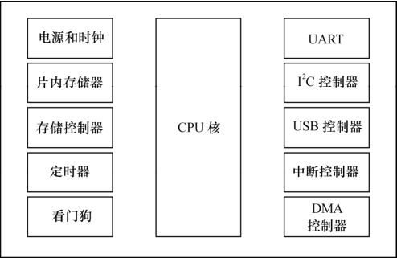
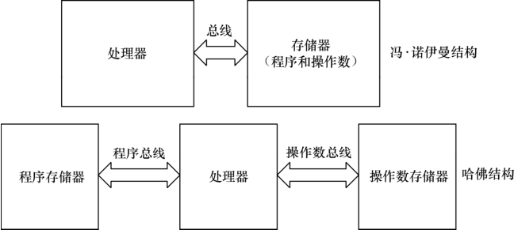

### 2.1.1 通用处理器

通用处理器（GPP）并不针对特定的应用领域进行体系结构和指令集的优化，它们具有一般化的通用体系结构和指令集，以求支持复杂的运算并易于添加新开发的功能。一般而言，在嵌入式微控制器（MCU）和微处理器（MPU）中会包含一个通用处理器核。

MPU通常代表一个CPU（中央处理器），而MCU则强调把中央处理器、存储器和外围电路集成在一个芯片中。早期，微控制器被称为单片机，指把计算机集成在一个芯片内。嵌入式微控制器也常被称作片上系统（SoC），含义是在一个芯片上设计了整个系统。芯片厂商在推出MCU时，往往会有明确的市场定位，如定位于PDA、MP3、ADSL等。定位不同的产品可能包含共同的CPU核，但是集成的扩展电路则不一样。图2.1所示给出了一个典型的集成了外围电路的MCU的结构。

举个例子，Intel的80386属于微处理器，而内部集成了80386处理器、片选单元、中断控制、定时器、看门狗定时器、串行I/O、DMA和总线仲裁、DRAM控制器等的386EX则是80386微处理器的微控制器版本。但是，要说明的是，GPP、MCU和MPU等概念其实非常含糊，许多地方并不加以区分，而明确区分这些概念在技术上本身也没有太大的意义。

嵌入式微控制器一般由一个CPU核和多个外围电路集成，目前主流的嵌入式CPU核有如下几种。

● Advanced RISC Machines公司的ARM。

ARM内核的设计技术被授权给数百家半导体厂商，做成不同的SoC芯片。ARM的功耗很低，在当今最活跃的无线局域网、3G、手机终端、手持设备、有线网络通信设备等中应用非常广泛。本书所基于的LDD6410开发板上采用的就是S3C6410这个ARM SoC芯片。

● MIPS技术公司的MIPS。

两个最重要的MIPS芯片厂商为PMC和IDT，PMC-Sierra公司的MIPS处理器被CISCO公司大量采用在高端路由器上。IDT公司在MIPS核上集成PCI接口，广泛用于以太网交换，另外也尝试增加了HDLC、Ethernet、串口、SDRAM控制器、片选、DMA控制器等外设接口，以用于低端通信产品。

● IBM和Motorola的PowerPC。

PowerPC处理器是通信和工控领域应用最广泛的处理器，国内包括华为、中兴在内的通信公司都大量使用PowerPC，MPC860和MPC8260是其最经典的两款。

● Motorola公司独有的内核68K/COLDFIRE。

68K内核是最早在嵌入式领域广泛应用的内核，其最著名的代表芯片是68360。Coldfire则继承了68K的特点并对其保持了兼容。Coldfire内核被用于DSP模块、CAN总线模块以及一般嵌入式处理器所集成的外设模块，在工业控制、机器人研究、家电控制等领域被广泛采用。

Motorola的半导体部已经独立为飞思卡尔半导体公司（Freescale Semiconductor Inc.），因为历史原因，上文仍然使用Motorola。

中央处理器的体系架构可以分为两类，一类为冯·诺伊曼结构，一类为哈佛结构。

冯·诺伊曼结构也称普林斯顿结构，是一种将程序指令存储器和数据存储器合并在一起的存储器结构。程序指令存储地址和数据存储地址指向同一个存储器的不同物理位置，因此程序指令和数据的宽度相同。而哈佛结构将程序指令和数据分开存储，指令和数据可以有不同的数据宽度。此外，哈佛结构还采用了独立的程序总线和数据总线，分别作为CPU与每个存储器之间的专用通信路径，具有较高的执行效率。图2.2描述了冯·诺伊曼结构和哈佛结构的区别。

从指令集的角度来讲，中央处理器也可以分为两类，即RISC（精简指令集计算机）和CISC（复杂指令集计算机）。CSIC强调增强指令的能力、减少目标代码的数量，但是指令复杂，指令周期长；而RISC强调尽可能减少指令集、指令单周期执行，但是目标代码会更大。ARM、MIPS、PowerPC等CPU内核都采用了RISC指令集。目前，RISC和CSIC二者的融合非常明显。

