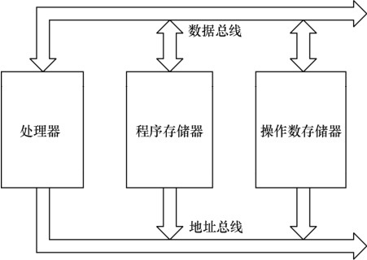
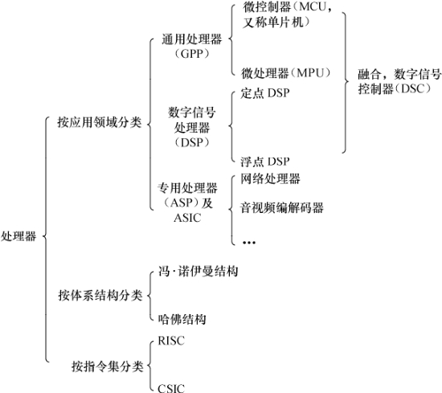

### 2.1.2 数字信号处理器

数字信号处理器（DSP）针对通信、图像、语音和视频处理等领域的算法而设计。它包含独立的硬件乘法器。DSP的乘法指令一般在单周期内完成，且优化了卷积、数字滤波、FFT（快速傅立叶变换）、相关、矩阵运算等算法中的大量重复乘法。

DSP一般采用如图2.3所示的改进的哈佛架构，它具有独立的地址总线和数据总线，两条总线由程序存储器和数据存储器分时共用。

DSP分为两类，一类是定点DSP，一类是浮点DSP。浮点DSP的浮点运算用硬件来实现，可以在单周期内完成，因而其浮点运算处理速度高于定点DSP。而定点DSP只能用定点运算模拟浮点运算。

德州仪器（TI）、美国模拟器件公司（ADI）是全球DSP的两大主要厂商。

TI的TMS320™DSP平台包含了功能不同的多个系列如2000系列、3000系列、4000系列、5000系列、6000系列，工程师也习惯称其为2X、3X、4X、5X、6X。2010年5月，TI已经宣布为其C64x系列数字信号处理器与多核片上系统提供Linux内核支持，以充分满足通信与关键任务基础设施、医疗诊断以及高性能测量测试等应用需求。TI对C64x Linux内核的产品支持TMS320C6474、TMS320C6455和TMS320C6457，将于2010年第3季度开始提供。

ADI主要有16位定点的21xx系列、32位浮点的SHARC系列、从SHARC系列发展而来的TigerSHARC系列及高性能16位DSP信号处理能力与通用微控制器方便性相结合的blackfin系列等。ADI的blackfin不含MMU，完整支持Linux，是MMU-less情况下Linux的典型案例，其官方网站为http://blackfin.uclinux.org/gf/，目前blackfin的Linux开发保持了Linux mainline的同步。

通用处理器和数字信号处理器也有相互融合以取长补短的趋势，如数字信号控制器（DSC）即为MCU+DSP，ADI的blackfin系列就属于DSC。目前，芯片厂商也推出了许多ARM+DSP的双核以及多核的处理器，如TI公司的OMAP 4平台就包括4个主要处理引擎：ARM Cortex-A9 MPCore、PowerVR SGX 540 GPU（Graphic Processing Unit）、C64x DSP 和ISP（Image Signal Processor）。

除了上面讲述的通用微控制器和数字信号处理器外，还有一些针对特定领域而设计的专用处理器（ASP），它们都是针对一些特定应用而设计的，如用于HDTV、ADSL、Cable Modem等的专用处理器。

网络处理器是一种可编程器件，它应用于电信领域的各种任务，如包处理、协议分析、路由查找、声音/数据的汇聚、防火墙、QoS等。网络处理器器件内部通常由若干个微码处理器和若干硬件协处理器组成，多个微码处理器在网络处理器内部并行处理，通过预先编制的微码来控制处理流程。而对于一些复杂的标准操作（如内存操作、路由表查找算法、QoS的拥塞控制算法、流量调度算法等）则采用硬件协处理器来进一步提高处理性能，从而实现了业务灵活性和高性能的有机结合。

对于某些应用场合，使用ASIC（专用集成电路）往往是低成本且高性能的方案。ASIC专门针对特定应用而设计，不具备也不需要灵活的编程能力。使用ASIC完成同样的功能往往比直接使用CPU资源或CPLD（复杂可编程逻辑器件）/FPGA（现场可编程门阵列）来得更廉价且高效。

在实际项目的硬件方案中，往往会根据应用的需求选择通用处理器、数字信号处理器、特定领域处理器、CPLD/FPGA或ASIC之一的解决方案，在复杂的系统中，这些芯片可能会同时存在，协同合作，各自发挥自己的长处。如在一款智能手机中，可使用MCU处理图形用户界面和用户的按键输入并运行多任务操作系统，使用DSP进行音视频编解码，而在射频方面则采用ASIC。

综合2.1节的内容，我们可得出如图2.4所示的处理器分类。

