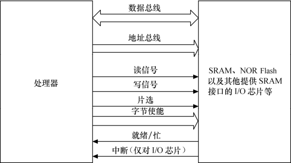
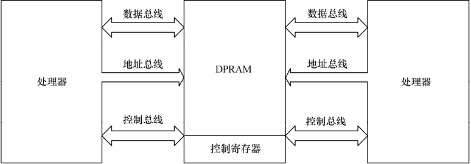
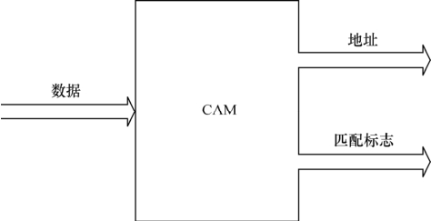
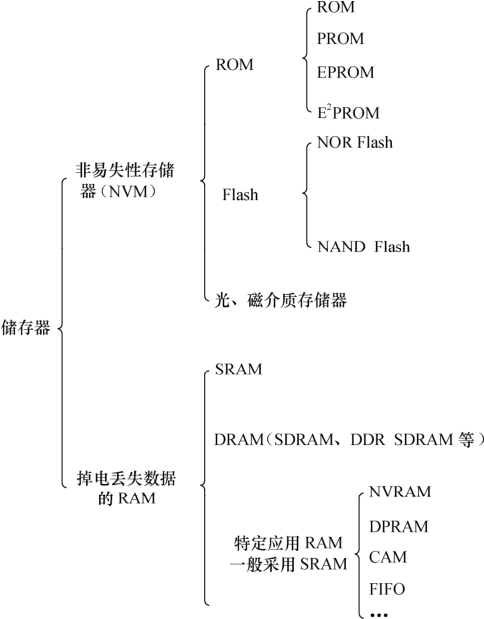

### 2.2 存储器

存储器主要可分类为只读储存器（ROM）、闪存（Flash）、随机存取存储器（RAM）、光、磁介质储存器。

ROM还可再细分为不可编程ROM、可编程ROM（PROM）、可擦除可编程ROM（EPROM）和电可擦除可编程ROM（EEPROM），EEPROM完全可以用软件来擦写，已经非常方便了。

目前ROM有被Flash替代的趋势，NOR（或非）和NAND（与非）是市场上两种主要的Flash闪存技术。Intel于1988年首先开发出NOR Flash技术，彻底改变了原先由EPROM和EEPROM一统天下的局面。紧接着，1989年，东芝公司发表了NAND Flash结构，每比特的成本被大大降低。

NOR Flash和CPU的接口属于典型的类SRAM接口（如图2.5所示），不需要增加额外的控制电路。NOR Flash的特点是可芯片内执行（XIP，eXecute In Place），程序可以直接在NOR内运行。而NAND Flash和CPU的接口必须由相应的控制电路进行转换，当然也可以通过地址线或GPIO产生NAND Flash接口的信号。NAND FLASH以块方式进行访问，不支持芯片内执行。

公共闪存接口（Common Flash Interface，简称CFI）是一个公开的、标准的从NOR Flash器件中读取数据的接口。它可以使系统软件查询已安装的Flash器件的各种参数，包括器件阵列结构参数、电气和时间参数以及器件支持的功能等。利用CFI，在不修改系统软件的情况下，就可以用新型的和改进的产品代替旧版本的产品。

一个NAND Flash的接口主要包含如下信号。

● I/O总线：地址、指令和数据通过这组总线传输，一般为8位或16位。

● 芯片启动（Chip Enable，CE#）：如果没有检测到CE信号，那么，NAND器件就保持待机模式，不对任何控制信号做出响应。

● 写使能（Write Enable，WE#）：WE#负责将数据、地址或指令写入NAND之中。

● 读使能（Read Enable，RE#）：RE#允许数据输出。

● 指令锁存使能（Command Latch Enable，CLE）：当CLE为高时，在WE#信号的上升沿，指令将被锁存到NAND指令寄存器中。

● 地址锁存使能（Address Latch Enable，ALE）：当ALE为高时，在WE#信号的上升沿，地址将被锁存到NAND地址寄存器中。

● 就绪/忙（Ready/Busy，R/B#）：如果NAND器件忙，R/B#信号将变低。该信号是漏极开路，需要采用上拉电阻。

NAND Flash较NOR Flash容量大，价格低；NAND Flash中每个块的最大擦写次数是一百万次，而NOR的擦写次数是十万次；NAND Flash的擦除、编程速度远超过NOR Flash。

由于Flash固有的电器特性，在读写数据过程中，偶然会产生1位或几位数据错误，即位反转，NAND Flash发生位反转的几率要远大于NOR Flash。位反转无法避免，因此，使用NAND Flash的同时，应采用错误探测/错误更正（EDC/ECC）算法。

Flash的编程原理都是只能将1写为0，而不能将0写为1。所以在Flash编程之前，必须将对应的块擦除，而擦除的过程就是把所有位都写为1的过程，块内的所有字节变为0xFF。

许多嵌入式系统都提供了IDE（Integrated Drive Electronics）接口，以供连接硬盘控制器或光驱，IDE接口的信号与SRAM类似。人们通常也把IDE接口称为ATA（Advanced Technology Attachment）接口，技术角度而言并不准确。其实，ATA接口发展至今，已经经历了ATA-1（IDE）、ATA-2（EIDE Enhanced IDE/Fast ATA）、ATA-3（FastATA-2）、Ultra ATA、Ultra ATA/33、Ultra ATA/66、Ultra ATA/100及Serial ATA的发展过程。

以上所述的各种ROM、Flash和磁介质存储器都属于非易失性存储器（NVM）的范畴，掉电信息不会丢失，而RAM则与此相反。

RAM也可再分为静态RAM（SRAM）和动态RAM（DRAM）。DRAM以电荷形式进行存储，数据存储在电容器中。由于电容器会由于漏电而导致电荷丢失，因而DRAM器件需要定期被刷新。SRAM是静态的，只要供电它就会保持一个值，SRAM没有刷新周期。每个SRAM存储单元由6个晶体管组成，而DRAM存储单元由1个晶体管和1个电容器组成。

通常所说的SDRAM、DDR SDRAM皆属于DRAM的范畴，它们采用与CPU外存控制器同步的时钟工作（注意不是与CPU的工作频率一致）。与SDRAM相比，DDR SDRAM同时利用了时钟脉冲的上升沿和下降沿传输数据，因此在时钟频率不变的情况下，数据传输频率被加倍。此外，还存在使用RSL（Rambus发信电平）技术的RDRAM（Rambus DRAM）和Direct RDRAM。

针对许多特定场合的应用，嵌入式系统中往往还使用了一些特定类型的RAM。

#### 1．NVRAM：非易失性RAM

既然是RAM，就是易失性的，为什么会有一类非易失性的RAM呢？

实际上，NVRAM借助带有备用电源的SRAM或借助NVM（如EEPROM）存储SRAM的信息并恢复来实现。NVRAM的特点是完全像SRAM一样读写，而且写入的信息掉电不丢失，不需要EEPROM和Flash的特定擦除和编程操作。NVRAM多用于存放系统中的参数信息。

#### 2．DPRAM：双端口RAM

DPRAM的特点是可以通过2个端口同时访问，具有2套完全独立的数据总线、地址总线线和读写控制线，通常用于2个处理器之间交互数据，如图2.6所示。当一端被写入数据后，另一端可以通过轮询或中断获知，并读取其写入的数据。由于双CPU同时访问DPRAM时的仲裁逻辑电路集成在DPRAM内部，因而硬件工程师设计电路的原理比较简单。

DPRAM的优点是通信速度快、实时性强、接口简单，而且两边CPU都可主动进行数据传输。除了双端口RAM以外，目前IDT等芯片厂商还推出了多端口RAM，可以供3个以上的CPU互通数据。

#### 3．CAM：内容寻址RAM

CAM是以内容进行寻址的存储器，是一种特殊的存储阵列RAM，它的主要工作机制就是将一个输入数据项与存储在CAM中的所有数据项自动同时进行比较，判别该输入数据项与CAM中存储的数据项是否相匹配，并输出该数据项对应的匹配信息。

如图2.7所示，在CAM中，输入的是所要查询的数据，输出的是数据地址和匹配标志。若匹配（即搜寻到数据），则输出数据地址。CAM用于数据检索的优势是软件无法比拟的，可以极大地提高系统性能。

● FIFO：先进先出队列

FIFO存储器的特点是先进先出，进出有序，FIFO多用于数据缓冲。FIFO和DPRAM类似，具有两个访问端口，但是FIFO两边的端口并不对等，某一时刻只能被设置为一边作为输入，一边作为输出。

如果FIFO的区域共为n个字节，我们只能通过循环n次读取同一个地址才能将该片区域读出，不能指定偏移地址。对于有n个数据的FIFO，当循环读取m次，下一次读会自动读取到第m + 1个数据，这是由FIFO本身的特性决定的。

总结2.2节的内容，我们可得出如图2.8所示的存储器分类。

