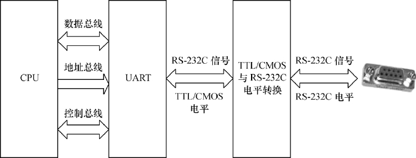

### 2.3.1 串口

RS-232、RS-422与RS-485都是串行数据接口标准，最初都是由电子工业协会（EIA）制订并发布的。

RS-232在1962年发布，命名为EIA-232-E。之后发布的RS-422定义了一种平衡通信接口，它是一种单机发送、多机接收的单向、平衡传输规范，被命名为TIA/EIA-422-A标准。RS-422改进了RS-232通信距离短、速率低的缺点。为进一步扩展应用范围，EIA又于1983年在RS-422的基础上制定了RS-485标准，增加了多点、双向通信能力，即允许多个发送器连接到同一条总线上，同时增加了发送器的驱动能力和冲突保护特性，并扩展了总线共模范围，被命名为TIA/EIA-485-A标准。

1969年发布的RS-232修改版RS-232C是嵌入式系统应用最广泛的串行接口，它为连接DTE（数据终端设备）与DCE（数据通信设备）而制定。RS-232C规标准接口有25条线（4条数据线、11条控制线、3条定时线、7条备用和未定义线），常用的只有9根，它们是RTS/CTS（请求发送/清除发送流控制）、RxD/TxD（数据收发）、DSR/DTR（数据终端就绪/数据设置就绪流控制）、DCD（数据载波检测，也称RLSD，即接收线信号检出）、Ringing-RI（振铃指示）、SG（信号地）信号。RTS/CTS、TxD/RxD、DRS/DTR等信号的定义如下。

● RTS：用来表示DTE请求DCE发送数据，当终端要发送数据时，使该信号有效。

● CTS：用来表示DCE准备好接收DTE发来的数据，是对RTS的响应信号。

● TxD：DTE通过TxD将串行数据发送到DCE。

● RxD：DTE通过RxD接收从DCE发来的串行数据。

● DSR：有效（ON状态）表明DCE可以使用。

● DTR：有效（ON状态）表明DTE可以使用。

● DCD：当本地DCE设备收到对方DCE设备送来的载波信号时，使DCD有效，通知DTE准备接收，并且由DCE将接收到的载波信号解调为数字信号，经RXD线送给DTE。

● Ringing-RI：当MODEM收到交换台送来的振铃呼叫信号时，使该信号有效（ON状态），通知终端，已被呼叫。

在嵌入式系统中，并不太注重DTE和DCE的概念，而RS-232C也很少用来连接modem，多使用RS-232C进行对等通信，如Windows超级终端、Linux minicom用来连接电路板控制台等。最简单的RS-232C串口只需要连接RxD、TxD、SG这3个信号，使用XON/XOFF软件流控。

组成一个RS-232C串口的硬件原理如图2.9所示，从CPU到连接器依次为：CPU、UART（通用异步接收器发送器，作用是完成并/串转换）、CMOS/TTL电平与RS-232C电平转换、DB9/DB25或自定义连接器。

