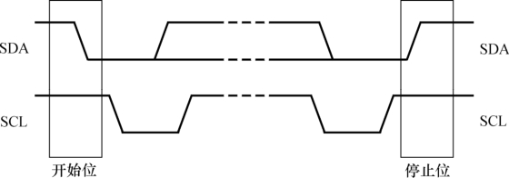
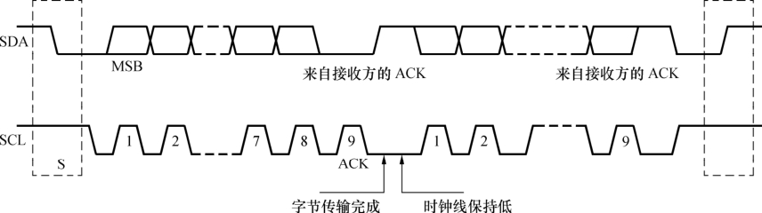

### 2.3.2 I2C

I2C（内置集成电路）总线是由Philips公司开发的两线式串行总线，产生于20世纪80年代，用于连接微控制器及其外围设备。I2C总线简单而有效，占用很少的PCB（印刷电路板）空间，芯片管脚数量少，设计成本低。I2C总线支持多主控（multi-mastering）模式，任何能够进行发送和接收的设备都可以成为主设备。主控能够控制数据的传输和时钟频率，在任意时刻只能有一个主控。

组成I2C总线的两个信号为数据线SDA和时钟SCL。为了避免总线信号的混乱，要求各设备连接到总线的输出端必须是开漏输出或集电极开路输出的结构。总线空闲时，上拉电阻使SDA 和SCL线都保持高电平。根据开漏输出或集电极开路输出信号的“线与”逻辑，I2C总线上任意器件输出低电平都会使相应总线上的信号线变低。

“线与”逻辑指的是两个或两个以上的输出直接互连就可以实现“AND”的逻辑功能，只有输出端是开漏（对于CMOS器件）输出或集电极开路（对于TTL器件）输出时才满足此条件。工程师一般以“OC门”简称开漏或集电极开路。

I2C设备上的串行数据线SDA接口电路是双向的，输出电路用于向总线上发送数据，输入电路用于接收总线上的数据。同样地，串行时钟线SCL也是双向的，作为控制总线数据传送的主机要通过SCL输出电路发送时钟信号，并检测总线上SCL上的电平以决定什么时候发下一个时钟脉冲电平；作为接收主机命令的从设备需按总线上SCL的信号发送或接收SDA上的信号，它也可以向SCL线发出低电平信号以延长总线时钟信号周期。

当SCL稳定在高电平时，SDA由高到低的变化将产生一个开始位，而由低到高的变化则产生一个停止位，如图2.10所示。

开始位和停止位都由I2C主设备产生。在选择从设备时，如果从设备采用7位地址，则主设备在发起传输过程前，需先发送1字节的地址信息，前7位为设备地址，最后1位为读写标志。之后，每次传输的数据也是1个字节，从MSB位开始传输。每个字节传完后，在SCL的第9个上升沿到来之前，接收方应该发出1个ACK位。SCL上的时钟脉冲由I2C主控方发出，在第8个时钟周期之后，主控方应该释放SDA，I2C总线的时序如图2.11所示。

