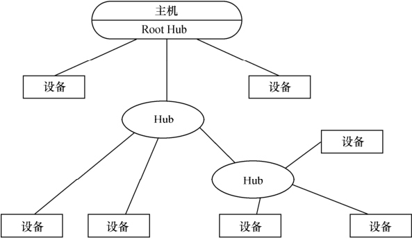
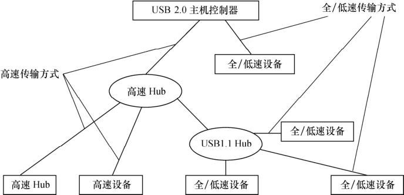

### 2.3.3 USB

USB（通用串行总线）是Intel、Microsoft等厂商为解决计算机外设种类的日益增加与有限的主板插槽和端口之间的矛盾而于1995年提出的，它具有数据传输率高、易扩展、支持即插即用和热插拔的优点，目前已得到广泛应用｡

USB 1.1包含全速和低速两种模式，低速方式的速率为1.5Mbit/s，支持一些不需要很大数据吞吐量和很高实时性的设备，如鼠标等。全速模式为12Mbit/s，可以外接速率更高的外设｡在USB 2.0中，增加了一种高速方式，数据传输率达到480Mbit/s，可以满足更高速外设的需要｡

USB的物理拓扑结构如图2.12所示，在USB 2.0中，高速方式下Hub使全速和低速方式的信令环境独立出来，图2.13所示高速方式下Hub的作用｡

在嵌入式系统中，电路板若需要挂接USB设备（device），则需提供USB主机（host）控制器和连接器；若电路板需要作为USB设备，则需提供USB设备适配器和连接器。有的MCU集成了USB主机控制器和设备适配器。

USB总线的机械连接非常简单，采用4芯的屏蔽线，一对差分线（D+，D-）传送信号，另一对（VBUS，电源地）传送+5V的直流电。一个USB主控制器端口最多可连接127个器件，各器件之间的距离不超过5米｡

USB提供了4种传输方式以适应各种设备的需要，说明如下。

（1）控制（Control）传输方式。

控制传输是双向传输，数据量通常较小，主要用来进行查询、配置和给USB设备发送通用的命令｡

（2）同步（Synchronization）传输方式。

同步传输提供了确定的带宽和间隔时间，它被用于时间严格并具有较强容错性的流数据传输，或者用于要求恒定的数据传送率的即时应用。例如进行语音业务传输时，使用同步传输方式是很好的选择｡

（3）中断（Interrupt）传输方式。

中断方式传送是单向的，对于USB主机而言，只有输入。中断传输方式主要用于定时查询设备是否有中断数据要传送，该传输方式应用在少量的、分散的、不可预测的数据传输场合，键盘、游戏杆和鼠标属于这一类型｡

（4）批量（Bulk）传输方式。

批量传输主要应用在没有带宽和间隔时间要求的批量数据的传送和接收，它要求保证传输｡打印机和扫描仪属于这种类型｡

