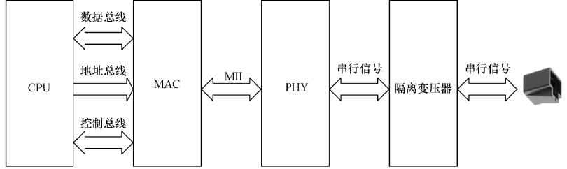

### 2.3.4 以太网接口

以太网接口由MAC（以太网媒体接入控制器）和PHY（物理接口收发器）组成。以太网MAC 由IEEE-802.3以太网标准定义，实现了数据链路层。常用的MAC支持10Mbit/s或100Mbit/s两种速率。PHY则实现物理层功能，IEEE-802.3标准定义了以太网PHY，它符合IEEE-802.3k中用于10BaseT（第14条）和100BaseTX（第24条和第25条）的规范。10BaseT和100BaseTX PHY两种实现的帧格式是一样的，但信令机制不同，而且10BaseT采用曼彻斯特编码，100BaseTX采用4B/5B编码。

MAC和PHY之间采用MII（媒体独立接口）连接，它是IEEE-802.3定义的以太网行业标准，包括1个数据接口和1个MAC和PHY之间的管理接口。数据接口包括分别用于发送和接收的两条独立信道，每条信道都有自己的数据、时钟和控制信号，MII数据接口总共需要16个信号。MII管理接口包含两个信号，一个是时钟信号，另一个是数据信号。通过管理接口，上层能监视和控制PHY。

组成一个以太网接口的硬件原理如图2.14所示，从CPU到最终接口依次为：CPU、MAC、PHY、以太网隔离变压器、RJ45插座。以太网隔离变压器是以太网收发芯片与连接器之间的磁性组件，在其两者之间起着信号传输、阻抗匹配、波形修复、信号杂波抑制和高电压隔离作用。

许多处理器内部集成了MAC或同时集成了MAC和PHY，另有许多以太网控制芯片也集成了MAC和PHY。

